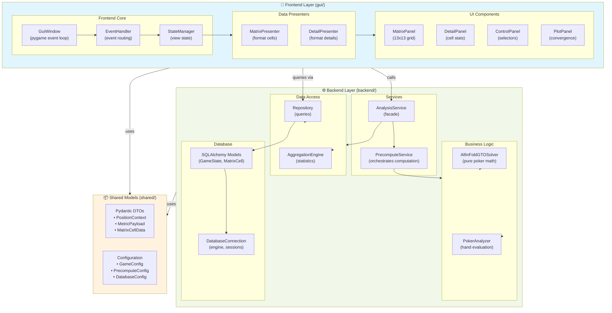
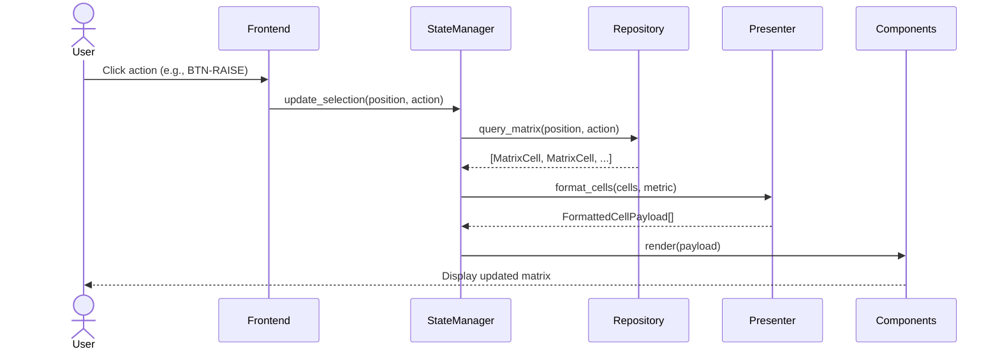
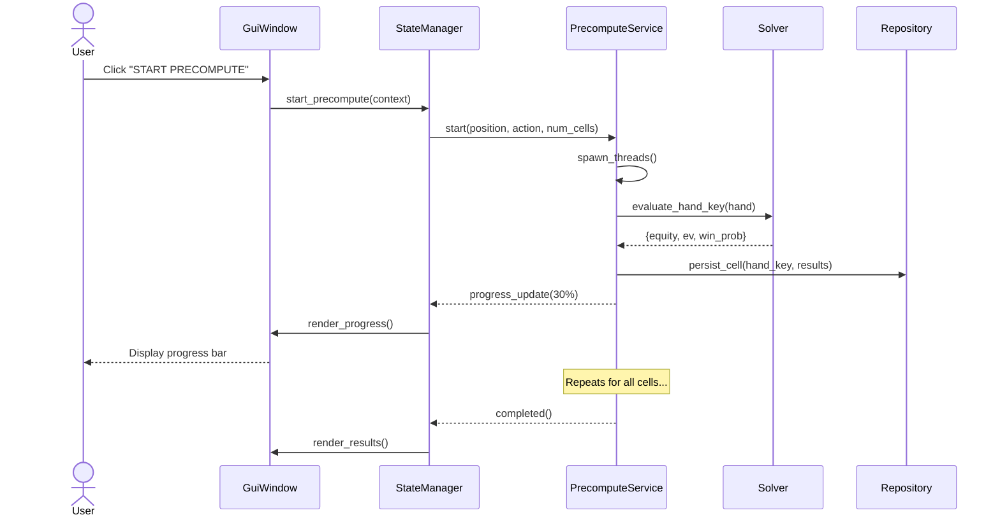
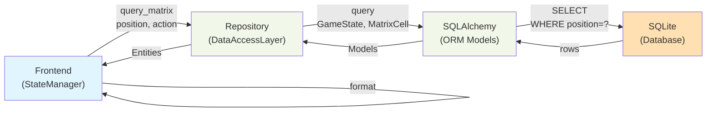

# Architecture A: Layered Backend-Frontend

## Overview

This is the **recommended approach** for AoF GTO Browser II. It provides a clean separation between backend (analysis, database, solver) and frontend (GUI, state management, rendering) while maintaining simplicity through direct imports in a monolithic Python application.

**Audience**: Teams wanting clear separation with minimal architectural complexity.

---

## Core Principles

1. **Layered Architecture** - Backend and Frontend are logically separate packages
2. **Direct Package Imports** - No REST API initially; direct module communication
3. **Dependency Injection** - Components receive dependencies via constructors
4. **Clear Contracts** - Pydantic models define interfaces between layers
5. **Testable Core** - Business logic independent of UI framework

---

## Component Architecture



---

## Package Structure

```
aof_gto_browser_ii/
├── backend/                      # Pure business logic & data
│   ├── __init__.py
│   ├── solver/
│   │   ├── __init__.py
│   │   ├── all_in_fold_gto.py  # AllInFoldGTOSolver (reused)
│   │   └── casino_rules.py      # Bonus payouts, rules
│   ├── analysis/
│   │   ├── __init__.py
│   │   ├── poker_analyzer.py   # PokerAnalyzer (reused)
│   │   ├── analysis_service.py # Facade for solver
│   │   └── precompute.py       # PrecomputeService
│   ├── database/
│   │   ├── __init__.py
│   │   ├── connection.py        # DatabaseConnection (reused)
│   │   ├── models.py            # SQLAlchemy models (reused)
│   │   ├── repository.py        # Data access layer
│   │   └── aggregation.py       # AggregationEngine
│   └── config/
│       ├── __init__.py
│       ├── game.py             # GameConfig
│       └── database.py         # DatabaseConfig
│
├── frontend/                     # GUI & presentation
│   ├── __init__.py
│   ├── gui/
│   │   ├── __init__.py
│   │   ├── window.py           # GuiWindow (pygame app)
│   │   ├── event_handler.py    # EventHandler routing
│   │   └── state.py            # StateManager (view state)
│   ├── components/
│   │   ├── __init__.py
│   │   ├── matrix_panel.py     # 13x13 matrix grid
│   │   ├── detail_panel.py     # Cell detail view
│   │   ├── control_panel.py    # Position/action selector
│   │   ├── plot_panel.py       # Convergence plot
│   │   └── base.py             # BaseComponent
│   ├── presenters/
│   │   ├── __init__.py
│   │   ├── matrix_presenter.py # Format cells for display
│   │   └── detail_presenter.py # Format details
│   └── services/
│       ├── __init__.py
│       └── gui_service.py      # Frontend-specific logic
│
├── shared/                       # Shared models & contracts
│   ├── __init__.py
│   ├── models/
│   │   ├── __init__.py
│   │   ├── context.py          # PositionContext, ActionContext
│   │   ├── payloads.py         # GUI-ready DTOs
│   │   └── enums.py            # MetricType, Position, etc.
│   └── config/
│       ├── __init__.py
│       └── defaults.py         # Default configurations
│
├── main.py                       # Entry point
└── config.yaml                   # YAML configuration

tests/
├── unit/
│   ├── backend/
│   │   ├── test_solver.py
│   │   ├── test_analysis_service.py
│   │   └── test_repository.py
│   └── frontend/
│       ├── test_state_manager.py
│       └── test_presenters.py
├── integration/
│   ├── test_backend_frontend_flow.py
│   └── test_database_operations.py
└── e2e/
    └── test_browser_workflow.py
```

---

## Data Flow

### 1. User Selects Position/Action/Metric



### 2. User Starts Precompute



### 3. Query Flow Architecture



---

## Key Components

### Backend Core

#### 1. **AnalysisService** (Facade)
```python
class AnalysisService:
    """Facade for all analysis operations."""
    
    def __init__(self, solver: AllInFoldGTOSolver, 
                 precompute: PrecomputeService):
        self.solver = solver
        self.precompute = precompute
    
    def evaluate_hand(self, hand_key: str, 
                     context: PositionContext) -> HandEvaluation:
        """Single hand evaluation."""
        pass
    
    def start_precompute_session(self, context: PositionContext) -> SessionId:
        """Batch computation session."""
        pass
    
    def get_progress(self, session_id: SessionId) -> PrecomputeProgress:
        """Query computation progress."""
        pass
```

#### 2. **PrecomputeService** (Orchestration)
```python
class PrecomputeService:
    """Manages multi-threaded computation."""
    
    def __init__(self, solver: AllInFoldGTOSolver, 
                 repository: Repository,
                 executor: ThreadPoolExecutor):
        self.solver = solver
        self.repository = repository
        self.executor = executor
        self.active_sessions = {}
    
    def start(self, context: PositionContext) -> SessionId:
        """Begin precompute for all hands in context."""
        pass
    
    def pause(self, session_id: SessionId):
        """Pause active session."""
        pass
    
    def cancel(self, session_id: SessionId):
        """Cancel computation."""
        pass
```

#### 3. **Repository** (Data Access)
```python
class Repository:
    """Clean data access layer."""
    
    def __init__(self, db_connection: DatabaseConnection):
        self.db = db_connection
    
    def query_matrix(self, position: Position, 
                    action: Action) -> List[MatrixCellEntity]:
        """Get all cells for position/action."""
        pass
    
    def query_cell(self, hand_key: str) -> Optional[MatrixCellEntity]:
        """Get specific cell data."""
        pass
    
    def persist_results(self, hand_key: str, 
                       results: HandEvaluation):
        """Save computation results."""
        pass
    
    def get_aggregates(self, context: PositionContext) -> Aggregates:
        """Get min/max/mean statistics."""
        pass
```

### Frontend Core

#### 1. **StateManager** (View State)
```python
@dataclass
class ViewState:
    """Frontend-only state."""
    position: Position
    action: Action
    metric: MetricType
    selected_cell: Optional[str]
    precompute_session: Optional[SessionId]
    precompute_progress: Optional[float]

class StateManager:
    """Manages view state, triggers updates."""
    
    def __init__(self, repository: Repository, 
                 analysis_service: AnalysisService):
        self.state = ViewState(...)
        self.repository = repository
        self.analysis_service = analysis_service
        self.observers = []
    
    def select_position_action(self, pos: Position, act: Action):
        """User changes position/action."""
        self.state.position = pos
        self.state.action = act
        self._notify_observers()
    
    def start_precompute(self):
        """User starts precompute."""
        self.state.precompute_session = \
            self.analysis_service.start_precompute_session(...)
        self._poll_progress()
    
    def _poll_progress(self):
        """Fetch progress periodically."""
        progress = self.analysis_service.get_progress(...)
        self.state.precompute_progress = progress.percentage
        self._notify_observers()
```

#### 2. **EventHandler** (Input Routing)
```python
class EventHandler:
    """Routes pygame events to state changes."""
    
    def __init__(self, state_manager: StateManager):
        self.state_manager = state_manager
    
    def handle_event(self, event: pygame.event.Event):
        """Route event to appropriate handler."""
        
        if event.type == MATRIX_CELL_CLICK:
            self._handle_cell_click(event.cell_id)
        elif event.type == POSITION_SELECT:
            self._handle_position_select(event.position)
        elif event.type == ACTION_SELECT:
            self._handle_action_select(event.action)
        elif event.type == PRECOMPUTE_START:
            self._handle_precompute_start()
    
    def _handle_cell_click(self, cell_id: str):
        """User clicked matrix cell."""
        self.state_manager.select_cell(cell_id)
```

#### 3. **MatrixPresenter** (Data Formatting)
```python
class MatrixPresenter:
    """Formats raw entities into GUI-ready payloads."""
    
    def __init__(self, repository: Repository):
        self.repository = repository
    
    def present_matrix(self, position: Position, 
                      action: Action, 
                      metric: MetricType) -> MatrixPayload:
        """Format matrix data for rendering."""
        
        cells = self.repository.query_matrix(position, action)
        
        return MatrixPayload(
            cells=[
                CellDisplay(
                    hand_key=cell.hand_key,
                    row=cell.row,
                    col=cell.col,
                    value=self._format_value(cell, metric),
                    color=self._compute_color(cell, metric),
                    is_computed=cell.is_computed
                )
                for cell in cells
            ],
            min_value=self._get_min(cells, metric),
            max_value=self._get_max(cells, metric),
            mean_value=self._get_mean(cells, metric)
        )
    
    def _format_value(self, cell: MatrixCellEntity, 
                     metric: MetricType) -> str:
        """Format value based on metric type."""
        if metric == MetricType.EQUITY:
            return f"{cell.equity:.1%}"
        elif metric == MetricType.EV:
            return f"${cell.ev:.2f}"
        # ...
```

---

## Shared Models (Contracts)

### Context Models
```python
# shared/models/context.py

@dataclass(frozen=True)
class PositionContext:
    """Specifies a poker position."""
    position: Position  # BTN, CO, HJ, etc.
    board: Optional[str]  # "Qs9h2d" or None for preflop
    pot_size: float
    bet_amount: float
    num_opponents: int

@dataclass(frozen=True)
class ActionContext:
    """Specifies an action at position."""
    position: PositionContext
    action: Action  # RAISE, CALL, FOLD, CHECK
    raise_size: Optional[float]

class MetricType(Enum):
    """Available metrics for display."""
    WIN_LOSE_PROBABILITY = "win_lose"
    EQUITY = "equity"
    EV = "ev"
    EQR = "eqr"  # Equity win Ratio
```

### Payload Models (DTO - Data Transfer Objects)
```python
# shared/models/payloads.py

@dataclass
class CellDisplay:
    """Single cell ready for rendering."""
    hand_key: str
    row: int
    col: int
    value: str  # Formatted display value
    color: Tuple[int, int, int]  # RGB
    is_computed: bool

@dataclass
class MatrixPayload:
    """Complete matrix ready for rendering."""
    cells: List[CellDisplay]
    min_value: float
    max_value: float
    mean_value: float

@dataclass
class PrecomputeProgress:
    """Computation progress update."""
    session_id: str
    percentage: float
    completed_cells: int
    total_cells: int
    elapsed_seconds: float
    estimated_remaining_seconds: float

@dataclass
class HandEvaluation:
    """Result of evaluating a single hand."""
    hand_key: str
    equity: float
    win_probability: float
    loss_probability: float
    ev: float
    eqr: float
```

---

## Dependency Injection

```python
# main.py - Application Composition

def create_backend() -> Tuple[AnalysisService, Repository]:
    """Wire up backend."""
    db_conn = DatabaseConnection(config.database_url)
    repository = Repository(db_conn)
    solver = AllInFoldGTOSolver(config.solver_params)
    precompute = PrecomputeService(solver, repository, 
                                   ThreadPoolExecutor(4))
    analysis_service = AnalysisService(solver, precompute)
    
    return analysis_service, repository

def create_frontend(analysis_service: AnalysisService,
                   repository: Repository) -> GuiWindow:
    """Wire up frontend."""
    state_manager = StateManager(repository, analysis_service)
    event_handler = EventHandler(state_manager)
    matrix_presenter = MatrixPresenter(repository)
    
    # Create components
    matrix_panel = MatrixPanel(matrix_presenter)
    detail_panel = DetailPanel(DetailPresenter())
    # ...
    
    window = GuiWindow(
        event_handler=event_handler,
        state_manager=state_manager,
        components=[matrix_panel, detail_panel, ...]
    )
    return window

if __name__ == "__main__":
    config = load_config("config.yaml")
    analysis_service, repository = create_backend()
    gui = create_frontend(analysis_service, repository)
    gui.run()
```

---

## Testing Strategy

### Unit Tests (No Framework Mocks)
```python
# tests/unit/backend/test_analysis_service.py

def test_evaluate_hand_returns_correct_ev():
    """Pure logic test - no mocks."""
    solver = AllInFoldGTOSolver(params)
    context = PositionContext(position=Position.BTN, ...)
    
    result = solver.evaluate_hand_key("AK", context)
    
    assert result.ev > 0
    assert result.equity > 0
    assert result.equity <= 1.0

def test_repository_persists_and_retrieves():
    """Database integration test."""
    with temporary_db() as db:
        repo = Repository(db)
        
        # Write
        repo.persist_cell("AK", HandEvaluation(...))
        
        # Read
        cell = repo.query_cell("AK")
        
        assert cell is not None
        assert cell.hand_key == "AK"
```

### Integration Tests
```python
# tests/integration/test_precompute_flow.py

def test_precompute_session_stores_and_retrieves():
    """Test precompute → database → frontend retrieval."""
    with temporary_db() as db:
        repo = Repository(db)
        solver = AllInFoldGTOSolver(params)
        precompute = PrecomputeService(solver, repo, executor)
        
        # Start precompute
        session_id = precompute.start(BtnRaiseContext)
        
        # Wait for completion
        while precompute.is_running(session_id):
            time.sleep(0.1)
        
        # Verify all cells computed
        cells = repo.query_matrix(Position.BTN, Action.RAISE)
        assert all(cell.is_computed for cell in cells)
```

### E2E Tests
```python
# tests/e2e/test_browser_workflow.py

def test_user_can_run_full_browser_session():
    """Full workflow from startup to precompute."""
    with temporary_db() as db:
        backend = create_backend_with_db(db)
        frontend = create_frontend(backend)
        
        # Simulate: select BTN-RAISE
        frontend.state_manager.select_position_action(
            Position.BTN, Action.RAISE
        )
        
        # Verify matrix loaded
        payload = frontend.state_manager.current_matrix_payload()
        assert len(payload.cells) == 169
        
        # Simulate: start precompute
        frontend.state_manager.start_precompute()
        
        # Wait for completion
        while frontend.state_manager.is_precomputing():
            time.sleep(0.1)
        
        # Verify results available
        cells = db.query_all_computed_cells()
        assert len(cells) > 0
```

---

## Migration Path from AoF GTO Browser

### Phase 1: Core Infrastructure
1. Create new package structure
2. Move `DatabaseConnection` (as-is)
3. Move `AllInFoldGTOSolver` (remove persistence deps)
4. Create `Repository` wrapping ORM queries
5. Create shared DTOs

### Phase 2: Backend Services
1. Create `PrecomputeService`
2. Create `AnalysisService` facade
3. Write comprehensive backend tests
4. Parallel: Preserve existing database schema

### Phase 3: Frontend Rewrite
1. Create `StateManager` from view state logic
2. Create `EventHandler` to replace direct component routing
3. Create Presenters to format data
4. Rewrite components to consume formatted data

### Phase 4: Integration & Testing
1. Write integration tests
2. Verify feature parity with old browser
3. Performance tuning
4. Documentation

---

## Pros & Cons

### ✅ Advantages
- **Simple separation**: Clear Frontend/Backend boundary
- **Testable**: Business logic independent of pygame
- **Gradual migration**: Can reuse existing components
- **Flexible future**: Can add REST API later
- **Clear dataflow**: DTOs make contracts explicit

### ⚠️ Limitations
- **No enforced boundaries**: Runtime only, not by language
- **Harder to split server**: Still monolithic
- **Cyclic import risk**: Need careful module organization
- **Testing requires DB**: Unit tests may want mocks

---

## Configuration Example

```yaml
# config.yaml

database:
  url: sqlite:///./poker_gto.db
  echo: false  # SQL logging
  pool_size: 5

precompute:
  simulations_per_combo: 1000
  max_workers: 4
  batch_size: 100
  timeout_seconds: 3600

game:
  cash_game:
    positions: [BTN, CO, HJ, LJ, UTG]
    actions: [FOLD, CALL, MIN_RAISE, 2BB_RAISE, 3BB_RAISE, 4BB_RAISE]
    bb: 1.0
    sb: 0.5
    
gui:
  window_width: 1400
  window_height: 900
  fps: 60
  cell_size: 50
```

---

## Conclusion

**Architecture A** provides the best balance for AoF GTO Browser II:
- Clear separation without over-engineering
- Reuses proven components from existing app
- Testable, extensible, maintainable
- Enables gradual migration from old browser
- Foundation for future evolution (REST API, mobile app, etc.)

**Recommended to proceed with this approach** unless you need the stronger guarantees of Architecture B or the extensibility of Architecture C.
