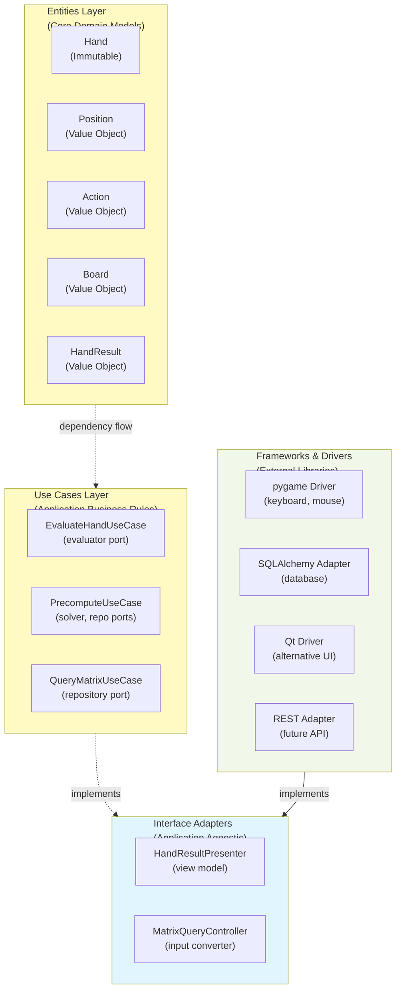
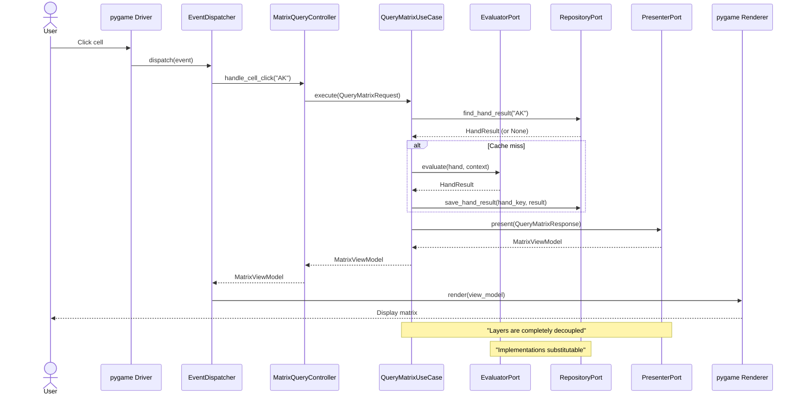

# Architecture B: Clean Architecture with Adapters

## Overview

This approach enforces **strict boundary separation** using the Clean Architecture pattern with **Adapter/Port pattern** for framework dependencies. The application core is completely decoupled from pygame, SQLAlchemy, and other frameworks.

**Audience**: Teams requiring strict separation, planning to support multiple UI frameworks, or building for long-term evolution.

**Complexity**: ⭐⭐⭐⭐ - Most structured, some overhead.

---

## Core Principles

1. **Dependency Rule** - Inner layers never depend on outer layers
2. **Framework Agnostic** - Core business logic has zero framework dependencies
3. **Interfaces First** - All external interactions via ports
4. **Testability** - Business logic testable with simple dataclasses, no mocks
5. **Substitutable Implementations** - Swap pygame for Qt, SQLite for PostgreSQL

---

## Dependency Structure



**Key Rule**: Entities and UseCases **never import** from Interfaces or Frameworks.

---

## Package Structure

```
aof_gto_browser_ii_clean/
│
├── entities/                    # Layer 1: Core domain (zero dependencies)
│   ├── __init__.py
│   ├── hand.py                 # Hand, HandResult value objects
│   ├── position.py             # Position enum, value object
│   ├── board.py                # Board value object
│   ├── action.py               # Action enum, context
│   └── evaluation.py           # EvaluationResult dataclass
│
├── use_cases/                   # Layer 2: Business rules (only entities)
│   ├── __init__.py
│   ├── ports/                  # Interfaces (abstract base classes)
│   │   ├── __init__.py
│   │   ├── evaluator_port.py   # abc EvaluatorPort
│   │   ├── repository_port.py  # abc RepositoryPort
│   │   ├── presenter_port.py   # abc PresenterPort
│   │   └── logger_port.py      # abc LoggerPort
│   ├── dtos/                   # Data Transfer Objects
│   │   ├── __init__.py
│   │   ├── evaluate_hand_request.py
│   │   ├── evaluate_hand_response.py
│   │   ├── precompute_request.py
│   │   └── precompute_response.py
│   ├── evaluate_hand.py        # EvaluateHandUseCase
│   ├── precompute_matrix.py    # PrecomputeMatrixUseCase
│   └── query_matrix.py         # QueryMatrixUseCase
│
├── interface_adapters/          # Layer 3: Controllers, Presenters
│   ├── __init__.py
│   ├── controllers/
│   │   ├── __init__.py
│   │   ├── hand_evaluator_controller.py
│   │   └── matrix_query_controller.py
│   ├── presenters/
│   │   ├── __init__.py
│   │   ├── matrix_hand_list_presenter.py
│   │   ├── cell_detail_presenter.py
│   │   └── viewmodels.py       # Hand, Cell ViewModels
│   └── gateways/               # Repository implementations stub
│       ├── __init__.py
│       └── memory_repository.py # In-memory test impl
│
├── frameworks/                  # Layer 4: Drivers & Adapters
│   ├── pygame_driver/
│   │   ├── __init__.py
│   │   ├── gui_window.py       # pygame.display wrapper
│   │   ├── event_dispatcher.py # Event routing
│   │   ├── components/
│   │   │   ├── matrix_component.py
│   │   │   ├── detail_component.py
│   │   │   └── base_component.py
│   │   └── event_loop.py       # 60 FPS loop
│   ├── sqlalchemy_adapter/
│   │   ├── __init__.py
│   │   ├── repository.py       # RepositoryPort impl
│   │   ├── models.py           # SQLAlchemy models
│   │   └── connection.py       # DB connection
│   └── logging_adapter/
│       ├── __init__.py
│       └── logger.py           # LoggerPort impl
│
├── app.py                       # Application composition root
└── config.yaml

tests/
├── unit/
│   ├── entities/
│   │   ├── test_hand.py
│   │   └── test_position.py
│   ├── use_cases/
│   │   ├── test_evaluate_hand_usecase.py
│   │   └── test_precompute_usecase.py
│   └── interface_adapters/
│       ├── test_matrix_presenter.py
│       └── test_controller.py
├── integration/
│   └── test_usecase_with_adapters.py
└── e2e/
    └── test_full_application.py
```

---

## Core Layers Explained

### Layer 1: **Entities** (Domain Models)

Pure data structures, zero dependencies, immutable where possible.

```python
# entities/hand.py

@dataclass(frozen=True)
class Hand:
    """Immutable poker hand."""
    card_1: str  # "As", "Kh", etc.
    card_2: str
    
    def is_pair(self) -> bool:
        return self.card_1[0] == self.card_2[0]
    
    def is_suited(self) -> bool:
        return self.card_1[1] == self.card_2[1]
    
    def to_key(self) -> str:
        """Convert to standard key: 'AK', 'AKo', etc."""
        rank1, suit1 = self.card_1
        rank2, suit2 = self.card_2
        
        if rank1 == rank2:
            return f"{rank1}{rank2}"  # "AA"
        
        pair = (rank1, rank2) if rank1 > rank2 else (rank2, rank1)
        suffix = "s" if suit1 == suit2 else "o"
        return f"{pair[0]}{pair[1]}{suffix}"

@dataclass(frozen=True)
class HandResult:
    """Result of evaluating a hand."""
    hand: Hand
    win_probability: float  # [0, 1]
    loss_probability: float  # [0, 1]
    draw_probability: float  # [0, 1]
    equity: float  # pot share
    ev: float  # expected value
    eqr: float  # equity/risk ratio
    
    def __post_init__(self):
        total = self.win_probability + self.loss_probability + self.draw_probability
        if not 0.99 <= total <= 1.01:
            raise ValueError(f"Probabilities don't sum to 1: {total}")


# entities/position.py

class Position(Enum):
    """Poker table position."""
    UTG = "utg"
    HJ = "hj"
    CO = "co"
    BTN = "btn"
    SB = "sb"
    BB = "bb"

@dataclass(frozen=True)
class PositionContext:
    """Immutable position specification."""
    position: Position
    num_opponents: int
    stack_bb: float
    pot_size_bb: float
```

### Layer 2: **Use Cases** (Business Rules)

Orchestrates domain logic using ports (interfaces).

```python
# use_cases/ports/evaluator_port.py

from abc import ABC, abstractmethod
from entities.hand import Hand, HandResult
from entities.position import PositionContext

class EvaluatorPort(ABC):
    """Port: abstraction for hand evaluation."""
    
    @abstractmethod
    def evaluate(self, hand: Hand, 
                 context: PositionContext) -> HandResult:
        """Evaluate a single hand."""
        pass

    @abstractmethod
    def evaluate_batch(self, hands: List[Hand],
                      context: PositionContext) -> List[HandResult]:
        """Evaluate multiple hands efficiently."""
        pass


# use_cases/ports/repository_port.py

from abc import ABC, abstractmethod
from typing import List, Optional

class RepositoryPort(ABC):
    """Port: abstraction for persistence."""
    
    @abstractmethod
    def find_hand_result(self, hand_key: str, 
                        context_id: str) -> Optional[HandResult]:
        """Find cached result."""
        pass
    
    @abstractmethod
    def save_hand_result(self, hand_key: str, 
                        result: HandResult):
        """Persist result."""
        pass
    
    @abstractmethod
    def query_matrix(self, position: Position, 
                    action: Action) -> List[HandResult]:
        """Query all hands for position/action."""
        pass


# use_cases/evaluate_hand.py

from dataclasses import dataclass
from use_cases.ports.evaluator_port import EvaluatorPort
from use_cases.ports.presenter_port import PresenterPort
from entities.hand import Hand, HandResult

@dataclass
class EvaluateHandRequest:
    """Input DTO."""
    hand_key: str
    position_context_id: str

class EvaluateHandUseCase:
    """Core business logic: evaluate a hand."""
    
    def __init__(self, evaluator: EvaluatorPort, 
                 repository: RepositoryPort,
                 presenter: PresenterPort):
        # Ports injected
        self.evaluator = evaluator
        self.repository = repository
        self.presenter = presenter
    
    def execute(self, request: EvaluateHandRequest) -> str:
        """Execute use case.
        
        Returns: ViewModel (formatted for presentation)
        """
        
        # Load position context from ID
        context = self._load_context(request.position_context_id)
        
        # Parse hand key
        hand = Hand.from_key(request.hand_key)
        
        # Check cache
        cached = self.repository.find_hand_result(
            request.hand_key, 
            request.position_context_id
        )
        
        if cached:
            result = cached
        else:
            # Compute
            result = self.evaluator.evaluate(hand, context)
            
            # Cache
            self.repository.save_hand_result(
                request.hand_key, 
                result
            )
        
        # Format for presentation
        view_model = self.presenter.present(result)
        
        return view_model


# use_cases/precompute_matrix.py

from dataclasses import dataclass
from typing import Callable, Optional
import time

@dataclass
class PrecomputeRequest:
    """Input DTO."""
    position: Position
    action: Action
    max_workers: int = 4
    timeout_seconds: int = 3600

@dataclass
class PrecomputeProgress:
    """Output DTO (ongoing)."""
    percentage: float
    completed: int
    total: int
    elapsed_seconds: float
    estimated_remaining_seconds: Optional[float]

class PrecomputeMatrixUseCase:
    """Core business logic: batch evaluation."""
    
    def __init__(self, evaluator: EvaluatorPort,
                 repository: RepositoryPort):
        self.evaluator = evaluator
        self.repository = repository
    
    def execute(self, request: PrecomputeRequest,
               progress_callback: Callable[[PrecomputeProgress], None]):
        """Execute precompute.
        
        Args:
            request: Precompute parameters
            progress_callback: Called with progress updates
        """
        
        # Generate all hands for position/action
        hands = self._generate_hands(request.position, request.action)
        context = self._load_context(request.position, request.action)
        
        total = len(hands)
        start_time = time.time()
        
        # Process batch (uses port for threading strategy)
        results = self.evaluator.evaluate_batch(hands, context)
        
        # Persist results
        for hand, result in zip(hands, results):
            self.repository.save_hand_result(hand.to_key(), result)
            
            # Report progress
            elapsed = time.time() - start_time
            progress = PrecomputeProgress(
                percentage=(len(completed) / total) * 100,
                completed=len(completed),
                total=total,
                elapsed_seconds=elapsed,
                estimated_remaining_seconds=self._estimate_remaining(
                    elapsed, len(completed), total
                )
            )
            progress_callback(progress)
```

### Layer 3: **Interface Adapters**

Controllers convert user input to use case requests.  
Presenters convert use case outputs to view models.

```python
# interface_adapters/controllers/matrix_query_controller.py

from use_cases.query_matrix import QueryMatrixUseCase, QueryMatrixRequest
from interface_adapters.presenters.viewmodels import MatrixViewModel

class MatrixQueryController:
    """Controls matrix queries."""
    
    def __init__(self, use_case: QueryMatrixUseCase):
        self.use_case = use_case
    
    def handle_position_action_selected(self, 
                                       position: str, 
                                       action: str) -> MatrixViewModel:
        """Convert UI input to use case input."""
        
        # Validate/convert strings
        pos = Position.from_string(position)
        act = Action.from_string(action)
        
        # Call use case
        request = QueryMatrixRequest(position=pos, action=act)
        response = self.use_case.execute(request)
        
        # Return view model (consumed by presenter)
        return response


# interface_adapters/presenters/viewmodels.py

from dataclasses import dataclass
from typing import List

@dataclass
class HandCellViewModel:
    """Single cell, ready for rendering."""
    hand_key: str
    row: int
    col: int
    value: str  # Formatted (e.g., "45.2%")
    color_rgb: Tuple[int, int, int]
    is_computed: bool

@dataclass
class MatrixViewModel:
    """Complete matrix, ready for pygame rendering."""
    cells: List[HandCellViewModel]
    metric: str
    min_value: str
    max_value: str
    mean_value: str
    legend_colors: Dict[float, Tuple[int, int, int]]


# interface_adapters/presenters/matrix_hand_list_presenter.py

from use_cases.ports.presenter_port import PresenterPort
from interface_adapters.presenters.viewmodels import MatrixViewModel

class MatrixHandListPresenter(PresenterPort):
    """Formats use case output for pygame."""
    
    def present(self, response) -> MatrixViewModel:
        """Convert QueryMatrixResponse → MatrixViewModel."""
        
        cells = []
        for hand_result in response.results:
            cells.append(
                HandCellViewModel(
                    hand_key=hand_result.hand.to_key(),
                    row=self._compute_row(hand_result.hand),
                    col=self._compute_col(hand_result.hand),
                    value=self._format_value(hand_result),
                    color_rgb=self._compute_color(hand_result),
                    is_computed=response.all_computed
                )
            )
        
        return MatrixViewModel(
            cells=cells,
            metric=response.metric,
            min_value=self._format_value(response.min_result),
            max_value=self._format_value(response.max_result),
            mean_value=self._format_value(response.mean_result),
            legend_colors=self._build_legend(response.min_result, response.max_result)
        )
```

### Layer 4: **Frameworks** (Drivers)

Implements ports with specific libraries.

```python
# frameworks/pygame_driver/event_dispatcher.py

import pygame
from interface_adapters.controllers.matrix_query_controller import MatrixQueryController

class EventDispatcher:
    """Routes pygame events to controllers."""
    
    def __init__(self, matrix_controller: MatrixQueryController):
        self.matrix_controller = matrix_controller
        self.handlers = {}
    
    def dispatch(self, event: pygame.event.Event):
        """Route event to appropriate handler."""
        
        if event.type == pygame.MOUSEBUTTONDOWN:
            self._handle_mouse_click(event)
        elif event.type == pygame.KEYDOWN:
            self._handle_key_press(event)
    
    def _handle_matrix_cell_click(self, cell_id: str):
        """User clicked matrix cell → call controller."""
        
        # Extract position and action from UI state
        position = self._get_selected_position()
        action = self._get_selected_action()
        
        # Call controller (which calls use case)
        view_model = self.matrix_controller.handle_position_action_selected(
            position, action
        )
        
        # Update UI with view model
        self._render_view_model(view_model)


# frameworks/sqlalchemy_adapter/repository.py

from use_cases.ports.repository_port import RepositoryPort
from entities.hand import HandResult
from frameworks.sqlalchemy_adapter.models import MatrixCellModel

class SQLAlchemyRepository(RepositoryPort):
    """SQLAlchemy implementation of RepositoryPort."""
    
    def __init__(self, session):
        self.session = session
    
    def find_hand_result(self, hand_key: str, 
                        context_id: str) -> Optional[HandResult]:
        """Query database."""
        
        cell = self.session.query(MatrixCellModel).filter_by(
            hand_key=hand_key,
            context_id=context_id
        ).first()
        
        if not cell:
            return None
        
        # Convert model → entity
        return HandResult(
            hand=Hand.from_key(cell.hand_key),
            win_probability=cell.win_prob,
            loss_probability=cell.loss_prob,
            draw_probability=cell.draw_prob,
            equity=cell.equity,
            ev=cell.ev,
            eqr=cell.eqr
        )
    
    def save_hand_result(self, hand_key: str, result: HandResult):
        """Persist to database."""
        
        cell = MatrixCellModel(
            hand_key=hand_key,
            win_prob=result.win_probability,
            loss_prob=result.loss_probability,
            draw_prob=result.draw_probability,
            equity=result.equity,
            ev=result.ev,
            eqr=result.eqr
        )
        self.session.add(cell)
        self.session.commit()
```

---

## Application Composition (Dependency Injection)

```python
# app.py - Wires up entire application

from entities.hand import Hand, HandResult
from use_cases.ports.evaluator_port import EvaluatorPort
from use_cases.ports.repository_port import RepositoryPort
from use_cases.query_matrix import QueryMatrixUseCase

from frameworks.sqlalchemy_adapter.repository import SQLAlchemyRepository
from frameworks.sqlalchemy_adapter.connection import create_session
from frameworks.poker_engine_adapter.evaluator import PokerEngineEvaluator

from interface_adapters.controllers.matrix_query_controller import MatrixQueryController
from interface_adapters.presenters.matrix_hand_list_presenter import MatrixHandListPresenter

from frameworks.pygame_driver.event_dispatcher import EventDispatcher
from frameworks.pygame_driver.gui_window import GuiWindow


def bootstrap_application():
    """Wire up entire application."""
    
    # Layer 4: Database connection
    session = create_session("sqlite:///poker.db")
    
    # Layer 4: Evaluator implementation (could be different engine)
    evaluator: EvaluatorPort = PokerEngineEvaluator(
        max_workers=4,
        simulations_per_hand=1000
    )
    
    # Layer 4: Repository implementation
    repository: RepositoryPort = SQLAlchemyRepository(session)
    
    # Layer 2: Use cases
    query_use_case = QueryMatrixUseCase(evaluator, repository)
    
    # Layer 3: Presenters
    presenter = MatrixHandListPresenter()
    
    # Layer 3: Controllers
    matrix_controller = MatrixQueryController(query_use_case)
    
    # Layer 4: Event dispatcher
    event_dispatcher = EventDispatcher(matrix_controller)
    
    # Layer 4: UI window
    window = GuiWindow(event_dispatcher)
    
    return window


if __name__ == "__main__":
    gui = bootstrap_application()
    gui.run()
```

---

## Testability Example

### Pure Logic Test (No Framework, No Mocks)
```python
# tests/unit/entities/test_hand.py

def test_hand_to_key_converts_correctly():
    """Test Hand → key conversion (pure logic)."""
    
    hand = Hand(card_1="As", card_2="Kh")
    
    key = hand.to_key()
    
    assert key == "AKo"

def test_hand_equality():
    """Value object semantics."""
    
    hand1 = Hand(card_1="As", card_2="Kh")
    hand2 = Hand(card_1="As", card_2="Kh")
    
    assert hand1 == hand2


# tests/unit/use_cases/test_evaluate_hand_usecase.py

def test_evaluate_uses_cache_if_available():
    """Use case business logic (no framework)."""
    
    # Create mock implementations (simple objects, not mocks)
    class MockEvaluator:
        def evaluate(self, hand, context):
            return HandResult(win_probability=0.45, ...)
    
    class MockRepository:
        def find_hand_result(self, hand_key, context_id):
            return HandResult(win_probability=0.45, ...)  # Cached
        
        def save_hand_result(self, **kwargs):
            pass
    
    class MockPresenter:
        def present(self, result):
            return f"Equity: {result.equity}"
    
    # Wire use case
    use_case = EvaluateHandUseCase(
        evaluator=MockEvaluator(),
        repository=MockRepository(),
        presenter=MockPresenter()
    )
    
    # Execute - should use cached result
    request = EvaluateHandRequest("AK", "ctx1")
    result = use_case.execute(request)
    
    # MockEvaluator.evaluate() never called because cache hit
    assert result == "Equity: 0.45"
```

### Integration Test
```python
# tests/integration/test_with_sqlalchemy.py

def test_full_flow_with_database():
    """Use case with real SQLAlchemy adapter."""
    
    # Create in-memory SQLite
    from sqlalchemy import create_engine
    engine = create_engine("sqlite:///:memory:")
    
    # Create tables
    Base.metadata.create_all(engine)
    
    # Wire real adapters
    from sqlalchemy.orm import sessionmaker
    Session = sessionmaker(bind=engine)
    session = Session()
    
    repository = SQLAlchemyRepository(session)
    evaluator = SimpleEvaluator()  # Stub
    presenter = MatrixHandListPresenter()
    
    use_case = QueryMatrixUseCase(evaluator, repository)
    
    # Execute
    request = QueryMatrixRequest(position=Position.BTN, action=Action.RAISE)
    response = use_case.execute(request)
    
    # Verify database
    assert len(response.results) == 169  # 13x13 matrix
```

---

## Data Flow with Clean Architecture



---

## Advantages & Disadvantages

### ✅ Advantages
- **Pure Business Logic** - No framework dependencies in usecases/entities
- **Framework Agnostic** - Can swap pygame → Qt → web without touching core
- **Testable without Mocks** - Use port implementations for testing
- **Clear Dependency Rules** - Compiler can't enforce, but structure is explicit
- **Flexible Persistence** - Can add PostgreSQL, MongoDB adapters without changing logic
- **Professional Architecture** - Follows industry best practices
- **Scalable to Microservices** - Each port could become service boundary

### ⚠️ Disadvantages
- **Higher Complexity** - More files, more layers, steeper learning curve
- **More Boilerplate** - DTOs, ports, adapters require more code
- **Runtime Verification** - No compile-time enforcement of dependency rule
- **Onboarding** - New developers need to understand clean architecture
- **Over-Engineering Risk** - Might be unnecessary for small application
- **Testing Boilerplate** - Still need integration tests with adapters
- **API Gateway Needed** - If multiple frontends, need orchestration layer

---

## When to Use Clean Architecture

✅ **Good fit if**:
- Multi-year project with evolving requirements
- Possibility of multiple UIs (desktop, web, mobile, API)
- Large team with separation of concerns need
- Long-term maintainability is priority
- Complex business logic that needs testing

❌ **Overkill if**:
- Small project (<5k LOC)
- Single UI (pygame only)
- Simple business logic
- Quick turnaround required
- Small team

---

## Comparison: Layered vs Clean Architecture

| Aspect | Architecture A | Architecture B |
|--------|---|---|
| **Dependency Rules** | Implicit | Explicit |
| **Framework Coupling** | Moderate | None |
| **Testing** | With mocks | Pure logic |
| **Complexity** | Low-Medium | High |
| **Files & Classes** | Fewer, larger | More, smaller |
| **Onboarding** | Easier | Steeper |
| **Flexibility** | Good | Excellent |
| **Multi-UI Support** | Requires refactor | Built-in |
| **Best for** | Most projects | Large/long teams |

---

## Conclusion

**Architecture B** is the gold standard for professional Python applications requiring maximum flexibility and maintainability. If your team has the discipline and experience, it's the recommended approach for long-term success.

Choose this if you anticipate:
- Multiple frontend implementations
- Migration to microservices
- Long maintenance period
- Significant business logic evolution
