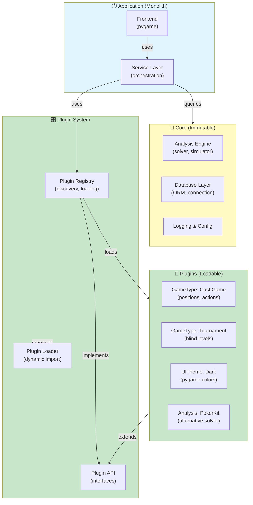

# Architecture C: Modular Monolith with Plugin System

## Overview

This approach creates a **self-contained monolithic application** with **plugin/module system** for extensibility. It balances simplicity with flexibility, allowing easy addition of new game types, analysis engines, and UI themes without modifying core.

**Audience**: Teams wanting extensibility without Clean Architecture complexity, planning to support multiple game types or variations.

**Complexity**: ⭐⭐⭐ - Medium complexity, good middle ground.

---

## Core Principles

1. **Core Engine** - Immutable solver, database, logging
2. **Plugin System** - Game types, analysis engines, UI themes as plugins
3. **Service Discovery** - Registry for plugins
4. **Configuration Driven** - Plugins loaded from config
5. **Isolation** - Plugins can't break core
6. **Versioning** - Plugin API versioning for stability

---

## High-Level Architecture



---

## Package Structure

```
aof_gto_browser_ii_modular/
├── core/                        # Immutable core (no deps on plugins)
│   ├── __init__.py
│   ├── solver/
│   │   ├── all_in_fold_gto.py  # Reused from old app
│   │   └── poker_analyzer.py
│   ├── database/
│   │   ├── connection.py
│   │   ├── models.py
│   │   └── repository.py
│   └── logging_config.py
│
├── plugins/                     # Plugin API definitions
│   ├── __init__.py
│   ├── base.py                 # PluginBase abstract class
│   ├── game_type.py            # GameTypePlugin interface
│   ├── analysis_engine.py      # AnalysisEnginePlugin interface
│   ├── ui_theme.py             # UIThemePlugin interface
│   └── registry.py             # PluginRegistry
│
├── plugin_types/               # Implementations of plugin types
│   ├── __init__.py
│   │
│   ├── game_types/             # Different poker game plugins
│   │   ├── __init__.py
│   │   ├── cash_game_plugin.py
│   │   │   ├── CashGamePlugin
│   │   │   └── positions: [UTG, HJ, CO, BTN, SB, BB]
│   │   │   └── actions: [FOLD, CALL, RAISE]
│   │   ├── tournament_plugin.py
│   │   │   ├── TournamentPlugin
│   │   │   └── blind_levels: [(10,20), (25,50), ...]
│   │   └── high_stakes_plugin.py
│   │
│   ├── analysis_engines/
│   │   ├── __init__.py
│   │   ├── pokerkit_engine.py   # Alternative solver
│   │   └── simulation_engine.py  # Multi-sim strategy
│   │
│   └── ui_themes/
│       ├── __init__.py
│       ├── dark_theme_plugin.py
│       ├── light_theme_plugin.py
│       └── high_contrast_plugin.py
│
├── app/                         # Application layer
│   ├── __init__.py
│   ├── state_manager.py        # Application state
│   ├── service_layer.py        # Orchestration
│   ├── gui/
│   │   ├── __init__.py
│   │   ├── window.py           # Main pygame window
│   │   ├── components/
│   │   │   ├── matrix_panel.py
│   │   │   ├── detail_panel.py
│   │   │   └── base_component.py
│   │   └── event_handler.py
│   └── presenters/
│       ├── matrix_presenter.py
│       └── detail_presenter.py
│
├── config/                      # Configuration
│   ├── __init__.py
│   ├── defaults.yaml
│   ├── schema.py
│   └── loader.py
│
├── main.py                      # Application entry point
└── requirements.txt

tests/
├── unit/
│   ├── test_solver_core.py
│   ├── test_repository.py
│   └── test_state_manager.py
├── integration/
│   ├── test_plugin_loading.py
│   ├── test_plugin_isolation.py
│   └── test_game_type_switching.py
└── e2e/
    └── test_full_app_with_plugins.py
```

---

## Core: Plugin Base Classes

### Plugin Interface Hierarchy

```python
# plugins/base.py

from abc import ABC, abstractmethod
from typing import Dict, Any
from dataclasses import dataclass

@dataclass
class PluginMetadata:
    """Plugin information."""
    name: str
    version: str
    author: str
    description: str
    api_version: str  # e.g., "1.0"

class PluginBase(ABC):
    """Base class for all plugins."""
    
    def __init__(self, metadata: PluginMetadata):
        self.metadata = metadata
    
    @abstractmethod
    def on_load(self) -> bool:
        """Called when plugin is loaded. Return False to fail."""
        pass
    
    @abstractmethod
    def on_unload(self):
        """Called when plugin is about to be unloaded."""
        pass
    
    def get_metadata(self) -> PluginMetadata:
        return self.metadata
    
    def validate_compatibility(self, app_version: str) -> bool:
        """Check if plugin is compatible with app version."""
        return self.metadata.api_version == "1.0"


# plugins/game_type.py

from enum import Enum

class GameTypePlugin(PluginBase):
    """Interface for game type plugins."""
    
    @abstractmethod
    def get_positions(self) -> List[str]:
        """Return list of positions for this game type."""
        pass
    
    @abstractmethod
    def get_actions(self, position: str) -> List[str]:
        """Return valid actions at position."""
        pass
    
    @abstractmethod
    def get_board_states(self) -> List[str]:
        """Return board states: PREFLOP, FLOP, TURN, RIVER."""
        pass
    
    @abstractmethod
    def is_heads_up(self) -> bool:
        """Is this a heads-up game?"""
        pass
    
    @abstractmethod
    def get_sb_bb(self) -> Tuple[float, float]:
        """Return small blind, big blind."""
        pass


# plugins/analysis_engine.py

class AnalysisEnginePlugin(PluginBase):
    """Interface for alternative analysis engines."""
    
    @abstractmethod
    def evaluate_hand(self, hand_key: str, 
                     context: Dict[str, Any]) -> Dict[str, float]:
        """Evaluate hand, return {equity, ev, win_prob, ...}."""
        pass
    
    @abstractmethod
    def supports_batch_evaluation(self) -> bool:
        """Can this engine process batches efficiently?"""
        pass
    
    @abstractmethod
    def get_max_workers(self) -> int:
        """Return optimal worker count."""
        pass


# plugins/ui_theme.py

from dataclasses import dataclass
from typing import Tuple

@dataclass
class ColorScheme:
    """UI color definitions."""
    background: Tuple[int, int, int]
    foreground: Tuple[int, int, int]
    accent: Tuple[int, int, int]
    equity_low: Tuple[int, int, int]
    equity_high: Tuple[int, int, int]

class UIThemePlugin(PluginBase):
    """Interface for UI themes."""
    
    @abstractmethod
    def get_colors(self) -> ColorScheme:
        """Return color scheme for this theme."""
        pass
    
    @abstractmethod
    def get_font_size(self) -> int:
        """Return recommended font size."""
        pass
    
    @abstractmethod
    def get_cell_size(self) -> int:
        """Return matrix cell size in pixels."""
        pass
```

---

## Plugin Registry & Loader

```python
# plugins/registry.py

from typing import Dict, Type, List
from pathlib import Path
import importlib
import inspect

class PluginRegistry:
    """Discovers and manages plugins."""
    
    def __init__(self, plugin_dirs: List[str]):
        self.plugin_dirs = [Path(p) for p in plugin_dirs]
        self.plugins_by_type: Dict[str, Dict[str, PluginBase]] = {}
        self.loaded_plugins: List[PluginBase] = []
    
    def discover_and_load(self):
        """Scan directories and load plugins."""
        
        for plugin_dir in self.plugin_dirs:
            if not plugin_dir.exists():
                continue
            
            for module_path in plugin_dir.glob("*_plugin.py"):
                self._load_module(module_path)
    
    def _load_module(self, module_path: Path):
        """Dynamically import and register plugin."""
        
        try:
            module_name = module_path.stem
            spec = importlib.util.spec_from_file_location(
                module_name, 
                module_path
            )
            module = importlib.util.module_from_spec(spec)
            spec.loader.exec_module(module)
            
            # Find plugin classes in module
            for name, obj in inspect.getmembers(module):
                if inspect.isclass(obj) and issubclass(obj, PluginBase) \
                   and obj is not PluginBase:
                    
                    # Instantiate and validate
                    plugin = obj()
                    
                    if plugin.on_load():
                        self._register_plugin(plugin)
                        self.loaded_plugins.append(plugin)
                        
                        logger.info(f"Loaded plugin: {plugin.metadata.name}")
        
        except Exception as e:
            logger.error(f"Failed to load plugin {module_path}: {e}")
    
    def _register_plugin(self, plugin: PluginBase):
        """Register plugin by type."""
        
        if isinstance(plugin, GameTypePlugin):
            self.plugins_by_type.setdefault("game_type", {})[
                plugin.metadata.name
            ] = plugin
        
        if isinstance(plugin, AnalysisEnginePlugin):
            self.plugins_by_type.setdefault("analysis_engine", {})[
                plugin.metadata.name
            ] = plugin
        
        if isinstance(plugin, UIThemePlugin):
            self.plugins_by_type.setdefault("ui_theme", {})[
                plugin.metadata.name
            ] = plugin
    
    def get_plugin(self, plugin_type: str, 
                  name: str) -> Optional[PluginBase]:
        """Retrieve loaded plugin."""
        return self.plugins_by_type.get(plugin_type, {}).get(name)
    
    def get_plugins_by_type(self, plugin_type: str) -> Dict[str, PluginBase]:
        """Get all plugins of a type."""
        return self.plugins_by_type.get(plugin_type, {})
    
    def unload_all(self):
        """Unload all plugins gracefully."""
        for plugin in reversed(self.loaded_plugins):
            try:
                plugin.on_unload()
            except Exception as e:
                logger.error(f"Error unloading {plugin.metadata.name}: {e}")
```

---

## Example Plugins

### Cash Game Plugin

```python
# plugin_types/game_types/cash_game_plugin.py

from plugins.game_type import GameTypePlugin
from plugins.base import PluginMetadata

class CashGamePlugin(GameTypePlugin):
    """Standard 6-max cash game."""
    
    def __init__(self):
        metadata = PluginMetadata(
            name="CashGame",
            version="1.0",
            author="poker-dev",
            description="Standard 6-max cash game (1/2, 2/5, etc.)",
            api_version="1.0"
        )
        super().__init__(metadata)
    
    def on_load(self) -> bool:
        logger.info("CashGame plugin loaded")
        return True
    
    def on_unload(self):
        logger.info("CashGame plugin unloaded")
    
    def get_positions(self) -> List[str]:
        return ["UTG", "HJ", "CO", "BTN", "SB", "BB"]
    
    def get_actions(self, position: str) -> List[str]:
        return ["FOLD", "CALL", "MIN_RAISE", "2BB_RAISE", 
                "3BB_RAISE", "4BB_RAISE", "5BB_RAISE", "ALL_IN"]
    
    def get_board_states(self) -> List[str]:
        return ["PREFLOP", "FLOP", "TURN", "RIVER"]
    
    def is_heads_up(self) -> bool:
        return False
    
    def get_sb_bb(self) -> Tuple[float, float]:
        return (0.5, 1.0)  # Configurable per table


# plugin_types/game_types/tournament_plugin.py

class TournamentPlugin(GameTypePlugin):
    """Tournament with blind levels."""
    
    def __init__(self):
        metadata = PluginMetadata(
            name="Tournament",
            version="1.0",
            author="poker-dev",
            description="Tournament with escalating blinds",
            api_version="1.0"
        )
        super().__init__(metadata)
        self.current_level = 0
        self.blind_levels = [
            (10, 20), (15, 30), (25, 50), (50, 100),
            (100, 200), (150, 300), (200, 400),
            (300, 600), (500, 1000), (1000, 2000)
        ]
    
    def on_load(self) -> bool:
        logger.info("Tournament plugin loaded")
        return True
    
    def on_unload(self):
        pass
    
    def get_positions(self) -> List[str]:
        return ["UTG", "UTG+1", "HJ", "CO", "BTN", "SB", "BB"]
    
    def get_actions(self, position: str) -> List[str]:
        return ["FOLD", "CALL", "SHOVE"]  # Simplified for tournaments
    
    def get_board_states(self) -> List[str]:
        return ["PREFLOP", "FLOP", "TURN", "RIVER"]
    
    def is_heads_up(self) -> bool:
        return False
    
    def get_sb_bb(self) -> Tuple[float, float]:
        sb, bb = self.blind_levels[self.current_level]
        return (sb, bb)
    
    def set_blind_level(self, level: int):
        """Allow external control of blind level."""
        if 0 <= level < len(self.blind_levels):
            self.current_level = level
```

### Dark Theme Plugin

```python
# plugin_types/ui_themes/dark_theme_plugin.py

from plugins.ui_theme import UIThemePlugin, ColorScheme
from plugins.base import PluginMetadata

class DarkThemePlugin(UIThemePlugin):
    """Dark theme for GUI."""
    
    def __init__(self):
        metadata = PluginMetadata(
            name="Dark",
            version="1.0",
            author="poker-dev",
            description="Dark theme with blue accents",
            api_version="1.0"
        )
        super().__init__(metadata)
    
    def on_load(self) -> bool:
        return True
    
    def on_unload(self):
        pass
    
    def get_colors(self) -> ColorScheme:
        return ColorScheme(
            background=(30, 30, 40),
            foreground=(220, 220, 220),
            accent=(66, 165, 245),
            equity_low=(244, 67, 54),     # Red for low equity
            equity_high=(76, 175, 80)     # Green for high equity
        )
    
    def get_font_size(self) -> int:
        return 11
    
    def get_cell_size(self) -> int:
        return 50
```

---

## Application Service Layer

```python
# app/service_layer.py

from core.repository import Repository
from core.solver import AllInFoldGTOSolver
from plugins.registry import PluginRegistry
from app.state_manager import StateManager

class ApplicationService:
    """Orchestrates application logic using plugins."""
    
    def __init__(self, repository: Repository,
                 solver: AllInFoldGTOSolver,
                 plugin_registry: PluginRegistry,
                 state_manager: StateManager):
        self.repository = repository
        self.solver = solver
        self.registry = plugin_registry
        self.state = state_manager
    
    def switch_game_type(self, game_type_name: str) -> bool:
        """Switch to different game type plugin."""
        
        game_plugin = self.registry.get_plugin("game_type", game_type_name)
        if not game_plugin:
            logger.error(f"Game type plugin '{game_type_name}' not found")
            return False
        
        # Update state with new positions/actions
        self.state.set_available_positions(game_plugin.get_positions())
        self.state.set_available_actions(game_plugin.get_actions)
        self.state.current_game_type = game_type_name
        
        logger.info(f"Switched to game type: {game_type_name}")
        return True
    
    def switch_theme(self, theme_name: str) -> bool:
        """Switch UI theme plugin."""
        
        theme_plugin = self.registry.get_plugin("ui_theme", theme_name)
        if not theme_plugin:
            return False
        
        self.state.current_theme = theme_name
        
        logger.info(f"Switched to theme: {theme_name}")
        return True
    
    def get_available_game_types(self) -> List[str]:
        """List loaded game type plugins."""
        plugins = self.registry.get_plugins_by_type("game_type")
        return list(plugins.keys())
    
    def get_available_themes(self) -> List[str]:
        """List loaded theme plugins."""
        plugins = self.registry.get_plugins_by_type("ui_theme")
        return list(plugins.keys())
    
    def precompute_matrix(self, position: str, action: str,
                         progress_callback):
        """Start precompute with current game type."""
        
        game_plugin = self.registry.get_plugin(
            "game_type", 
            self.state.current_game_type
        )
        
        # Generate hands using plugin
        positions = game_plugin.get_positions()
        # ... coordinate with solver
```

---

## Configuration with Plugins

```yaml
# config.yaml

app:
  version: "2.0"
  window_width: 1400
  window_height: 900

database:
  url: sqlite:///./poker_gto.db

plugins:
  # Directories to scan for plugins
  directories:
    - ./plugin_types/game_types
    - ./plugin_types/analysis_engines
    - ./plugin_types/ui_themes
  
  # Default plugins to load
  defaults:
    game_type: CashGame
    ui_theme: Dark
    analysis_engine: AllInFoldGTO

# Per-game configuration
game_configs:
  CashGame:
    sb: 0.5
    bb: 1.0
    max_position: 6
  
  Tournament:
    starting_bb: 20
    blind_increase_interval_minutes: 20
```

---

## Application Composition

```python
# main.py

from pathlib import Path
from core.database import DatabaseConnection
from core.solver import AllInFoldGTOSolver
from plugins.registry import PluginRegistry
from app.service_layer import ApplicationService
from app.state_manager import StateManager
from app.gui.window import GuiWindow

def bootstrap_application():
    """Wire up entire application with plugins."""
    
    # Load configuration
    config = load_config("config.yaml")
    
    # Core infrastructure (always loaded)
    db_conn = DatabaseConnection(config.database.url)
    repository = Repository(db_conn)
    solver = AllInFoldGTOSolver()
    
    # Plugin system
    plugin_dirs = config.plugins.directories
    registry = PluginRegistry(plugin_dirs)
    registry.discover_and_load()
    
    # Verify plugins loaded
    game_types = registry.get_plugins_by_type("game_type")
    if not game_types:
        raise RuntimeError("No game type plugins found!")
    
    # Application state
    state = StateManager(
        default_game_type=config.plugins.defaults.game_type,
        default_theme=config.plugins.defaults.ui_theme
    )
    
    # Application service
    service = ApplicationService(
        repository=repository,
        solver=solver,
        plugin_registry=registry,
        state_manager=state
    )
    
    # GUI (consumes default game type)
    gui = GuiWindow(
        service=service,
        state=state,
        registry=registry
    )
    
    return gui, registry


if __name__ == "__main__":
    gui, registry = bootstrap_application()
    
    try:
        gui.run()
    finally:
        registry.unload_all()
```

---

## Testing Plugin Loading

```python
# tests/integration/test_plugin_loading.py

def test_load_and_switch_game_types():
    """Test plugin loading and game type switching."""
    
    registry = PluginRegistry(["plugin_types/game_types"])
    registry.discover_and_load()
    
    # Verify multiple game types loaded
    game_types = registry.get_plugins_by_type("game_type")
    assert "CashGame" in game_types
    assert "Tournament" in game_types
    
    # Verify interface compliance
    cash_plugin = game_types["CashGame"]
    assert len(cash_plugin.get_positions()) > 0
    assert len(cash_plugin.get_actions("BTN")) > 0


def test_plugin_isolation():
    """Ensure failed plugins don't break app."""
    
    # Create registry with bad plugin path
    registry = PluginRegistry(["nonexistent_path"])
    
    # Should not crash, just no plugins
    registry.discover_and_load()
    
    assert len(registry.loaded_plugins) == 0


def test_game_type_plugin_contract():
    """Verify plugins implement required interface."""
    
    registry = PluginRegistry(["plugin_types/game_types"])
    registry.discover_and_load()
    
    for plugin_name, plugin in registry.get_plugins_by_type("game_type").items():
        assert hasattr(plugin, 'get_positions')
        assert hasattr(plugin, 'get_actions')
        assert hasattr(plugin, 'get_board_states')
        
        # Verify valid responses
        positions = plugin.get_positions()
        assert isinstance(positions, list)
        assert len(positions) > 0
```

---

## Adding a New Game Type

### Step 1: Create Plugin File
```python
# plugin_types/game_types/short_deck_plugin.py

from plugins.game_type import GameTypePlugin
from plugins.base import PluginMetadata

class ShortDeckPlugin(GameTypePlugin):
    """Short Deck Hold'em (remove 2-5)."""
    
    def __init__(self):
        super().__init__(PluginMetadata(
            name="ShortDeck",
            version="1.0",
            author="poker-dev",
            description="Short Deck Hold'em",
            api_version="1.0"
        ))
    
    # Implement interface...
```

### Step 2: Update config.yaml
```yaml
plugins:
  directories:
    - ./plugin_types/game_types  # Auto-scans
```

### Step 3: No Code Changes Required!
The plugin is automatically discovered and loaded at startup.

---

## Advantages & Disadvantages

### ✅ Advantages
- **Extensibility** - Add game types without modifying core
- **Maintainability** - Plugins are isolated, self-contained
- **Configuration Driven** - Load/unload plugins without recompiling
- **Gradual Adoption** - Start simple, add plugins as needed
- **Experimentation** - Easy to test alternative engines
- **User Plugins** - Users can write custom game types
- **Monolithic Simplicity** - No network complexity, debugging easier

### ⚠️ Disadvantages
- **Plugin API Design** - Need to design good interfaces upfront
- **Version Compatibility** - Dealing with plugin version conflicts
- **Runtime Discovery** - Errors might only appear at runtime
- **Module Coupling** - Plugins still in same process, can affect each other
- **Complex Testing** - Plugin loading/unloading requires careful test cleanup
- **Documentation Overhead** - Plugin developers need documentation

---

## Comparison: All Three Architectures

| Aspect | A (Layered) | B (Clean) | C (Modular) |
|--------|---|---|---|
| **Complexity** | Low | High | Medium |
| **Extensibility** | Good | Excellent | Excellent |
| **Testability** | Good | Excellent | Good |
| **Framework Coupling** | Moderate | None | Moderate |
| **Multi-UI Support** | Requires work | Built-in | Requires plugin impl |
| **Multiple Analysis Engines** | Hard | Easy | Via plugin |
| **New Game Types** | Code changes | Code changes | Plugin (no code) |
| **Learning Curve** | Low | High | Medium |
| **Best For** | Most projects | Large/long teams | Extensible systems |
| **Example Use** | MVP, startups | Enterprise | Poker ecosystems |

---

## Recommendation Matrix

Choose **Architecture A** if:
- Team < 5 people
- Single game type
- Single UI (pygame)
- Timeline < 12 months
- Clear requirements

Choose **Architecture B** if:
- Team > 10 people
- Multi-year project
- Multiple UI frameworks planned
- Heavy business logic
- Long maintenance needed

Choose **Architecture C** if:
- Extensibility key requirement
- Multiple analysis engines
- Multiple game types
- User customizations important
- Community/plugin ecosystem planned

---

## Conclusion

**Architecture C** is ideal for AoF GTO Browser II if you want:
- Support for multiple game types (cash, tournament, heads-up, etc.)
- Alternative analysis engines
- Customizable themes
- Easy community contributions
- Clear separation without over-engineering

The plugin system provides a **professional, extensible foundation** while remaining simpler than Clean Architecture.
