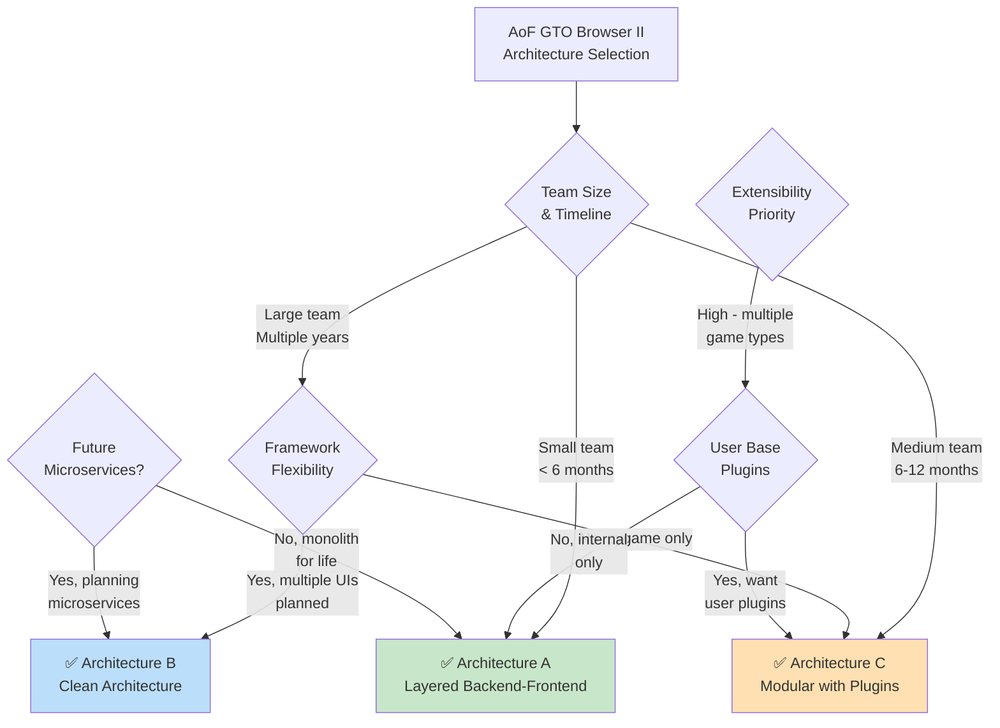
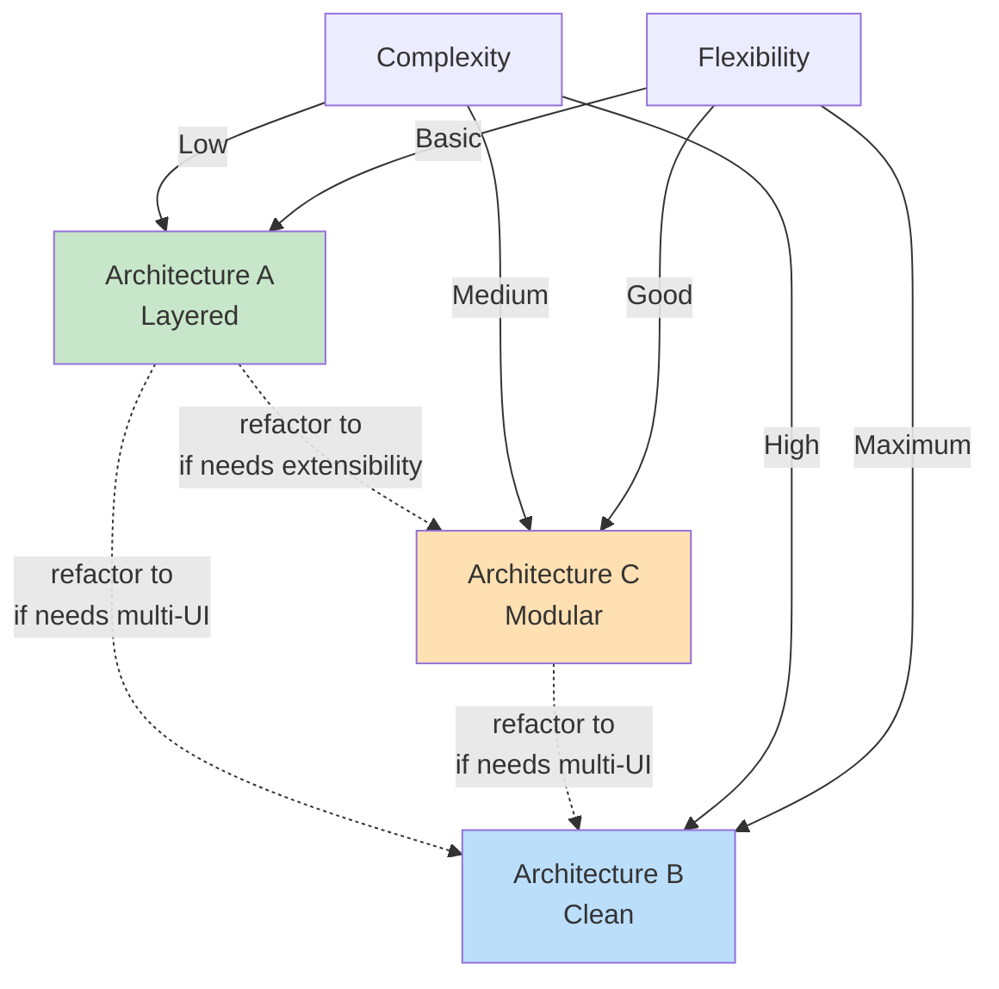
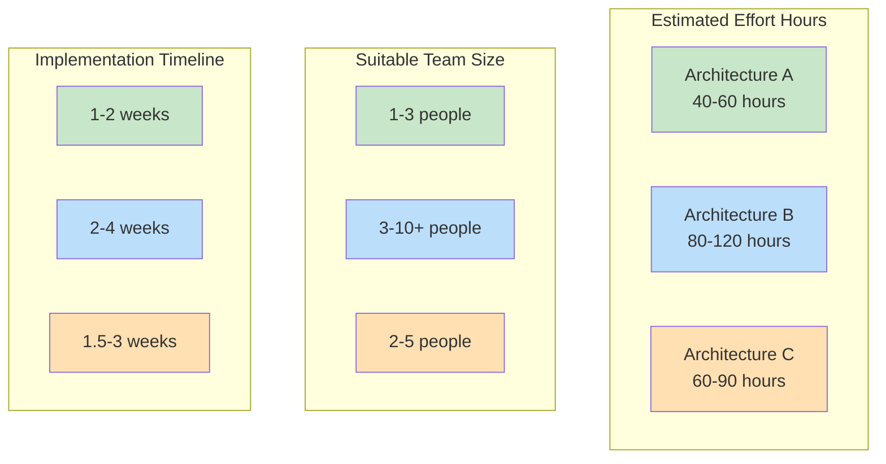

# Architecture Comparison & Decision Guide

## Quick Reference Matrix



---

## Architecture Selection Decision Tree

### Scenario Analysis

#### Scenario 1: Solo Developer, MVP Phase
```
📊 Profile:
- 1 developer
- 3-month timeline
- Single game type (cash)
- Just need poker calculations GUI
- Future uncertain

✅ Recommendation: Architecture A (Layered)

Why:
- Simplest to implement and understand
- Fastest time to market
- Clear separation good enough
- Easy to refactor if successful
```

#### Scenario 2: Small Team, Multiple Game Types
```
📊 Profile:
- 2-3 developers
- 6-month timeline
- Support: Cash, Tournament, Heads-Up games
- Different analysis needs per game type
- Potential for community plugins later

✅ Recommendation: Architecture C (Modular)

Why:
- Plugin system handles game type variations
- No code changes to add new games
- Clear extension points
- Medium complexity is manageable
```

#### Scenario 3: Enterprise, Multi-Platform
```
📊 Profile:
- 10+ developers split across teams
- 18-month timeline
- Desktop (pygame), Web API, Mobile planned
- Complex business logic requiring testing
- VERY long maintenance horizon

✅ Recommendation: Architecture B (Clean)

Why:
- Clean boundaries enforce separation
- Framework-agnostic core testable
- Multiple UI implementations without duplication
- Scales to microservices if needed
- Professional architecture for large codebases
```

#### Scenario 4: Researcher/Academic
```
📊 Profile:
- 2-3 researchers
- Frequent algorithm changes
- Benchmarking different solvers
- Not production software
- Minimal testing overhead

✅ Recommendation: Architecture A + Alternative Engines (Modular plugin system)

Why:
- Just enough structure
- Can add solver plugins without refactoring
- Flexibility for experimentation
```

---

## Feature Comparison

### Core Features

| Feature | Required | A | B | C |
|---------|:--------:|:--:|:--:|:--:|
| **Basic Poker Analysis** | ✓ | ✓ | ✓ | ✓ |
| **13x13 Hand Matrix GUI** | ✓ | ✓ | ✓ | ✓ |
| **Precompute Management** | ✓ | ✓ | ✓ | ✓ |
| **Database Persistence** | ✓ | ✓ | ✓ | ✓ |
| **Configuration Support** | ✓ | ✓ | ✓ | ✓ |

### Advanced Features

| Feature | Nice-to-Have | A | B | C |
|---------|:-----:|:--:|:--:|:--:|
| **Multiple Game Types** | ✓ | âš ️ | ✓ | ✓✓ |
| **Custom Themes** | ✓ | âš ️ | ✓ | ✓✓ |
| **Alternative Solvers** | ✓ | âš ️ | ✓ | ✓✓ |
| **Web UI** | ✓ | âš ️ | ✓✓ | âš ️ |
| **Mobile App** | ✓ | ✗ | ✓ | ✗ |
| **User Plugins** | ✓ | ✗ | ✗ | ✓✓ |
| **Microservices** | ✓ | ✗ | ✓ | ✗ |

Legend: ✓ = supported, âš ️ = possible with work, ✓✓ = excellent support, ✗ = not supported

---

## Architecture Characteristics

### Architecture A: Layered Backend-Frontend

**Structure:**
```
Frontend (pygame)
    ↓ imports
Backend (solver, DB)
    ↓ imports
Shared (DTOs)
```

**Best For:**
- ✅ Straightforward applications
- ✅ Single UI (pygame)
- ✅ Small to medium teams
- ✅ Quick implementation
- ✅ Gradual evolution

**Trade-offs:**
- ⚠️ Mixing concerns possible (discipline required)
- ⚠️ Hard-coded game types
- ⚠️ Porting to new UI requires refactoring
- ⚠️ Testing requires some mocking

**Lines of Code Estimate:**
- Core: ~800 LOC
- Frontend: ~1,200 LOC
- Tests: ~1,500 LOC
- **Total: ~3,500 LOC**

---

### Architecture B: Clean Architecture with Adapters

**Structure:**
```
Entities (no deps)
    ↓
Use Cases (only entities)
    ↓
Interface Adapters
    ↓ implements
Frameworks (pygame, SQLAlchemy)
```

**Best For:**
- ✅ Complex business logic
- ✅ Professional architecture
- ✅ Multiple UI frameworks
- ✅ Long-term projects
- ✅ Large teams

**Trade-offs:**
- ⚠️ Higher complexity
- ⚠️ More files and code
- ⚠️ Learning curve
- ⚠️ Potential over-engineering

**Lines of Code Estimate:**
- Entities: ~300 LOC
- Use Cases: ~800 LOC
- Interface Adapters: ~600 LOC
- Frameworks: ~1,000 LOC
- Tests: ~2,500 LOC
- **Total: ~5,200 LOC**

---

### Architecture C: Modular Monolith with Plugins

**Structure:**
```
Core (immutable)
    ↓
Plugin System (registry, API)
    ↓
Plugins (game types, engines, themes)
    ↓
Application (GUI, services)
```

**Best For:**
- ✅ Extensibility is key
- ✅ Multiple variations (game types)
- ✅ Community ecosystem
- ✅ Medium complexity
- ✅ Experimental features

**Trade-offs:**
- ⚠️ Plugin API design critical
- ⚠️ Version compatibility issues
- ⚠️ Runtime discovery errors
- ⚠️ Plugins can interfere with each other

**Lines of Code Estimate:**
- Core: ~600 LOC
- Plugin System: ~500 LOC
- Sample Plugins: ~800 LOC
- Application: ~1,000 LOC
- Tests: ~1,800 LOC
- **Total: ~4,700 LOC**

---

## Complexity vs. Flexibility Trade-off



**Key Insight:** Start with A, migrate to C or B if needed.

---

## Implementation Effort Comparison



---

## Risk Analysis

### Architecture A Risks

| Risk | Severity | Mitigation |
|------|:--------:|-----------|
| Monolithic entanglement | Medium | Clear package boundaries, code reviews |
| Framework lock-in | High | Prepare to migrate to B if multi-UI needed |
| Hard-coded game types | Medium | Use configuration, prepare plugin system |
| Testing limitations | Low | Mock carefully, integration tests |

### Architecture B Risks

| Risk | Severity | Mitigation |
|------|:--------:|-----------|
| Over-engineering | High | Demonstrate need before building |
| Team learning curve | High | Pair programming, architecture docs |
| Implementation complexity | High | Start with use cases, integrate frameworks gradually |
| Cyclic imports | Medium | Careful module organization |

### Architecture C Risks

| Risk | Severity | Mitigation |
|------|:--------:|-----------|
| Plugin API design | High | Design carefully before building plugins |
| Compatibility issues | Medium | Version API, test plugin loading |
| Runtime errors | Medium | Good error handling, logging |
| Plugin interference | Low | Process isolation if needed later |

---

## Migration Paths

### Path 1: A → B (Layered → Clean)

```
Architecture A
├── Extract use cases from services
├── Create entity layer (frozen dataclasses)
├── Define ports (Abstract Base Classes)
├── Implement adapters for frameworks
└─> Architecture B

Timeline: 20-30 hours
Risk: Medium (complete rewrite of core)
```

### Path 2: A → C (Layered → Modular)

```
Architecture A
├── Create plugin base classes
├── Implement plugin registry
├── Extract game type logic to plugin
├── Move configuration to plugin loaders
└─> Architecture C

Timeline: 15-20 hours
Risk: Low (additive changes)
```

### Path 3: C → B (Modular → Clean)

```
Architecture C
├── Extract plugin interfaces to ports
├── Create use cases using ports
├── Build entity layer
├── Migrate adapter implementations
└─> Architecture B

Timeline: 25-40 hours
Risk: Medium (significant refactoring)
```

---

## Real-World Decision Examples

### Decision 1: "We want multiple game types"

```
Game Types Needed: CashGame, Tournament, HeadsUp
Decision: Architecture C

Reasoning:
- Plugin system perfect for game type variations
- Each game type = one plugin file
- No code changes to add new games
- Clear separation of concerns
```

### Decision 2: "We might build a web version later"

```
UI Targets: Desktop (current) + Web (future)
Decision: Architecture B

Reasoning:
- Clean architecture enables clean separation
- Web Django adapter ← use cases ← entities
- Zero duplication of business logic
- Each UI framework = one adapter implementation
```

### Decision 3: "Small team, tight timeline"

```
Team: 1-2 developers
Timeline: 6 weeks
Decision: Architecture A

Reasoning:
- Simplest to implement
- Fastest time to market
- Small codebase easy to refactor later
- Good foundation for learning patterns
```

### Decision 4: "Community-driven poker platform"

```
Scenario: Want user plugins for custom games/analysis
Decision: Architecture C with expansion to B

Phase 1: Architecture C (plugins for game types + solvers)
Phase 2: Architecture B (REST API for web/mobile)

Reasoning:
- Plugins crucial for community
- Clean architecture enables API layer
- Modular monolith is good MVP
```

---

## Quick Selection Checklist

### Choose Architecture A if:
- [ ] Team size: 1-3 people
- [ ] Timeline: < 6 months
- [ ] Single UI: pygame only
- [ ] Single game type: CashGame
- [ ] MVP mindset: get working quickly
- [ ] Willing to refactor later if needed

**Score: 6/6 → Go with A ✅**

### Choose Architecture C if:
- [ ] Team size: 2-5 people
- [ ] Timeline: 6-12 months
- [ ] Multiple game types: Cash, Tournament, etc.
- [ ] Customizable themes needed
- [ ] Potential for alternative solvers
- [ ] Community plugins desired

**Score: 4-6/6 → Go with C ✅**

### Choose Architecture B if:
- [ ] Team size: 5+ people
- [ ] Timeline: 12+ months
- [ ] Multiple UIs: Desktop + Web + Mobile
- [ ] Complex business logic
- [ ] Enterprise requirements
- [ ] Long-term maintenance critical

**Score: 4-6/6 → Go with B ✅**

---

## Recommended Starting Point

### For AoF GTO Browser II Specifically:

```
✅ RECOMMENDATION: Start with Architecture A

Rationale:
1. Incremental improvement over existing app
2. Reuses proven components (solver, DB)
3. Clear separation without over-engineering
4. Fast implementation (4-6 weeks)
5. Test bed for understanding design needs

Upgrade Path:
- If need multiple game types → Refactor to Architecture C
- If need Web UI → Refactor to Architecture B
- If both → Proceed directly to Architecture B
```

### Implementation Sequence for Architecture A

```
Phase 1: Foundation (Week 1)
├── Backend services (solver facade, query service)
├── Shared DTOs (context, payloads)
└── Database repository abstraction

Phase 2: Frontend Rewrite (Week 2-3)
├── State manager (view state)
├── Event handler (input routing)
├── Component presenters (data formatting)
└── GUI components (pygame UI)

Phase 3: Integration & Refinement (Week 4-5)
├── Full integration testing
├── Performance optimization
├── Database schema validation
└── Configuration system

Phase 4: Polish & Documentation (Week 6)
├── Error handling
├── Logging
├── Documentation
└── Migration from old browser
```

---

## Architecture Comparison Table (Detailed)

| Dimension | Architecture A | Architecture B | Architecture C |
|-----------|---|---|---|
| **Learning Curve** | Easy | Hard | Medium |
| **Implementation Time** | 4-6 weeks | 8-12 weeks | 6-10 weeks |
| **Code Duplication Risk** | Medium | Low | Low |
| **Testing Complexity** | Medium | Low | Medium |
| **Framework Dependencies** | Moderate | None | Moderate |
| **Scalability** | Good | Excellent | Good |
| **Multiple UI Support** | Difficult | Easy | Medium |
| **Plugin Extensibility** | Not built-in | Possible | Built-in |
| **Microservices Path** | Hard | Easy | Medium |
| **Developer Onboarding** | 1-2 days | 1-2 weeks | 3-5 days |
| **Maintenance Cost** | Medium | High (but structured) | Low |
| **Refactoring Flexibility** | Good | Excellent | Excellent |

---

## Conclusion & Recommendation

For **AoF GTO Browser II**, the recommendation hierarchy is:

### 1. **Architecture A** (Preferred) ⭐⭐⭐⭐⭐
- Clean separation without over-engineering
- Fast to implement and validate ideas
- Low risk, easy to migrate to B or C later
- Perfect for 1-3 person team on 6-month timeline
- Reuses existing components effectively

### 2. **Architecture C** (Strong Alternative) ⭐⭐⭐⭐
- Best if multiple game types are priority
- Plugin system future-proofs extensibility
- Medium complexity, good balance
- Community-friendly architecture

### 3. **Architecture B** (Future Upgrade Path) ⭐⭐⭐
- Only if multi-platform is immediate need
- Overly complex for current stage
- Great migration target from A or C

---

## Next Steps

1. **Team Alignment** - Review this guide with your team
2. **Scenario Validation** - Confirm which scenario matches your situation
3. **Design Selection** - Choose one of the three architectures
4. **Detailed Planning** - Read the corresponding architecture document
5. **Implementation** - Start with Phase 1 of chosen architecture
6. **Regular Reviews** - Re-evaluate quarterly as needs evolve

All detailed architecture specifications are in the following documents:
- `02_ARCHITECTURE_A.md` - Layered Backend-Frontend
- `03_ARCHITECTURE_B.md` - Clean Architecture with Adapters  
- `04_ARCHITECTURE_C.md` - Modular Monolith with Plugins
