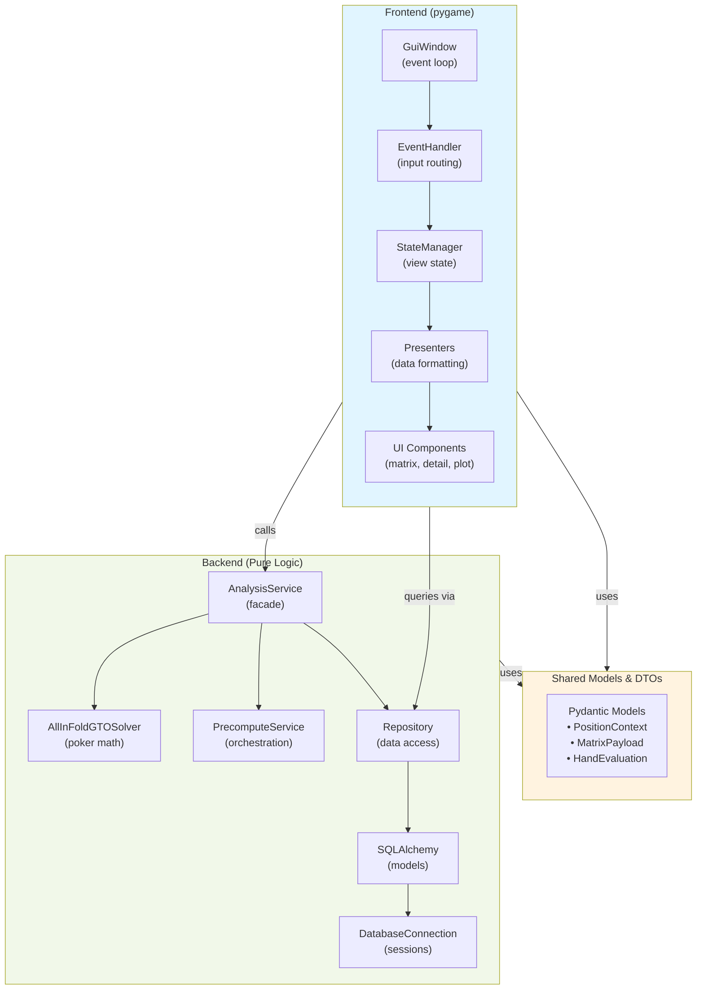
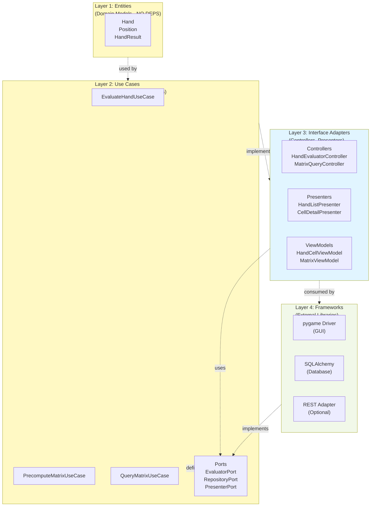
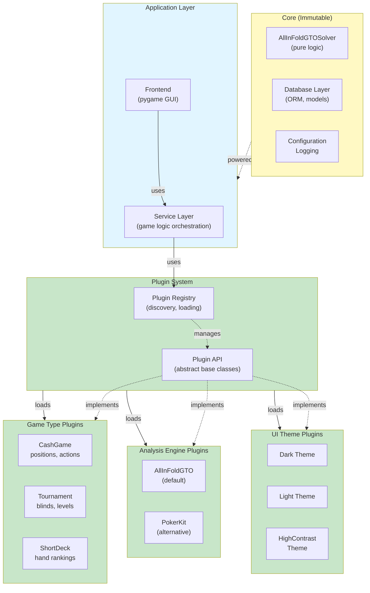
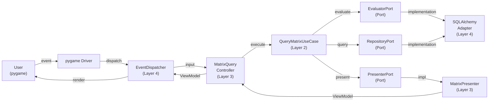
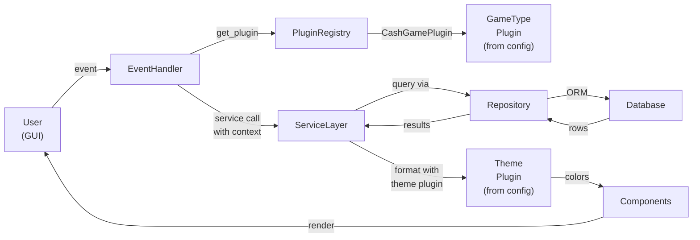
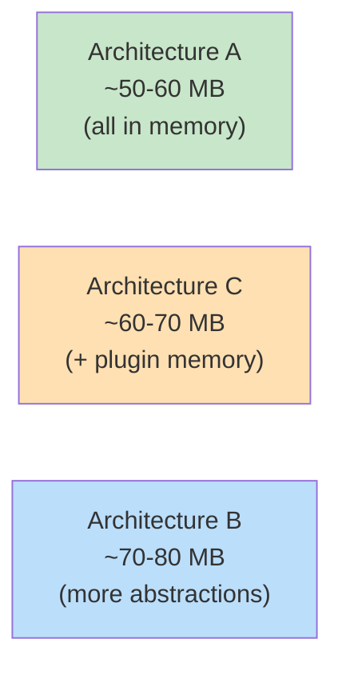
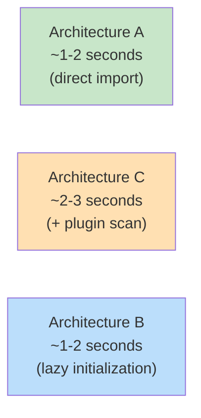
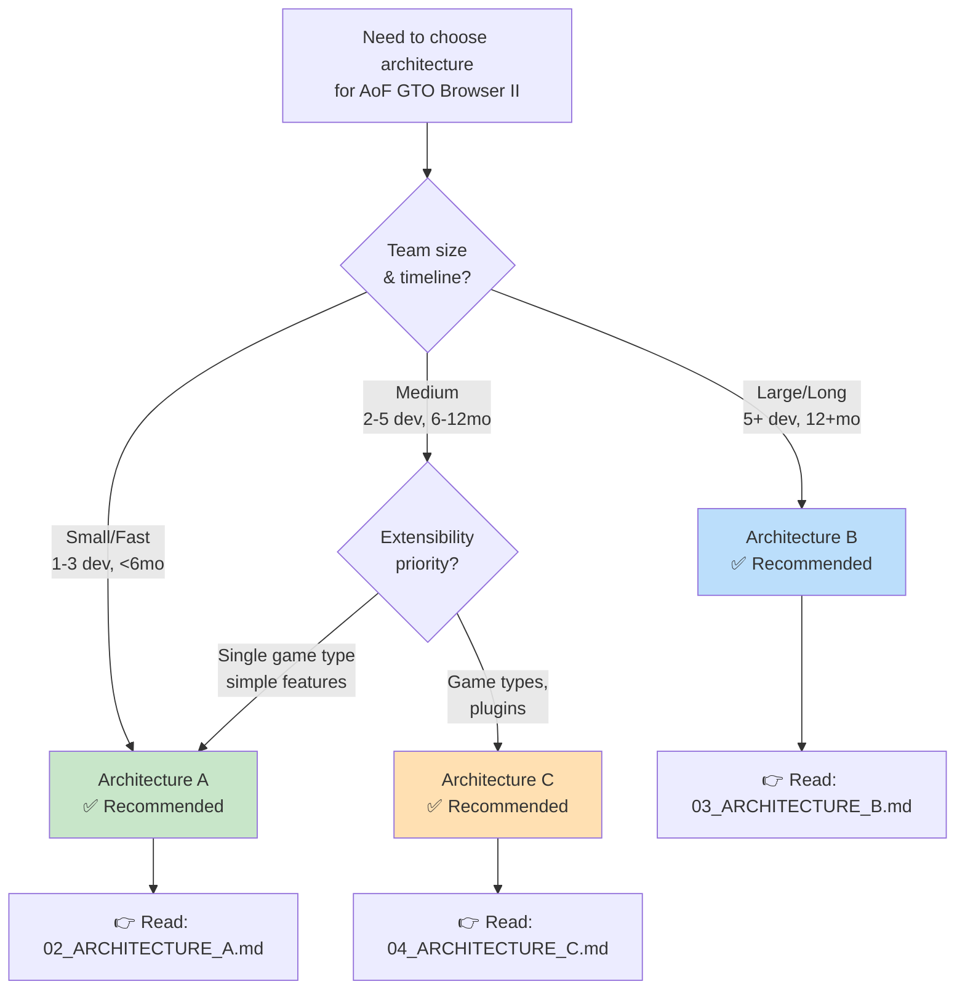

# Architecture Visual Guide & Migration Roadmap

## Visual Architecture Comparison

### Architecture A: Layered Backend-Frontend



**Key Characteristics:**
- Direct imports between packages
- Simple and clear
- No enforced boundaries
- Easy to understand and debug
- Risk: monolithic entanglement over time

---

### Architecture B: Clean Architecture with Adapters



**Key Characteristics:**
- Strict dependency rule: inner layers independent
- Zero framework dependencies in core
- Completely testable business logic
- Framework-agnostic (swap pygame for Qt/web)
- Risk: over-engineering for small projects

---

### Architecture C: Modular Monolith with Plugins



**Key Characteristics:**
- Core is immutable and extensible via plugins
- Game types/engines/themes as plugins
- Configuration-driven loading
- Good balance of simplicity and extensibility
- Risk: plugin compatibility issues

---

## Data Flow Comparison

### Architecture A: Query Flow

```mermaid
graph LR
    User["User<br/>(GUI)"] -->|mouse event| EH["EventHandler"]
    EH -->|update_selection| SM["StateManager<br/>(view state)"]
    SM -->|query_matrix<br/>Position, Action| Repo["Repository<br/>(data access)"]
    Repo -->|ORM query| DB["SQLAlchemy<br/>to Database"]
    DB -->|rows| Repo
    Repo -->|[MatrixCell]| SM
    SM -->|format| Pres["MatrixPresenter"]
    Pres -->|MatrixPayload| GUI["Components"]
    GUI -->|render| User
```

**Characteristics:**
- Synchronous data flow
- Simple to trace
- StateManager triggers updates
- No intermediate services layer

---

### Architecture B: Query Flow



**Characteristics:**
- Unidirectional dependencies
- Ports provide abstraction
- Adapters implement ports
- Framework-independent core

---

### Architecture C: Query Flow



**Characteristics:**
- Plugins loaded at startup
- Service layer uses plugin registry
- Configuration drives plugin selection
- Real-time plugin availability

---

## Performance Characteristics

### Memory Footprint



### Startup Time



### Query Latency (typical)

```
Architecture A:  GUI → StateManager → Presenter → Components = ~5ms
Architecture B:  GUI → Controller → UseCase → Presenter → Components = ~5ms  
Architecture C:  GUI → Service → Plugin → Presenter → Components = ~5-10ms
```

All acceptable for interactive GUI.

---

## Migration Roadmap: A → C

If you start with Architecture A and decide to add plugin system:

### Phase 1: Foundation (2-3 days)

```
1. Create plugins/ package structure
2. Define plugin base classes:
   - PluginBase (ABC)
   - GameTypePlugin
   - AnalysisEnginePlugin
   - UIThemePlugin
3. Create PluginRegistry
4. Create PluginLoader
5. Write tests for plugin discovery
```

### Phase 2: Extract First Plugin (3-5 days)

```
1. Create CashGamePlugin
   - Extract position/action definitions
   - Implement get_positions(), get_actions()
   - Move configuration to plugin
2. Update ServiceLayer to use plugin
3. Add game type switching logic
4. Update config.yaml for plugin paths
5. Test game type switching
```

### Phase 3: Extract Additional Plugins (2-3 days each)

```
Per plugin:
1. Create plugin class
2. Implement required interfaces
3. Move logic from hardcoded to plugin
4. Test integration with registry
5. Update documentation
```

### Phase 4: Refactor Service Layer (2-3 days)

```
1. Move game type awareness to registry
2. Remove hardcoded game type logic
3. Dynamic position/action generation
4. Update GUI to use registry
5. Test all variations
```

### Result: Full Architecture C

**Total Migration Effort: ~5-10 days for experienced developer**

---

## Migration Roadmap: A → B

If you start with Architecture A and later need clean boundaries:

### Phase 1: Extract Entities (3-5 days)

```
1. Create entities/ package
2. Define value objects:
   - Hand
   - Position
   - Action
   - HandResult
   - Board
3. Move business logic from external classes
4. Make immutable (frozen dataclasses)
5. Write entity tests
```

### Phase 2: Extract Use Cases (5-7 days)

```
1. Identify core business logic
2. Create use_cases/ package
3. Define ports (ABC):
   - EvaluatorPort
   - RepositoryPort
   - PresenterPort
4. Extract use case logic:
   - EvaluateHandUseCase
   - PrecomputeMatrixUseCase
   - QueryMatrixUseCase
5. Write use case tests (no framework mocks)
```

### Phase 3: Create Adapters (5-7 days)

```
1. Create interface_adapters/ package
2. Controllers:
   - MatrixQueryController
   - HandEvaluatorController
3. Presenters:
   - MatrixPresenter
   - DetailPresenter
4. ViewModels (DTO structures)
5. Wire controllers and presenters
```

### Phase 4: Framework Integration (5-7 days)

```
1. Create frameworks/ package
2. Implement SQLAlchemyAdapter (RepositoryPort)
3. Implement PygameDriver (components with injected adapters)
4. Create EventDispatcher for routing
5. Wire everything in app.py
6. Test complete flow
```

### Phase 5: Testing & Validation (3-5 days)

```
1. Unit tests for entities (pure logic)
2. Unit tests for use cases (no mocks)
3. Integration tests with adapters
4. E2E tests (full application)
5. Refactor duplicated logic
```

### Result: Full Architecture B

**Total Migration Effort: ~25-35 days for experienced developer**

---

## Metrics to Track

### Code Quality Metrics by Architecture

| Metric | Goal | A | B | C |
|--------|:----:|:--:|:--:|:--:|
| **Cyclomatic Complexity** | < 10 | ✓ | ✓ | ✓ |
| **Class Size** | < 300 LOC | âš ️ | ✓ | ✓ |
| **Function Size** | < 30 LOC | âš ️ | ✓ | ✓ |
| **Test Coverage** | > 80% | âš ️ | ✓ | ✓ |
| **Coupling** | Low | âš ️ | ✓ | ✓ |
| **Cohesion** | High | âš ️ | ✓ | ✓ |
| **Import Cycles** | 0 | âš ️ | ✓ | âš ️ |

**Interpretation:**
- ✓ = Architecture naturally supports
- âš ️ = Requires discipline from developers

---

## Dependency Injection Comparison

### Architecture A (Constructor Injection)

```python
def create_app():
    db = DatabaseConnection("sqlite://")
    repo = Repository(db)
    service = AnalysisService(repo)
    gui = GuiWindow(service, repo)
    return gui
```

**Pros:**
- Simple and straightforward
- Good for small projects
- Easy to understand

**Cons:**
- Deep dependency chains
- Hard to mock in tests
- Configuration coupled to DI

---

### Architecture B (Port Injection)

```python
def create_app():
    db = DatabaseConnection("sqlite://")
    
    # Ports are injected with implementations
    repo_impl = SQLAlchemyRepository(db)
    evaluator_impl = PokerEngineEvaluator()
    presenter_impl = MatrixPresenter()
    
    # Use cases receive only ports
    use_case = QueryMatrixUseCase(
        evaluator=evaluator_impl,
        repository=repo_impl,
        presenter=presenter_impl
    )
    
    # Adapters are just wrappers
    return setup_pygame_driver(use_case)
```

**Pros:**
- Explicit dependencies
- Easy to swap implementations
- Framework code isolated

**Cons:**
- More wiring code
- More classes to understand

---

### Architecture C (Plugin Registry)

```python
def create_app():
    db = DatabaseConnection("sqlite://")
    registry = PluginRegistry(["plugin_types/"])
    registry.discover_and_load()
    
    # Services get registry, discover at runtime
    service = ServiceLayer(
        repo=Repository(db),
        registry=registry
    )
    
    gui = GuiWindow(service)
    return gui
```

**Pros:**
- No wiring code
- Plugins loaded dynamically
- Configuration-driven

**Cons:**
- Less explicit at code read time
- Runtime discovery possible issues

---

## Testing Pyramid for Each Architecture

### Architecture A

```
        🔺 E2E Tests (5-10%)
          Full workflow tests
       
       ▬▬▬▬▬▬▬▬▬▬▬▬▬▬▬▬▬▬
        ⬜ Integration (30-40%)
          Database + Service tests
       
       ▬▬▬▬▬▬▬▬▬▬▬▬▬▬▬▬▬▬
        ✓ Unit (50-60%)
          Individual functions
          (Some with mocks)
```

### Architecture B

```
        🔺 E2E Tests (5-10%)
          Full workflow with all layers
       
       ▬▬▬▬▬▬▬▬▬▬▬▬▬▬▬▬▬▬
        ⬜ Integration (15-25%)
          Adapter + port tests
       
       ▬▬▬▬▬▬▬▬▬▬▬▬▬▬▬▬▬▬
        ✓ Unit (65-75%)
          Pure logic (NO mocks!)
          Port implementations
```

### Architecture C

```
        🔺 E2E Tests (5-10%)
          Full workflow with plugins
       
       ▬▬▬▬▬▬▬▬▬▬▬▬▬▬▬▬▬▬
        ⬜ Integration (25-35%)
          Plugin loading tests
          Plugin + core tests
       
       ▬▬▬▬▬▬▬▬▬▬▬▬▬▬▬▬▬▬
        ✓ Unit (50-60%)
          Plugin logic
          Service logic
```

---

## Team Organization Patterns

### Team Structure for Architecture A

```
1 Developer (Solo/Small Team):
├── Backend services
├── GUI components
└── Database

2-3 Developers:
├── Developer 1: Backend/Solver
├── Developer 2: Frontend/GUI
└── Developer 3: Database/Testing
```

### Team Structure for Architecture B

```
Enterprise Team (8+ developers):
├── Core Team (2-3): Entities, Use Cases
├── Backend Integration (2): Adapters, Ports, DB
├── Frontend Team (2-3): pygame Driver, Components
└── Testing/DevOps (1-2): Test Infrastructure
```

### Team Structure for Architecture C

```
Growing Team (3-6 developers):
├── Core Team (2): Solver, Database, Plugin System
├── Frontend Team (1): GUI, State Management
├── Plugin Developers (1-2): Game Types, Themes, Engines
└── DevOps (1): Config, Deployment, Plugin Registry
```

---

## Checklist: Pre-Decision Assessment

### For Architecture A:
- [ ] Team: 1-3 developers
- [ ] Timeline: < 6 months
- [ ] Single UI: Pygame only
- [ ] Features: Single game type
- [ ] Extensibility: Low priority
- [ ] Multi-platform: Not needed

**If mostly checked: Choose A ✅**

### For Architecture C:
- [ ] Team: 2-5 developers
- [ ] Timeline: 6-12 months
- [ ] Multiple game types needed
- [ ] Themes/customization important
- [ ] Extensibility: Medium priority
- [ ] Community plugins: Possible

**If mostly checked: Choose C ✅**

### For Architecture B:
- [ ] Team: 5+ developers
- [ ] Timeline: 12+ months
- [ ] Multiple UIs planned (web, mobile)
- [ ] Complex business logic
- [ ] Enterprise/professional environment
- [ ] Long-term maintenance critical

**If mostly checked: Choose B ✅**

---

## Conclusion

All three architectures are **valid and production-ready**. The choice depends on your specific context:



**Next Step:** Read the detailed document for your chosen architecture.
