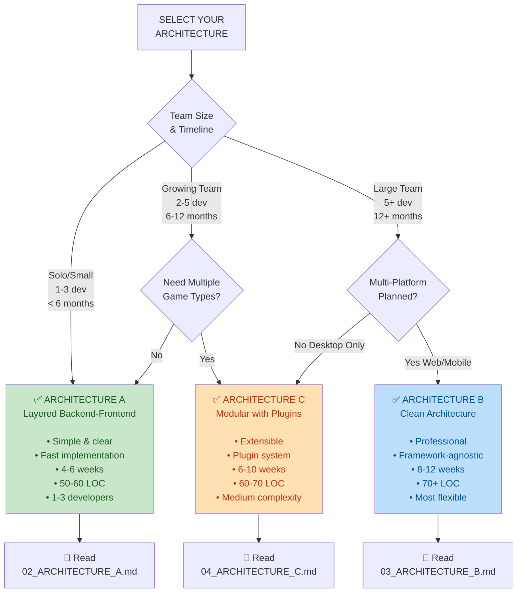

# AoF GTO Browser II - Design Documentation

## 📋 Document Overview

This folder contains comprehensive design specifications for the next generation of the All-In-or-Fold GTO Browser. It includes analysis of the existing application, three architectural alternatives, comparison frameworks, and migration roadmaps.

**Total Reading Time: 1-2 hours for full understanding**

---

## 📁 Documentation Structure

### 1. **[01_ANALYSIS.md](01_ANALYSIS.md)** ⭐ Start here!
**Purpose**: Understand what exists and why it needs improvement  
**Contents**:
- Current architecture assessment (strengths & weaknesses)
- Component reusability matrix
- Core issues to address
- Design principles for the new application

**Time**: 15-20 minutes  
**Audience**: Everyone

---

### 2. **[02_ARCHITECTURE_A.md](02_ARCHITECTURE_A.md)** ✅ Most Recommended
**Purpose**: Layered Backend-Frontend architecture  
**Best For**: Small teams, fast implementation, single UI

**Contents**:
- Detailed component architecture with Mermaid diagrams
- Package structure and organization
- Data flow diagrams
- Key components (AnalysisService, PrecomputeService, Repository, StateManager, Presenters)
- Dependency Injection patterns
- Testing strategy
- Migration path from existing app
- Configuration examples
- Pros & Cons analysis

**Time**: 30-40 minutes  
**Audience**: Teams choosing Architecture A

**Summary**:
```
Simple backend/frontend split
↓
Clear separation of concerns
↓
Easy to understand and implement
↓
Fast development (4-6 weeks)
```

---

### 3. **[03_ARCHITECTURE_B.md](03_ARCHITECTURE_B.md)** 🏢 Enterprise-Grade
**Purpose**: Clean Architecture with Adapters  
**Best For**: Large teams, multiple UI frameworks, long-term projects

**Contents**:
- Core principles and dependency rules
- 4 layers: Entities → Use Cases → Interface Adapters → Frameworks
- Complete package structure
- Detailed component explanations
- Port/adapter pattern implementation
- Application composition
- Testability examples (pure logic testing)
- Comparison with other approaches
- Use cases

**Time**: 40-50 minutes  
**Audience**: Teams choosing Architecture B or wanting professional structure

**Summary**:
```
Framework-agnostic core
↓
Zero dependencies in business logic
↓
Swap pygame for Qt/Web anytime
↓
Complex but future-proof (8-12 weeks)
```

---

### 4. **[04_ARCHITECTURE_C.md](04_ARCHITECTURE_C.md)** 🔌 Extensible
**Purpose**: Modular Monolith with Plugin System  
**Best For**: Multiple game types, extensibility, community plugins

**Contents**:
- Plugin system design
- Plugin registry and loader
- Base classes and interfaces
- Game type plugins (CashGame, Tournament)
- Theme plugins (Dark, Light)
- Analysis engine plugins
- Service layer orchestration
- Configuration-driven loading
- Adding new game types (no code changes!)
- Plugin isolation and versioning
- Testing plugin system
- Comparison table

**Time**: 35-45 minutes  
**Audience**: Teams choosing Architecture C or wanting extensibility

**Summary**:
```
Immutable core + plugin system
↓
Game types as plugins
↓
Configuration-driven features
↓
Balanced complexity (6-10 weeks)
```

---

### 5. **[05_COMPARISON_AND_DECISION.md](05_COMPARISON_AND_DECISION.md)** 🎯 Decision Guide
**Purpose**: Help you choose the right architecture  
**Contents**:
- Quick reference decision tree
- 4 scenario analyses (solo dev, small team, enterprise, researcher)
- Feature comparison matrix
- Architecture characteristics for each
- Complexity vs flexibility trade-offs
- Implementation effort estimates
- Risk analysis for each approach
- Real-world decision examples
- Selection checklist
- **Recommended starting point: Architecture A** ✅

**Time**: 15-20 minutes  
**Audience**: Decision makers, team leads

---

### 6. **[06_VISUAL_GUIDE_AND_ROADMAP.md](06_VISUAL_GUIDE_AND_ROADMAP.md)** 📊 Visual Reference
**Purpose**: Visual comparisons and migration paths  
**Contents**:
- Side-by-side architecture diagrams
- Data flow comparison (visual)
- Performance characteristics
- **Migration roadmaps**:
  - A → C (Modular system)
  - A → B (Clean architecture)
  - Effort estimates for each migration
- Code quality metrics by architecture
- Dependency injection patterns comparison
- Testing pyramid for each approach
- Team organization patterns
- Complete decision tree

**Time**: 20-30 minutes  
**Audience**: Visual learners, architects

---

## 🚀 Quick Start Guide

### If you have 15 minutes (Executive Summary)
1. Read: [01_ANALYSIS.md](01_ANALYSIS.md) - Current state
2. Read: [05_COMPARISON_AND_DECISION.md](05_COMPARISON_AND_DECISION.md) - Decision guide
3. **Result**: Know which architecture fits your situation

### If you have 1 hour (Design Decision)
1. Read: [01_ANALYSIS.md](01_ANALYSIS.md) - Understand current app
2. Read: [05_COMPARISON_AND_DECISION.md](05_COMPARISON_AND_DECISION.md) - Compare options
3. Read: Corresponding architecture document:
   - [02_ARCHITECTURE_A.md](02_ARCHITECTURE_A.md) if choosing A
   - [03_ARCHITECTURE_B.md](03_ARCHITECTURE_B.md) if choosing B
   - [04_ARCHITECTURE_C.md](04_ARCHITECTURE_C.md) if choosing C
4. **Result**: Ready to start implementation

### If you have 2-3 hours (Complete Design Review)
1. Read all documents in order:
   - [01_ANALYSIS.md](01_ANALYSIS.md)
   - [02_ARCHITECTURE_A.md](02_ARCHITECTURE_A.md)
   - [03_ARCHITECTURE_B.md](03_ARCHITECTURE_B.md)
   - [04_ARCHITECTURE_C.md](04_ARCHITECTURE_C.md)
   - [05_COMPARISON_AND_DECISION.md](05_COMPARISON_AND_DECISION.md)
   - [06_VISUAL_GUIDE_AND_ROADMAP.md](06_VISUAL_GUIDE_AND_ROADMAP.md)
2. **Result**: Deep understanding of all approaches and trade-offs

---

## 📊 Architecture Selection Flowchart



---

## 📈 Recommendation Summary

### **🥇 First Choice: Architecture A** (Layered Backend-Frontend)

**Most Suitable For AoF GTO Browser II**

**Reasons**:
- Incremental improvement over existing app
- Reuses proven components (solver, DB, ORM)
- Clear separation without over-engineering
- Fastest implementation (4-6 weeks)
- Test bed for understanding design needs
- Easy migration path to B or C if needed

**Team**: 1-3 developers  
**Timeline**: 4-6 weeks  
**Complexity**: ⭐⭐ (Low-Medium)  
**Long-term Flexibility**: Good

---

### **🥈 Second Choice: Architecture C** (Modular with Plugins)

**If Multiple Game Types Are Priority**

**Reasons**:
- Plugin system handles game type variations naturally
- No code changes to add new games (configuration-driven)
- Clear extension points for themes, engines
- Medium complexity (sweet spot)
- Good community potential

**Team**: 2-5 developers  
**Timeline**: 6-10 weeks  
**Complexity**: ⭐⭐⭐ (Medium)  
**Long-term Flexibility**: Excellent

---

### **🥉 Third Choice: Architecture B** (Clean Architecture)

**If Multi-Platform Is Immediate Need**

**Reasons**:
- Only if planning Web/Mobile UIs soon
- Otherwise likely over-engineering
- Perfect migration target from A or C
- Professional structure for large teams
- Maximum flexibility but complexity cost

**Team**: 5+ developers  
**Timeline**: 8-12 weeks  
**Complexity**: ⭐⭐⭐⭐ (High)  
**Long-term Flexibility**: Maximum

---

## 🔄 Upgrade Paths

```
Start with Architecture A
        ↓
    Every 6 months, ask:
        ↓
    "Do we need multiple UIs?"
    ├─ YES  → Upgrade to Architecture B
    └─ NO   → Ask next question
        ↓
    "Do we need plugin extensibility?"
    ├─ YES  → Upgrade to Architecture C
    └─ NO   → Stay with Architecture A
```

**Key Point**: Architecture A is an excellent starting point. Refactoring to B or C is straightforward if needs change.

---

## 📋 Implementation Checklists

### Architecture A - Implementation Checklist

- [ ] **Week 1: Backend Services**
  - [ ] AnalysisService (solver facade)
  - [ ] PrecomputeService (orchestration)
  - [ ] Repository (data access)
  - [ ] Shared DTOs (PositionContext, MatrixPayload, etc.)

- [ ] **Week 2-3: Frontend Rewrite**
  - [ ] StateManager (view state)
  - [ ] EventHandler (input routing)
  - [ ] Presenters (data formatting)
  - [ ] GUI components (matrix, detail, etc.)

- [ ] **Week 4-5: Integration & Testing**
  - [ ] Backend-frontend integration
  - [ ] Database connection verification
  - [ ] Precompute workflows
  - [ ] Error handling & logging

- [ ] **Week 6: Polish & Docs**
  - [ ] Configuration system
  - [ ] Migration from old browser
  - [ ] Documentation
  - [ ] Performance optimization

---

## 🔗 Related Documents in Repository

- **Existing Code**: `python/hopilot/` - Current implementation
- **Database Schema**: `database_schema.md`
- **GTO Solver**: `python/hopilot/all_in_fold_gto.py`
- **Current GUI**: `python/hopilot/aof_gto_browser_gui.py`

---

## ❓ FAQ

### Q: Can we start with A and upgrade to B or C later?
**A**: Yes! This is the recommended approach. Migrations are well-documented in [06_VISUAL_GUIDE_AND_ROADMAP.md](06_VISUAL_GUIDE_AND_ROADMAP.md).

### Q: What if we pick wrong?
**A**: Low risk. Refactoring between these architectures is straightforward (15-40 days). The early implementation moves you forward either way.

### Q: How much code reuse from the old browser?
**A**: 
- Architecture A: ~60-70% reusable (solver, models, DB layer)
- Architecture B: ~40-50% reusable (components require rewrite)
- Architecture C: ~70-80% reusable (solver, DB, core)

### Q: Will we hit performance issues?
**A**: No. All three architectures perform similarly for poker analysis (~5-10ms query latency). Architecture B might add 1-2ms overhead from abstraction layers.

### Q: What if requirements change mid-project?
**A**: All three are designed for change:
- **A→C**: Add plugin system (15-20 hours)
- **A→B**: Extract use cases and entities (25-35 hours)
- **C→B**: Formalize boundaries (25-40 hours)

### Q: Which has the most community examples?
**A**: 
- **Architecture A**: Django, Flask (MVC pattern)
- **Architecture B**: Clean Architecture books and talks
- **Architecture C**: Plugin systems (VS Code, Blender)

---

## 📞 Next Steps

1. **Stakeholder Alignment** (30 min)
   - Share [05_COMPARISON_AND_DECISION.md](05_COMPARISON_AND_DECISION.md) with your team
   - Identify which scenario matches your situation

2. **Architecture Selection** (30 min)
   - Make decision using decision tree and checklist
   - Document reasoning

3. **Detailed Review** (60 min)
   - Read full architecture document for chosen approach
   - Identify any concerns or questions

4. **Technical Planning** (1-2 hours)
   - Create implementation timeline
   - Break into 2-week sprints
   - Identify blockers and dependencies

5. **Kickoff** (Next day)
   - Set up repository structure
   - Create initial package structure
   - Begin Phase 1 implementation

---

## 📞 Questions or Feedback?

If you have questions about specific architectures:
- **Architecture A questions?** → See [02_ARCHITECTURE_A.md](02_ARCHITECTURE_A.md#section)
- **Architecture B questions?** → See [03_ARCHITECTURE_B.md](03_ARCHITECTURE_B.md#section)
- **Architecture C questions?** → See [04_ARCHITECTURE_C.md](04_ARCHITECTURE_C.md#section)
- **Decision uncertainty?** → See [05_COMPARISON_AND_DECISION.md](05_COMPARISON_AND_DECISION.md#section)
- **Visual reference needed?** → See [06_VISUAL_GUIDE_AND_ROADMAP.md](06_VISUAL_GUIDE_AND_ROADMAP.md#section)

---

## 📚 Reading Recommendations

**For Executives/Managers**:
- [01_ANALYSIS.md](01_ANALYSIS.md) - Current state
- [05_COMPARISON_AND_DECISION.md](05_COMPARISON_AND_DECISION.md) - Decision guide
- [06_VISUAL_GUIDE_AND_ROADMAP.md](06_VISUAL_GUIDE_AND_ROADMAP.md) - Visual overview

**For Architects/Senior Developers**:
- All documents (complete understanding)
- Focus: Trade-offs and migration paths

**For Junior Developers**:
- [01_ANALYSIS.md](01_ANALYSIS.md) - Understand current patterns
- Chosen architecture document (deep dive)
- [06_VISUAL_GUIDE_AND_ROADMAP.md](06_VISUAL_GUIDE_AND_ROADMAP.md) - Visual reference

**For DevOps/Infrastructure**:
- [05_COMPARISON_AND_DECISION.md](05_COMPARISON_AND_DECISION.md) - Deployment implications
- Chosen architecture diagram sections

---

**Last Updated**: April 2, 2026  
**Status**: Ready for architecture selection and implementation planning

---

## 📖 Start Reading

👉 **Recommended Entry Point**:
1. This document (5 min)
2. [01_ANALYSIS.md](01_ANALYSIS.md) (15 min)
3. [05_COMPARISON_AND_DECISION.md](05_COMPARISON_AND_DECISION.md) (15 min)
4. Your chosen architecture document (30-40 min)

**Total Time**: ~1 hour to full decision
