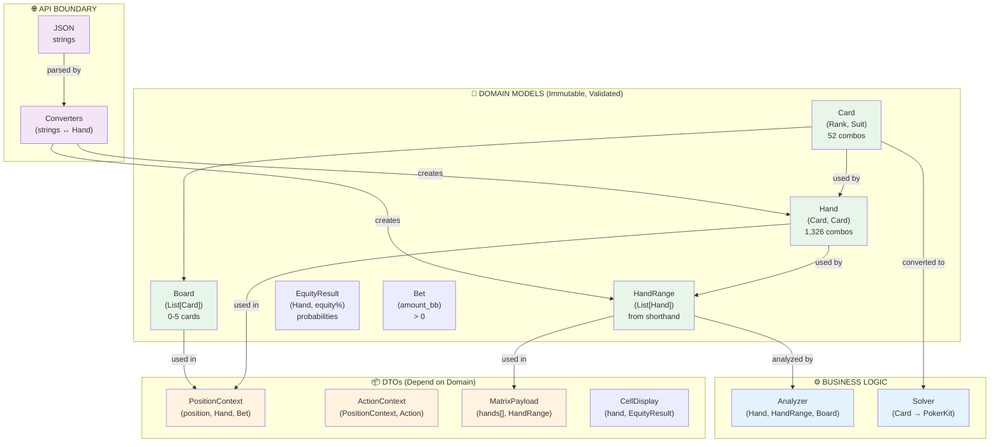

# Domain Models - Architecture & Design Index

## Overview

Domain models are **core business concepts** used throughout the application. They are NOT DTOs.

- **Location**: Business logic, analysis engines, testers
- **Dependency**: ✅ DTOs depend on these; these do NOT depend on DTOs
- **Mutability**: Immutable, validated at construction
- **Lifetime**: Application lifetime (not just transport)

---

## Domain Models (This Folder)

| Model | Purpose | Combos/Size | File |
|-------|---------|-------------|------|
| **Card** | Single playing card (rank + suit) | 52 total | [01_DOMAIN_Card.md](01_DOMAIN_Card.md) |
| **Hand** | Two-card poker hand | 1,326 combos | [02_DOMAIN_Hand.md](02_DOMAIN_Hand.md) |
| **HandRange** | Distribution of hands (e.g., "22+,AKs") | 1-1,326 hands | [03_DOMAIN_HandRange.md](03_DOMAIN_HandRange.md) |
| **Board** | Community cards (0-5 cards) | 0-5 cards | [04_DOMAIN_Board.md](04_DOMAIN_Board.md) |
| **EquityResult** | Hand equity vs range with probabilities | 0.0-1.0 equity | [05_DOMAIN_EquityResult.md](05_DOMAIN_EquityResult.md) |
| **Bet** | Amount in big blinds with validation | > 0 BBS | [06_DOMAIN_Bet.md](06_DOMAIN_Bet.md) |

---

## Architecture Diagram



---

## Dependency Flow

```
Application Boundary
├─ JSON Request {"heroes_hole_cards": ["As", "Kd"]}
│
├─ API Converters (parse strings)
│  └─ Hand.from_strings("As", "Kd") → Hand domain model
│
├─ DTO Construction
│  └─ PositionContext(heroes_hole_cards=hand)  ← Hand is domain model
│
├─ Business Logic (uses domain models)
│  └─ analyzer.analyze(hand=context.heroes_hole_cards)
│
├─ Domain Model Serialization
│  └─ hand.to_strings() → MatrixPayload DTO
│
└─ JSON Response {"hands": {"AKs": {...}}}
```

---

## Design Principles

### 1. **Immutability**
All domain models are frozen dataclasses:
```python
@dataclass(frozen=True)
class Card:
    rank: Rank
    suit: Suit
```

**Why**: Safe for use in sets/dicts, thread-safe, prevents accidental mutations

### 2. **Validation at Construction**
Problems caught at creation, not runtime:
```python
Hand(card1, card2)        # Raises ValueError if duplicate cards
HandRange(hands)          # Raises ValueError if duplicates
Board(cards)              # Raises ValueError if > 5 cards or duplicates
```

### 3. **Enum-based (Type Safety)**
```python
class Rank(Enum):
    ACE = 14
    KING = 13
    # ...

class Suit(Enum):
    SPADES = "s"
    HEARTS = "h"
    # ...

# IDE hints for valid values
card = Card(rank=Rank.ACE, suit=Suit.SPADES)  # ✅ Autocompleted
```

### 4. **Bidirectional Conversion**
Domain models easily convert to/from strings (for DTOs):
```python
card = Card.from_string("As")           # String → domain
card.to_string()                        # Domain → string

hand = Hand.from_strings("As", "Kd")    # Strings → domain
hand.to_strings()                       # Domain → strings

range = HandRange.from_shorthand("AKs+")  # Shorthand → domain
range.to_shorthand()                      # Domain → shorthand
```

### 5. **Rich Behavior**
Domain models understand poker semantics:
```python
hand = Hand(card1, card2)
hand.is_pair()      # True if AA, KK, etc.
hand.is_suited()    # True if both same suit
hand.shorthand()    # "AKs", "22", "QJo", etc.
hand.num_combos()   # 6 for pairs, 4 for suited, 12 for offsuit

hand_range = HandRange(hands=[...])
hand_range.size()   # Number of hands
hand_range.contains(hand)  # Check membership
hand_range.union(other_range)  # Combine ranges
```

### 6. **Solver Independence**
Domain models are **library-agnostic**:
```python
class Card:  # Never imports treys, PokerKit, etc.
    @staticmethod
    def from_string(s: str) -> Optional['Card']:
        # Pure parsing logic only
        pass

# Conversion to PokerKit/treys happens in Adapter layer
class PokerkitAdapter(PokerSolver):
    @staticmethod
    def _card_to_pokerkit(card: Card) -> PokerkitCard:
        # Adapter handles library-specific conversion
        pass
```

---

## Domain Model Interactions

### Card → Hand
```python
card1 = Card.from_string("As")
card2 = Card.from_string("Kd")
hand = Hand(card1, card2)  # ✅ Valid: different cards
```

### Hand → HandRange
```python
hand = Hand.from_strings("As", "Kd")
range = HandRange(hands=[hand, another_hand, ...])
```

### HandRange Composition
```python
range1 = HandRange.from_shorthand("AKs+")     # 4 hands
range2 = HandRange.from_shorthand("22+")      # 13 pairs
combined = HandRange.union(range1, range2)    # 17 hands
```

### Board → Card List
```python
board = Board.from_strings(["As", "Kh", "2d"])
cards = board.cards  # [Card(A,s), Card(K,h), Card(2,d)]
```

### Domain Models → DTOs
```python
# In API endpoint
hand = Hand.from_strings(json_data["card1"], json_data["card2"])
range = HandRange.from_shorthand(json_data["range"])

position_context = PositionContext(
    heroes_hole_cards=hand,      # Domain model goes into DTO
    opponent_range=range         # Domain model goes into DTO
)

# For response
response = MatrixPayload(
    hands=computed_results,
    opponent_range_notation=range.to_shorthand()  # Serialize back
)
```

---

## File Structure

```
01_DOMAIN_MODELS/
├── 00_INDEX.md                          ← This file
├── 01_DOMAIN_Card.md                    ← Card domain model
├── 02_DOMAIN_Hand.md                    ← Hand domain model
├── 03_DOMAIN_HandRange.md               ← HandRange domain model
├── 04_DOMAIN_Board.md                   ← Board domain model
└── README.md                            ← Setup instructions
```

---

## Design Checklist

Each domain model document includes:

- [ ] **Purpose** - What business problem does this solve?
- [ ] **Specification** - Fields, methods, validation
- [ ] **Code Template** - Ready-to-use class definition
- [ ] **Enum Definitions** - For rank, suit, position, etc.
- [ ] **Conversion Methods** - `from_string()`, `to_string()`, etc.
- [ ] **Rich Methods** - `is_pair()`, `is_suited()`, shorthand conversion
- [ ] **Validation Rules** - What makes this domain model invalid?
- [ ] **Interactions** - With other domain models and DTOs
- [ ] **Mermaid Diagrams** - Relationships and flows
- [ ] **Test Cases** - Construction, validation, conversion
- [ ] **Best Practices** - How to use correctly
- [ ] **Common Mistakes** - What NOT to do

---

## Next Steps

1. **Read** [01_DOMAIN_Card.md](01_DOMAIN_Card.md) - Foundation (all others depend)
2. **Read** [02_DOMAIN_Hand.md](02_DOMAIN_Hand.md) - Uses Card
3. **Read** [03_DOMAIN_HandRange.md](03_DOMAIN_HandRange.md) - Uses Hand
4. **Read** [04_DOMAIN_Board.md](04_DOMAIN_Board.md) - Uses Card
5. **Then read** `../02_SHARED_MODELS/` - DTOs that use these domain models

---

## Key Insight

Domain models and DTOs have an **inverse dependency relationship**:

```
Domain Models:  INDEPENDENT (no DTO imports)
   ↑
   │ (DTOs depend on domain models)
   │
   ↓
DTOs:           DEPENDENT (import domain models)
```

This allows domain models to remain pure and evolve independently from API contracts.

