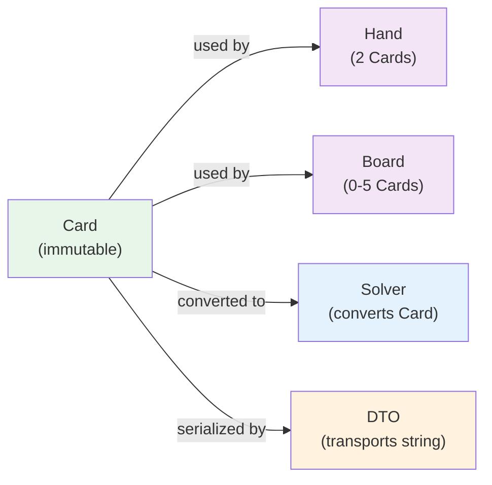

# Domain Model: Card

## Purpose

Represents a single playing card using **enum-based rank and suit** for type safety and poker semantics.

**Why not use `str`?**
- ❌ `"As"`, `"AS"`, `"A of spades"` all compile but mean different things
- ❌ No IDE hints for valid values
- ❌ Invalid formats not caught until runtime
- ✅ `Card(rank=Rank.ACE, suit=Suit.SPADES)` is type-safe and validated

---

## Specification

```python
from dataclasses import dataclass
from enum import Enum
from typing import Optional

class Rank(Enum):
    """Poker ranks (Ace high in standard hand evaluation)."""
    TWO = 2
    THREE = 3
    FOUR = 4
    FIVE = 5
    SIX = 6
    SEVEN = 7
    EIGHT = 8
    NINE = 9
    TEN = 10
    JACK = 11
    QUEEN = 12
    KING = 13
    ACE = 14
    
    @property
    def char(self) -> str:
        """Get single-character representation."""
        if self == Rank.TEN:
            return 'T'
        elif self == Rank.JACK:
            return 'J'
        elif self == Rank.QUEEN:
            return 'Q'
        elif self == Rank.KING:
            return 'K'
        elif self == Rank.ACE:
            return 'A'
        else:
            return str(self.value)

class Suit(Enum):
    """Card suits."""
    SPADES = "s"
    HEARTS = "h"
    DIAMONDS = "d"
    CLUBS = "c"
    
    @property
    def full_name(self) -> str:
        """Get full suit name."""
        return {
            Suit.SPADES: "Spades",
            Suit.HEARTS: "Hearts",
            Suit.DIAMONDS: "Diamonds",
            Suit.CLUBS: "Clubs"
        }[self]

@dataclass(frozen=True)
class Card:
    """Immutable playing card representation."""
    rank: Rank
    suit: Suit
    
    def __str__(self) -> str:
        """Convert to shorthand: 'As', 'Kh', '2d', 'Tc'."""
        return f"{self.rank.char}{self.suit.value}"
    
    def __repr__(self) -> str:
        """Detailed representation: 'Ace of Spades'."""
        return f"{self.rank.name} of {self.suit.full_name}"
    
    @staticmethod
    def from_string(card_str: str) -> Optional['Card']:
        """Parse card from string.
        
        Supports formats:
        - Shorthand: "As", "Kh", "2d", "Tc"
        - Long form: "Ace of Spades", "King of Hearts" (case-insensitive)
        
        Returns None if invalid.
        """
        if not card_str:
            return None
        
        card_str = card_str.strip().lower()
        
        # Long format: "ace of spades"
        if ' of ' in card_str or '_of_' in card_str:
            separator = ' of ' if ' of ' in card_str else '_of_'
            parts = card_str.split(separator)
            if len(parts) != 2:
                return None
            rank_str, suit_str = parts
        else:
            # Short format: "As" or "A s"
            card_str = card_str.replace(' ', '')
            if len(card_str) < 2:
                return None
            rank_str = card_str[:-1]
            suit_str = card_str[-1]
        
        # Parse rank
        rank_map = {
            '2': Rank.TWO, '3': Rank.THREE, '4': Rank.FOUR, '5': Rank.FIVE,
            '6': Rank.SIX, '7': Rank.SEVEN, '8': Rank.EIGHT, '9': Rank.NINE,
            't': Rank.TEN, '10': Rank.TEN,
            'j': Rank.JACK, 'q': Rank.QUEEN, 'k': Rank.KING, 'a': Rank.ACE,
            'two': Rank.TWO, 'three': Rank.THREE, 'four': Rank.FOUR, 'five': Rank.FIVE,
            'six': Rank.SIX, 'seven': Rank.SEVEN, 'eight': Rank.EIGHT, 'nine': Rank.NINE,
            'ten': Rank.TEN, 'jack': Rank.JACK, 'queen': Rank.QUEEN, 'king': Rank.KING, 'ace': Rank.ACE
        }
        
        # Parse suit
        suit_map = {
            's': Suit.SPADES, 'spade': Suit.SPADES, 'spades': Suit.SPADES,
            'h': Suit.HEARTS, 'heart': Suit.HEARTS, 'hearts': Suit.HEARTS,
            'd': Suit.DIAMONDS, 'diamond': Suit.DIAMONDS, 'diamonds': Suit.DIAMONDS,
            'c': Suit.CLUBS, 'club': Suit.CLUBS, 'clubs': Suit.CLUBS
        }
        
        rank = rank_map.get(rank_str)
        suit = suit_map.get(suit_str)
        
        if rank is None or suit is None:
            return None
        
        return Card(rank=rank, suit=suit)
    
    def to_string(self) -> str:
        """Convert to shorthand string: 'As', 'Kh', etc."""
        return str(self)
    
    def is_ace(self) -> bool:
        """Is this card an Ace? Useful for A-x analysis."""
        return self.rank == Rank.ACE
```

---

## Fields

| Field | Type | Notes |
|-------|------|-------|
| `rank` | `Rank` | 2-A (enum with values 2-14) |
| `suit` | `Suit` | Spades, Hearts, Diamonds, Clubs |

---

## Factory Methods

| Method | Input | Returns | Notes |
|--------|-------|---------|-------|
| `Card.from_string()` | `"As"`, `"king of hearts"` | `Card` or `None` | Robust parsing, handles variants |
| `__str__()` | — | `str` | Shorthand: `"As"`, `"Kh"`, `"2d"` |
| `__repr__()` | — | `str` | Full form: `"Ace of Spades"` |
| `to_string()` | — | `str` | Explicit conversion to shorthand |

---

## Helper Methods

| Method | Returns | Purpose |
|--------|---------|----------|
| `is_ace()` | `bool` | Check for Ace (useful for A-x range analysis) |

---

## Usage Examples

### Example 1: Create Card from String
```python
# Parse shorthand
card = Card.from_string("As")
assert card.rank == Rank.ACE
assert card.suit == Suit.SPADES
assert str(card) == "As"

# Parse long form
card = Card.from_string("King of hearts")
assert str(card) == "Kh"
```

### Example 2: Create Card with Enums
```python
# Type-safe construction
card = Card(rank=Rank.ACE, suit=Suit.SPADES)

# Can use in IDE with autocomplete
my_ace = Card(rank=Rank.ACE, suit=Suit.HEARTS)
```

### Example 3: Card Properties
```python
ace = Card.from_string("As")
assert ace.is_ace()

card1 = Card.from_string("As")
card2 = Card.from_string("Kd")
assert card1 != card2  # Immutable  
```

---

## Card Abstraction Layer: Solver Library Integration

### Overview

The `Card` domain model is **library-agnostic**, but must integrate with different poker solver libraries (poker kit, treys, pyker, etc). An abstraction layer provides bidirectional conversion while maintaining type safety.

### Supported Solver Libraries

| Library | Format | Notes | Integration |
|---------|--------|-------|-------------|
| **PokerKit** | `Card("As")` string | Native string support | Direct conversion |
| **Treys** | Integer (0-51) | 13 ranks × 4 suits | Mapping layer |
| **PyPokerEngine** | Tuple `('A', 'S')` | Rank-suit tuples | Adapter pattern |
| **Pokerstars/ACPC** | 2-char strings `"As"` | Same as our format | Passthrough |
| **Custom Solver** | Any format | User-defined | Abstract adapter |

---

### Design Pattern: Card Adapter

The abstraction uses a **Adapter/Bridge pattern** to convert between domain Card and library-specific formats:

```
┌─────────────────────────────────────────┐
│      Domain Model: Card(Rank, Suit)     │
│                                         │
│  rank: Rank.ACE   suit: Suit.SPADES    │
└────────────┬────────────────────────────┘
             │
             ├─ CardAdapter.to_pokerkit()   ──→ "As"
             ├─ CardAdapter.to_treys()      ──→ 12 (52-card index)
             ├─ CardAdapter.to_pypoker()    ──→ ('A', 'S')
             ├─ CardAdapter.to_string()     ──→ "As"
             └─ CardAdapter.to_<custom>()   ──→ <format>
```

---

### Adapter Implementation Specification

```python
class CardAdapter:
    """Convert between domain Card and library-specific formats."""
    
    # PokerKit Integration
    @staticmethod
    def to_pokerkit(card: Card) -> str:
        """Convert to PokerKit format (simple string).
        
        PokerKit uses string format natively, so this is passthrough.
        
        Args:
            card: Domain Card object
        
        Returns:
            String like "As", "Kh", "2d", "Tc"
        
        Example:
            >>> to_pokerkit(Card(Rank.ACE, Suit.SPADES))
            "As"
        """
        return str(card)  # Already correct format: "As"
    
    @staticmethod
    def from_pokerkit(card_str: str) -> Optional[Card]:
        """Convert from PokerKit format.
        
        Args:
            card_str: String like "As", "Kh"
        
        Returns:
            Domain Card or None if invalid
        """
        return Card.from_string(card_str)
    
    # Treys Integration (Used by many solvers)
    @staticmethod
    def to_treys(card: Card) -> int:
        """Convert to Treys format (0-51 integer index).
        
        Treys uses: suit × 13 + rank
        - Suits: ♠=0, ♥=1, ♦=2, ♣=3
        - Ranks: 2=0, 3=1, ..., A=12
        
        Args:
            card: Domain Card
        
        Returns:
            Integer 0-51 (52 cards total)
        
        Examples:
            >>> to_treys(Card(Rank.TWO, Suit.SPADES))      # 0
            >>> to_treys(Card(Rank.ACE, Suit.SPADES))      # 12
            >>> to_treys(Card(Rank.TWO, Suit.HEARTS))      # 13
            >>> to_treys(Card(Rank.ACE, Suit.CLUBS))       # 51
        """
        SUIT_MAP = {
            Suit.SPADES: 0,
            Suit.HEARTS: 1,
            Suit.DIAMONDS: 2,
            Suit.CLUBS: 3
        }
        suit_idx = SUIT_MAP[card.suit]
        rank_idx = card.rank.value - 2  # TWO=0, ACE=12
        return suit_idx * 13 + rank_idx
    
    @staticmethod
    def from_treys(treys_int: int) -> Optional[Card]:
        """Convert from Treys format.
        
        Args:
            treys_int: Integer 0-51
        
        Returns:
            Domain Card or None if invalid
        
        Examples:
            >>> from_treys(0)   # Two of Spades
            Card(Rank.TWO, Suit.SPADES)
            >>> from_treys(12)  # Ace of Spades
            Card(Rank.ACE, Suit.SPADES)
            >>> from_treys(51)  # Ace of Clubs
            Card(Rank.ACE, Suit.CLUBS)
        """
        if not (0 <= treys_int < 52):
            return None
        
        SUIT_MAP = {0: Suit.SPADES, 1: Suit.HEARTS, 2: Suit.DIAMONDS, 3: Suit.CLUBS}
        suit = SUIT_MAP[treys_int // 13]
        rank = Rank(2 + (treys_int % 13))
        return Card(rank=rank, suit=suit)
    
    # PyPokerEngine Integration
    @staticmethod
    def to_pypoker(card: Card) -> tuple:
        """Convert to PyPokerEngine format (rank, suit tuple).
        
        Args:
            card: Domain Card
        
        Returns:
            Tuple like ('A', 'S'), ('K', 'H'), ('2', 'D')
        
        Example:
            >>> to_pypoker(Card(Rank.ACE, Suit.SPADES))
            ('A', 'S')
        """
        SUIT_MAP = {Suit.SPADES: 'S', Suit.HEARTS: 'H', 
                   Suit.DIAMONDS: 'D', Suit.CLUBS: 'C'}
        return (card.rank.char, SUIT_MAP[card.suit])
    
    @staticmethod
    def from_pypoker(rank_char: str, suit_char: str) -> Optional[Card]:
        """Convert from PyPokerEngine format.
        
        Args:
            rank_char: 'A', 'K', 'Q', 'J', 'T', '2'-'9'
            suit_char: 'S', 'H', 'D', 'C'
        
        Returns:
            Domain Card or None if invalid
        """
        RANK_MAP = {
            'A': Rank.ACE, 'K': Rank.KING, 'Q': Rank.QUEEN, 'J': Rank.JACK, 'T': Rank.TEN,
            '2': Rank.TWO, '3': Rank.THREE, '4': Rank.FOUR, '5': Rank.FIVE,
            '6': Rank.SIX, '7': Rank.SEVEN, '8': Rank.EIGHT, '9': Rank.NINE
        }
        SUIT_MAP = {'S': Suit.SPADES, 'H': Suit.HEARTS, 'D': Suit.DIAMONDS, 'C': Suit.CLUBS}
        
        rank = RANK_MAP.get(rank_char.upper())
        suit = SUIT_MAP.get(suit_char.upper())
        
        if rank is None or suit is None:
            return None
        
        return Card(rank=rank, suit=suit)
    
    # JSON/Serialization Format
    @staticmethod
    def to_json(card: Card) -> Dict[str, str]:
        """Convert to JSON representation.
        
        Returns:
            Dict with 'rank' and 'suit' keys
        
        Example:
            >>> to_json(Card(Rank.ACE, Suit.SPADES))
            {'rank': 'ACE', 'suit': 'SPADES'}
        """
        return {
            'rank': card.rank.name,
            'suit': card.suit.name
        }
    
    @staticmethod
    def from_json(data: Dict[str, str]) -> Optional[Card]:
        """Convert from JSON representation.
        
        Args:
            data: Dict with 'rank' and 'suit' keys
        
        Returns:
            Domain Card or None if invalid
        """
        try:
            rank = Rank[data['rank']]
            suit = Suit[data['suit']]
            return Card(rank=rank, suit=suit)
        except (KeyError, ValueError):
            return None
```

---

### Integration Patterns

#### Pattern 1: Single Card Conversion (PokerKit)

```python
from shared.domain.card import Card, CardAdapter
from pokerkit.utilities import Card as PokerkitCard

# Domain to PokerKit
domain_card = Card.from_string("As")
pokerkit_card_str = CardAdapter.to_pokerkit(domain_card)  # "As"

# Can pass directly to PokerKit functions expecting strings
result = evaluate_with_pokerkit([pokerkit_card_str, "Kh"])

# PokerKit back to Domain
domain_card_back = CardAdapter.from_pokerkit("As")
```

#### Pattern 2: Hand Conversion (Treys)

```python
# Convert entire hand to Treys format
from shared.domain.hand import Hand
from shared.domain.card import CardAdapter

hand = Hand.from_shorthand("AKs")

# Get all combos and convert to Treys
for combo in hand.to_strings():  # [('As', 'Ks'), ...]
    card1, card2 = combo
    treys_cards = [
        CardAdapter.to_treys(Card.from_string(card1)),
        CardAdapter.to_treys(Card.from_string(card2))
    ]
    # Pass to Treys solver
    equity = evaluate_with_treys(treys_cards, board_treys)
```

#### Pattern 3: Range Conversion (PyPokerEngine)

```python
# Convert entire range to PyPokerEngine format
from shared.domain.hand_range import HandRange
from shared.domain.card import CardAdapter

range_obj = HandRange.from_shorthand("22+,AKs+")

all_combos_pypoker = []
for hand in range_obj.hands:
    for combo in [hand.to_strings()]:  # Get card pair
        card1_str, card2_str = combo
        card1 = Card.from_string(card1_str)
        card2 = Card.from_string(card2_str)
        
        pypoker_combo = (
            CardAdapter.to_pypoker(card1),
            CardAdapter.to_pypoker(card2)
        )
        all_combos_pypoker.append(pypoker_combo)

# Pass to PyPokerEngine
strategy = compute_strategy(all_combos_pypoker, other_params)
```

---

### Custom Solver Integration

For solvers not in the standard library, create a custom adapter:

```python
class CustomSolverAdapter(CardAdapter):
    """Adapter for custom poker solver."""
    
    @staticmethod
    def to_custom_format(card: Card) -> str:
        """Convert to custom solver's format.
        
        Example: custom solver might use "ASPAD" for Ace of Spades.
        """
        suit_map = {Suit.SPADES: 'PAD', Suit.HEARTS: 'HEART', 
                   Suit.DIAMONDS: 'DIAMOND', Suit.CLUBS: 'CLUB'}
        return f"{card.rank.char}{suit_map[card.suit]}"
    
    @staticmethod
    def from_custom_format(custom_str: str) -> Optional[Card]:
        """Convert from custom solver format."""
        # Parse "ASPAD" → Card(ACE, SPADES)
        rank_char = custom_str[0]
        suit_part = custom_str[1:]
        
        suit_map = {'PAD': Suit.SPADES, 'HEART': Suit.HEARTS,
                   'DIAMOND': Suit.DIAMONDS, 'CLUB': Suit.CLUBS}
        
        # ... implementation
```

---

### Library Comparison Table

| Library | Native Format | Conversion Effort | Speed | Use Case |
|---------|---------------|-------------------|-------|----------|
| **PokerKit** | String `"As"` | ✅ Minimal (passthrough) | ⚡ Fast | Hand evaluation, equity |
| **Treys** | Integer 0-51 | ✅ Simple (math) | ⚡⚡ Fastest | Hand strength lookup |
| **PyPokerEngine** | Tuple `('A','S')` | ✅ Simple (map) | ⚡ Fast | Bot simulations |
| **Custom** | Varies | 🟡 Depends | 🟡 Varies | Specialized solvers |

---

### Performance Considerations

**Conversion Cost**:
- **PokerKit**: O(1) - direct string passthrough
- **Treys**: O(1) - simple arithmetic
- **PyPokerEngine**: O(1) - dictionary lookup
- **Batch conversions**: O(n) where n = number of cards

**Batch Conversion Optimization**:

```python
def convert_range_to_treys(range_obj: HandRange) -> List[List[int]]:
    """Efficient bulk conversion."""
    result = []
    for hand in range_obj.hands:
        card1_str, card2_str = hand.to_strings()
        combo = [
            CardAdapter.to_treys(Card.from_string(card1_str)),
            CardAdapter.to_treys(Card.from_string(card2_str))
        ]
        result.append(combo)
    return result
    # Cost: O(combos) = O(range.num_combos())
    # Memory: O(combos) for output
```

---

## Code Template

```python
# shared/domain/card.py

from dataclasses import dataclass
from enum import Enum
from typing import Optional

class Rank(Enum):
    TWO = 2
    THREE = 3
    FOUR = 4
    FIVE = 5
    SIX = 6
    SEVEN = 7
    EIGHT = 8
    NINE = 9
    TEN = 10
    JACK = 11
    QUEEN = 12
    KING = 13
    ACE = 14
    
    @property
    def char(self) -> str:
        char_map = {
            Rank.TEN: 'T', Rank.JACK: 'J', Rank.QUEEN: 'Q',
            Rank.KING: 'K', Rank.ACE: 'A'
        }
        return char_map.get(self, str(self.value))

class Suit(Enum):
    SPADES = "s"
    HEARTS = "h"
    DIAMONDS = "d"
    CLUBS = "c"

@dataclass(frozen=True)
class Card:
    rank: Rank
    suit: Suit
    
    def __str__(self) -> str:
        return f"{self.rank.char}{self.suit.value}"
    
    @staticmethod
    def from_string(card_str: str) -> Optional['Card']:
        # (implementation as shown above)
        pass
    
    def is_ace(self) -> bool:
        return self.rank == Rank.ACE
```

---

## Validation Rules

```python
# Valid cards (52 total)
Card(rank=Rank.ACE, suit=Suit.SPADES)  # ✅ OK
Card.from_string("As")                 # ✅ OK
Card.from_string("2d")                 # ✅ OK
Card.from_string("king of hearts")     # ✅ OK

# Invalid (will return None from from_string)
Card.from_string("")                   # ❌ None
Card.from_string("XY")                 # ❌ None
Card.from_string("Ax")                 # ❌ None (invalid suit)
Card.from_string("Zs")                 # ❌ None (invalid rank)

# Cannot construct invalid enum
Card(rank="Ace", suit="spades")        # ❌ TypeError (not enum)
```

---

## Interactions with Other Models



---

## Testing

```python
import pytest
from shared.domain.card import Card, Rank, Suit

def test_card_creation_with_enum():
    """Create card using enums."""
    card = Card(rank=Rank.ACE, suit=Suit.SPADES)
    assert card.rank == Rank.ACE
    assert card.suit == Suit.SPADES

def test_card_from_string_shorthand():
    """Parse shorthand format."""
    card = Card.from_string("As")
    assert card.rank == Rank.ACE
    assert card.suit == Suit.SPADES
    assert str(card) == "As"

def test_card_from_string_long_form():
    """Parse long format."""
    card = Card.from_string("King of hearts")
    assert card.rank == Rank.KING
    assert card.suit == Suit.HEARTS
    assert str(card) == "Kh"

def test_card_from_string_case_insensitive():
    """Parsing handles case variations."""
    assert Card.from_string("as").rank == Rank.ACE
    assert Card.from_string("AS").rank == Rank.ACE
    assert Card.from_string("As").rank == Rank.ACE

def test_card_from_string_invalid():
    """Invalid strings return None."""
    assert Card.from_string("") is None
    assert Card.from_string("XY") is None
    assert Card.from_string("Ax") is None
    assert Card.from_string("2z") is None

def test_card_is_immutable():
    """Card is frozen."""
    card = Card(rank=Rank.ACE, suit=Suit.SPADES)
    with pytest.raises(Exception):  # FrozenInstanceError
        card.rank = Rank.KING

def test_card_is_ace():
    """Test ace detection."""
    ace = Card.from_string("As")
    assert ace.is_ace()
    
    non_ace = Card.from_string("Kd")
    assert not non_ace.is_ace()

def test_card_in_set():
    """Cards can be used in sets (frozen)."""
    card1 = Card.from_string("As")
    card2 = Card.from_string("As")
    
    card_set = {card1, card2}
    assert len(card_set) == 1  # Same card, one element

def test_card_hash():
    """Cards are hashable (frozen)."""
    card1 = Card.from_string("As")
    card2 = Card.from_string("As")
    
    card_dict = {card1: "ace of spades"}
    assert card_dict[card2] == "ace of spades"  # Same hash
```

---

## Best Practices

1. **Always use enums for construction**
   ```python
   # ✅ Good - type safe
   card = Card(rank=Rank.ACE, suit=Suit.SPADES)
   
   # ❌ Bad - loses type safety
   card = Card.from_string("As")  # Only for parsing input
   ```

2. **Use `from_string()` only at boundaries**
   ```python
   # ✅ Good - at API boundary
   @app.post("/analyze")
   def analyze(data: dict):
       card = Card.from_string(data["card"])  # Parse user input
   
   # ❌ Bad - deep in business logic
   def calculate_equity(card_str: str):  # Should accept Card
       card = Card.from_string(card_str)
   ```

3. **Use CardAdapter for solver library integration**
   ```python
   # ✅ Good - abstraction layer for libraries
   from shared.domain.card import Card, CardAdapter
   
   domain_card = Card.from_string("As")
   pokerkit_str = CardAdapter.to_pokerkit(domain_card)      # "As"
   treys_int = CardAdapter.to_treys(domain_card)            # 12
   pypoker_tuple = CardAdapter.to_pypoker(domain_card)      # ('A', 'S')
   
   # ❌ Bad - hardcoding library formats deep in code
   def evaluate_equity(card_str: str):
       # What library format is this? Unclear!
   ```

4. **Use helper methods for poker semantics**
   ```python
   # ✅ Good - reads intent
   if card.is_broadway():
       # handle broadway cards
   
   # ❌ Bad - obscuring intent
   if card.rank.value >= 10:
       # handle broadway cards
   ```

5. **Store cards in containers**
   ```python
   # ✅ Good - use sets for uniqueness
   known_cards = {card1, card2, card3}
   
   # ✅ Good - use lists for order
   board_cards = [card1, card2, card3]
   ```

---

## Common Mistakes

❌ **Using string instead of Card domain model**:
```python
# This loses type safety
def evaluate_hand(card1: str, card2: str):
    # Any string passes type checking
    # Errors caught at runtime only
    pass
```

✅ **Use Card domain model**:
```python
def evaluate_hand(card1: Card, card2: Card):
    # Type safe - wrong cards caught at call site
    # IDE hints available
    pass
```

---

❌ **Mixing Rank/Suit directly in business logic**:
```python
# Obscures poker semantics
if card.rank.value >= 10:  # What does this mean?
    # broadway-related logic
```

✅ **Use helper methods**:
```python
if card.is_broadway():  # Clear intent
    # broadway-related logic
```

---

## Immutability (frozen=True)

```python
card = Card(rank=Rank.ACE, suit=Suit.SPADES)

# Cannot modify
card.rank = Rank.KING  # ❌ FrozenInstanceError

# This is intentional - cards are facts about the game
# They never change once dealt
```

---

**Next**: Read [02_DOMAIN_Hand.md](02_DOMAIN_Hand.md) (depends on Card)

