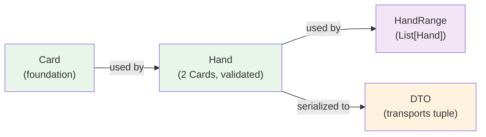

# Domain Model: Hand

## Purpose

Represents a two-card poker hand with validation, conversion, and shorthand notation (e.g., "AKs", "22", "QJo").

**Depends on**: Card (foundation)

Validates:
- ✅ Exactly 2 cards
- ✅ No duplicate cards
- ✅ Can compute shorthand notation
- ✅ Can compute combo count (6 for pairs, 4 for suited, 12 for offsuit)

---

## Specification

```python
from dataclasses import dataclass
from typing import Optional, List
from shared.domain.card import Card, Rank

@dataclass(frozen=True)
class Hand:
    """Two-card poker hand (immutable, validated)."""
    card1: Card
    card2: Card
    
    def __post_init__(self):
        """Validate hand at construction."""
        if self.card1 == self.card2:
            raise ValueError(f"Hand cannot have duplicate cards: {self.card1}")
    
    def __str__(self) -> str:
        """Shorthand notation: 'AKs', '22', 'QJo'."""
        return self.to_shorthand()
    
    def to_cards(self) -> List[Card]:
        """Get cards as list."""
        return [self.card1, self.card2]
    
    def to_strings(self) -> tuple[str, str]:
        """Convert to string tuple for DTO transport."""
        return (str(self.card1), str(self.card2))
    
    def to_shorthand(self) -> str:
        """Convert to shorthand notation.
        
        Returns:
        - Pairs: "AA", "KK", "22"
        - Suited: "AKs", "QJo", "A2s"
        - Offsuit: "AKo", "K9o", "A9o"
        """
        rank1 = self.card1.rank
        rank2 = self.card2.rank
        suit1 = self.card1.suit
        suit2 = self.card2.suit
        
        # Ensure higher rank first (for consistent notation)
        if rank1.value < rank2.value:
            rank1, rank2 = rank2, rank1
            suit1, suit2 = suit2, suit1
        
        if rank1 == rank2:
            # Pocket pair: "AA", "KK", etc.
            return f"{rank1.char}{rank2.char}"
        elif suit1 == suit2:
            # Suited: "AKs", "A2s", etc.
            return f"{rank1.char}{rank2.char}s"
        else:
            # Offsuit: "AKo", "K9o", etc.
            return f"{rank1.char}{rank2.char}o"
    
    @staticmethod
    def from_strings(card1_str: str, card2_str: str) -> Optional['Hand']:
        """Parse hand from two card strings.
        
        Args:
            card1_str: Card string like "As", "Kh", "2d"
            card2_str: Card string like "Kd", "Qh", "2c"
        
        Returns:
            Hand if valid, None if invalid.
        """
        card1 = Card.from_string(card1_str)
        card2 = Card.from_string(card2_str)
        
        if card1 is None or card2 is None:
            return None
        
        try:
            return Hand(card1=card1, card2=card2)
        except ValueError:
            return None
    
    @staticmethod
    def from_tuple(cards: tuple[str, str]) -> Optional['Hand']:
        """Parse hand from tuple of card strings."""
        return Hand.from_strings(cards[0], cards[1])
    
    def is_pair(self) -> bool:
        """Is this a pocket pair?"""
        return self.card1.rank == self.card2.rank
    
    def is_suited(self) -> bool:
        """Are both cards same suit?"""
        return self.card1.suit == self.card2.suit
    
    def is_offsuit(self) -> bool:
        """Are cards different suits?"""
        return not self.is_suited()
    

    
    def num_combos(self) -> int:
        """Number of ways to make this exact hand.
        
        Returns:
        - 6 for pocket pairs
        - 4 for suited hands
        - 12 for offsuit hands
        """
        if self.is_pair():
            return 6  # AA -> AsAh, AsAd, AsAc, AhAd, AhAc, AdAc
        elif self.is_suited():
            return 4  # AKs -> AsKs, AhKh, AdKd, AcKc
        else:
            return 12  # AKo -> all 12 cross-suit combos
    

```

---

## Fields

| Field | Type | Notes |
|-------|------|-------|
| `card1` | `Card` | First card (order doesn't matter semantically) |
| `card2` | `Card` | Second card (must be different from card1) |

---

## Factory Methods

| Method | Input | Returns | Notes |
|--------|-------|---------|-------|
| `Hand.from_strings()` | `"As"`, `"Kd"` | `Hand` or `None` | Robust parsing |
| `Hand.from_tuple()` | `("As", "Kd")` | `Hand` or `None` | From tuple |
| `to_strings()` | — | `tuple[str, str]` | For DTO transport |
| `to_shorthand()` | — | `str` | Shorthand notation |

---

## Helper Methods

| Method | Returns | Purpose |
|--------|---------|----------|
| `is_pair()` | `bool` | Check if pocket pair |
| `is_suited()` | `bool` | Check if both cards same suit |
| `is_offsuit()` | `bool` | Check if different suits |
| `num_combos()` | `int` | 6 (pair), 4 (suited), 12 (offsuit) - critical for equity |

---

## Usage Examples

### Example 1: Create from Strings
```python
hand = Hand.from_strings("As", "Kd")
assert hand.to_shorthand() == "AKo"
assert hand.num_combos() == 12  # Offsuit

hand2 = Hand.from_strings("As", "Ks")
assert hand2.to_shorthand() == "AKs"
assert hand2.num_combos() == 4  # Suited
```

### Example 2: Pocket Pair
```python
pair = Hand.from_strings("Ac", "Ah")
assert pair.is_pair()
assert pair.to_shorthand() == "AA"
assert pair.num_combos() == 6
```

### Example 3: Detect Hand Types
```python
hand1 = Hand.from_strings("As", "Kd")
assert hand1.is_broadway()
assert hand1.is_connected()
assert hand1.is_offsuit()

hand2 = Hand.from_strings("As", "Qd")
assert hand2.is_broadway()
assert hand2.is_gapped()

hand3 = Hand.from_strings("2s", "3d")
assert not hand3.is_broadway()
assert hand3.is_connected()
```

### Example 4: Use in DTO
```python
# DTO uses Hand object
position_context = PositionContext(
    position=Position.BTN,
    num_opponents=2,
    heroes_hole_cards=hand  # Hand domain model
)

# Serialize for transport
dto_data = {
    "heroes_hole_cards": hand.to_strings(),  # ("As", "Kd")
    "position": "BTN"
}
```

### Example 5: Combo Count for Equity
```python
def calculate_range_equity(hero_range: HandRange, villain_range: HandRange):
    """Calculate equity for range vs range.
    
    Weight by combo count:
    - Pairs: 6 combos each (78 total)
    - Suited: 4 combos each (312 total)
    - Offsuit: 12 combos each (936 total)
    - Total: 1,326 possible hand combinations
    """
    total_equity = 0
    total_combos = 0
    
    for hero_hand in hero_range.hands:
        for villain_hand in villain_range.hands:
            equity = calculate_equity(hero_hand, villain_hand)
            combos = hero_hand.num_combos() * villain_hand.num_combos()
            
            total_equity += equity * combos
            total_combos += combos
    
    return total_equity / total_combos
```

---

## Code Template

```python
# shared/domain/hand.py

from dataclasses import dataclass
from typing import Optional, List
from shared.domain.card import Card

@dataclass(frozen=True)
class Hand:
    card1: Card
    card2: Card
    
    def __post_init__(self):
        if self.card1 == self.card2:
            raise ValueError(f"Duplicate cards: {self.card1}")
    
    def to_shorthand(self) -> str:
        rank1, rank2 = self.card1.rank, self.card2.rank
        suit1, suit2 = self.card1.suit, self.card2.suit
        
        if rank1.value < rank2.value:
            rank1, rank2, suit1, suit2 = rank2, rank1, suit2, suit1
        
        if rank1 == rank2:
            return f"{rank1.char}{rank2.char}"
        elif suit1 == suit2:
            return f"{rank1.char}{rank2.char}s"
        else:
            return f"{rank1.char}{rank2.char}o"
    
    def is_pair(self) -> bool:
        return self.card1.rank == self.card2.rank
    
    def is_suited(self) -> bool:
        return self.card1.suit == self.card2.suit
    
    def num_combos(self) -> int:
        return 6 if self.is_pair() else (4 if self.is_suited() else 12)
    
    @staticmethod
    def from_strings(card1_str: str, card2_str: str) -> Optional['Hand']:
        c1 = Card.from_string(card1_str)
        c2 = Card.from_string(card2_str)
        if c1 and c2:
            try:
                return Hand(card1=c1, card2=c2)
            except ValueError:
                return None
        return None
```

---

## Validation Rules

```python
# Valid hands
Hand.from_strings("As", "Kd")   # ✅ AKo
Hand.from_strings("As", "Ks")   # ✅ AKs
Hand.from_strings("Ac", "Ah")   # ✅ AA (pair)

# Invalid: Duplicate cards
Hand.from_strings("As", "As")   # ❌ ValueError

# Invalid: Bad card strings
Hand.from_strings("Xx", "Yy")   # ❌ Returns None
Hand.from_strings("As", "")     # ❌ Returns None
```

---

## Interactions with Other Models



Also used by:
- **Solvers**: Calculate equity/EV for single hand
- **Analyzers**: Build analysis results keyed by hand shorthand
- **Matrix**: Map hand to 13×13 cell

---

## Testing

```python
import pytest
from shared.domain.hand import Hand

def test_hand_creation():
    """Create hand from strings."""
    hand = Hand.from_strings("As", "Kd")
    assert hand.card1.rank.char == "A"
    assert hand.card2.rank.char == "K"

def test_hand_pair():
    """Test pocket pair."""
    pair = Hand.from_strings("Ac", "Ah")
    assert pair.is_pair()
    assert pair.to_shorthand() == "AA"
    assert pair.num_combos() == 6

def test_hand_suited():
    """Test suited hand."""
    suited = Hand.from_strings("As", "Ks")
    assert not suited.is_pair()
    assert suited.is_suited()
    assert suited.to_shorthand() == "AKs"
    assert suited.num_combos() == 4

def test_hand_offsuit():
    """Test offsuit hand."""
    offsuit = Hand.from_strings("As", "Kd")
    assert not offsuit.is_pair()
    assert offsuit.is_offsuit()
    assert offsuit.to_shorthand() == "AKo"
    assert offsuit.num_combos() == 12

def test_hand_duplicate_rejection():
    """Cannot have duplicate cards."""
    with pytest.raises(ValueError):
        Hand.from_strings("As", "As")

def test_hand_to_strings():
    """Convert back to strings."""
    hand = Hand.from_strings("As", "Kd")
    strings = hand.to_strings()
    assert len(strings) == 2
    assert set(strings) == {"As", "Kd"}

def test_hand_immutable():
    """Hand is frozen."""
    hand = Hand.from_strings("As", "Kd")
    with pytest.raises(Exception):  # FrozenInstanceError
        hand.card1 = Card.from_string("2s")

def test_hand_hashable():
    """Hands can be used in sets and dicts."""
    hand1 = Hand.from_strings("As", "Kd")
    hand2 = Hand.from_strings("As", "Kd")
    
    hand_set = {hand1, hand2}
    assert len(hand_set) == 1  # Same hand
```

---

## Best Practices

1. **Create from strings only at boundaries**
   ```python
   # ✅ Good - at API boundary
   hand = Hand.from_strings(request_data["card1"], request_data["card2"])
   
   # ❌ Bad - deep in business logic
   def calculate_equity(card1_str: str, card2_str: str):
       hand = Hand.from_strings(card1_str, card2_str)
   ```

2. **Use shorthand for display and logging**
   ```python
   # ✅ Good - readable
   logger.info(f"Analyzing {hand.to_shorthand()}")
   matrix_key = hand.to_shorthand()  # "AKs"
   
   # ❌ Bad - verbose
   logger.info(f"Analyzing {hand.card1} {hand.card2}")
   ```

3. **Use combo count for equity calculations**
   ```python
   # ✅ Good - accounts for multiple ways to make hand
   for hand in range_hands:
       weight = hand.num_combos()
       # Weight equity by likelihood
   
   # ❌ Bad - treats all hands equally
   equity = sum(equity_map[h] for h in range_hands) / len(range_hands)
   ```

4. **Use hand properties for filtering**
   ```python
   # ✅ Good - clear intent
   premium_hands = [h for h in range_hands if h.is_broadway()]
   pairs_only = [h for h in range_hands if h.is_pair()]
   
   # ❌ Bad - obscure conditions
   premium = [h for h in hands if h.card1.rank.value >= 10 and h.card2.rank.value >= 10]
   ```

---

## Common Mistakes

❌ **Creating Hand without validation**:
```python
# Duplicate cards not caught
hand = Hand(card1=card_a, card2=card_a)  # ValueError
```

✅ **Use from_strings() for validation**:
```python
hand = Hand.from_strings("As", "As")  # Returns None
hand = Hand.from_strings("As", "Kd")  # Returns Hand
```

---

❌ **Hardcoding combo counts**:
```python
# Brittle - combo counts vary by hand type
equity = (equity_ak * 12 + equity_aa * 6) / 18
```

✅ **Use num_combos() method**:
```python
equity = (equity_ak * ak_hand.num_combos() + equity_aa * aa_hand.num_combos()) / (ak_hand.num_combos() + aa_hand.num_combos())
```

---

**Next**: Read [03_DOMAIN_HandRange.md](03_DOMAIN_HandRange.md) (depends on Hand)

