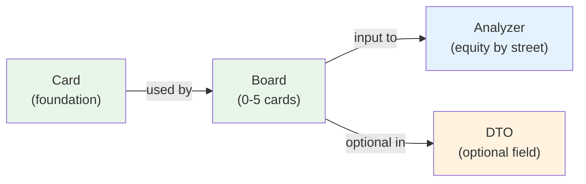

# Domain Model: Board

## Purpose

Represents community cards (0-5 cards) for post-flop analysis. Optional in AoF (pre-flop only game).

**Depends on**: Card (foundation)

**Note**: For AoF games, board is typically `None` since analysis is pre-flop only.

Validates:
- ✅ 0-5 cards (poker rule)
- ✅ No duplicate cards
- ✅ Cards progress logically (flop, flop+turn, flop+turn+river)

---

## Specification

```python
from dataclasses import dataclass, field
from typing import Optional, List
from shared.domain.card import Card

@dataclass(frozen=True)
class Board:
    """Community cards representation (0-5 cards, immutable)."""
    
    cards: List[Card] = field(default_factory=list)
    
    def __post_init__(self):
        """Validate board state."""
        # Check card count
        if not 0 <= len(self.cards) <= 5:
            raise ValueError(f"Board must have 0-5 cards, got {len(self.cards)}")
        
        # Check no duplicates
        if len(set(self.cards)) != len(self.cards):
            raise ValueError("Board cannot have duplicate cards")
    
    def __str__(self) -> str:
        """String representation: 'As Kh 2d Ts Jd'."""
        return " ".join(str(card) for card in self.cards)
    
    def to_strings(self) -> List[str]:
        """Convert to list of card strings for transport."""
        return [str(card) for card in self.cards]
    
    @staticmethod
    def from_strings(card_strings: List[str]) -> Optional['Board']:
        """Parse board from list of card strings.
        
        Args:
            card_strings: List of card strings like ["As", "Kh", "2d"]
        
        Returns:
            Board if valid, None if invalid.
        """
        cards = []
        for card_str in card_strings:
            card = Card.from_string(card_str)
            if card is None:
                return None
            cards.append(card)
        
        try:
            return Board(cards=cards)
        except ValueError:
            return None
    
    def is_empty(self) -> bool:
        """Is board empty (pre-flop)?"""
        return len(self.cards) == 0
    
    def is_flop(self) -> bool:
        """Is board showing flop (exactly 3 cards)?"""
        return len(self.cards) == 3
    
    def is_turn(self) -> bool:
        """Is board showing turn (exactly 4 cards)?"""
        return len(self.cards) == 4
    
    def is_river(self) -> bool:
        """Is board showing river (exactly 5 cards)?"""
        return len(self.cards) == 5
    
    def is_complete(self) -> bool:
        """Is board complete (5 cards)?"""
        return len(self.cards) == 5
    
    def get_street(self) -> str:
        """Get street: preflop/flop/turn/river."""
        return {
            0: "preflop",
            3: "flop",
            4: "turn",
            5: "river"
        }.get(len(self.cards), "unknown")
    
    def get_flop(self) -> Optional[tuple[Card, Card, Card]]:
        """Get flop cards (first 3) if available."""
        if len(self.cards) >= 3:
            return (self.cards[0], self.cards[1], self.cards[2])
        return None
    
    def get_turn(self) -> Optional[Card]:
        """Get turn card (4th) if available."""
        if len(self.cards) >= 4:
            return self.cards[3]
        return None
    
    def get_river(self) -> Optional[Card]:
        """Get river card (5th) if available."""
        if len(self.cards) >= 5:
            return self.cards[4]
        return None
    
    def num_cards(self) -> int:
        """Number of cards on board."""
        return len(self.cards)
    
    def contains_card(self, card: Card) -> bool:
        """Does board contain this card?"""
        return card in self.cards
    
    def all_board_cards(self) -> List[Card]:
        """Get all cards as list."""
        return list(self.cards)
```

---

## Fields

| Field | Type | Notes |
|-------|------|-------|
| `cards` | `List[Card]` | 0-5 community cards |

---

## Factory Methods

| Method | Input | Returns | Notes |
|--------|-------|---------|-------|
| `Board.from_strings()` | `["As", "Kh", "2d"]` | `Board` or `None` | Robust parsing |
| `to_strings()` | — | `List[str]` | For DTO transport |
| `__str__()` | — | `str` | Display format |

---

## Helper Methods (Street Detection)

| Method | Returns | Examples |
|--------|---------|----------|
| `is_empty()` | `bool` | Pre-flop |
| `is_flop()` | `bool` | 3 cards |
| `is_turn()` | `bool` | 4 cards |
| `is_river()` | `bool` | 5 cards |
| `is_complete()` | `bool` | All 5 cards dealt |
| `get_street()` | `str` | "preflop", "flop", etc. |

---

## Helper Methods (Card Access)

| Method | Returns | Notes |
|--------|---------|-------|
| `get_flop()` | `tuple[Card,Card,Card]` or `None` | First 3 cards |
| `get_turn()` | `Card` or `None` | 4th card |
| `get_river()` | `Card` or `None` | 5th card |
| `num_cards()` | `int` | 0-5 |
| `contains_card(card)` | `bool` | Is card on board? |
| `all_board_cards()` | `List[Card]` | All cards |

---

## Usage Examples

### Example 1: Pre-Flop (AoF Default)
```python
# Pre-flop board (for AoF games)
board = Board()  # Empty
assert board.is_empty()
assert board.get_street() == "preflop"
assert board.num_cards() == 0
```

### Example 2: Parse Flop
```python
# Flop showing As Kh 2d
board = Board.from_strings(["As", "Kh", "2d"])
assert board.is_flop()
assert board.get_street() == "flop"
assert board.num_cards() == 3

flop_cards = board.get_flop()
assert flop_cards[0] == Card.from_string("As")
```

### Example 3: Completed Board (River)
```python
# Full board: As Kh 2d Ts Jd
board = Board.from_strings(["As", "Kh", "2d", "Ts", "Jd"])
assert board.is_river()
assert board.is_complete()
assert board.get_street() == "river"

flop = board.get_flop()  # (As, Kh, 2d)
turn = board.get_turn()  # Ts
river = board.get_river()  # Jd
```

### Example 4: Check for Duplicate Cards
```python
# Invalid: duplicate cards
board = Board.from_strings(["As", "As", "Kh"])  # ❌ Returns None

# Valid: all different
board = Board.from_strings(["As", "Kh", "2d"])  # ✅ Valid
```

### Example 5: Verify No Card Overlaps
```python
board = Board.from_strings(["As", "Kh", "2d"])
hero_hand = Hand.from_strings("As", "Ks")  # Oops, As on board!

# Check for conflicts
if board.contains_card(hero_hand.card1):
    raise ValueError("Hero card conflicts with board")
```

### Example 6: Street-based Logic
```python
def analyze_hand(hand: Hand, board: Board):
    """Different analysis for different streets."""
    
    if board.is_empty():
        # Pre-flop: analyze against ranges
        return analyze_preflop(hand)
    
    elif board.is_flop():
        # Post-flop: consider board texture
        flop = board.get_flop()
        return analyze_postflop(hand, flop)
    
    elif board.is_river():
        # River: showdown value only
        return analyze_showdown(hand, board.all_board_cards())
```

---

## Code Template

```python
# shared/domain/board.py

from dataclasses import dataclass, field
from typing import Optional, List
from shared.domain.card import Card

@dataclass(frozen=True)
class Board:
    """Community cards (0-5 cards)."""
    
    cards: List[Card] = field(default_factory=list)
    
    def __post_init__(self):
        if not 0 <= len(self.cards) <= 5:
            raise ValueError(f"Board must have 0-5 cards, got {len(self.cards)}")
        if len(set(self.cards)) != len(self.cards):
            raise ValueError("Board cannot have duplicate cards")
    
    def is_empty(self) -> bool:
        return len(self.cards) == 0
    
    def is_complete(self) -> bool:
        return len(self.cards) == 5
    
    def get_street(self) -> str:
        return {0: "preflop", 3: "flop", 4: "turn", 5: "river"}.get(
            len(self.cards), "unknown"
        )
    
    @staticmethod
    def from_strings(card_strings: List[str]) -> Optional['Board']:
        cards = [Card.from_string(s) for s in card_strings]
        if any(c is None for c in cards):
            return None
        try:
            return Board(cards=[c for c in cards if c])
        except ValueError:
            return None
```

---

## Validation Rules

```python
# Valid boards
Board()                                      # ✅ Empty (pre-flop)
Board.from_strings(["As", "Kh", "2d"])      # ✅ Flop
Board.from_strings(["As", "Kh", "2d", "Ts"]) # ✅ Turn
Board.from_strings(["As", "Kh", "2d", "Ts", "Jd"])  # ✅ River

# Invalid
Board.from_strings(["As", "As", "Kh"])      # ❌ Duplicate cards
Board.from_strings(["As", "Kh"])            # ❌ 2 cards (not valid)
Board.from_strings([...])  # > 5 cards      # ❌ Too many cards
```

---

## Interactions with Other Models



**Note**: For AoF (pre-flop only) games, Board is rarely used. PositionContext typically has `board=None`.

---

## Testing

```python
import pytest
from shared.domain.board import Board

def test_empty_board():
    """Create empty board (pre-flop)."""
    board = Board()
    assert board.is_empty()
    assert board.num_cards() == 0
    assert board.get_street() == "preflop"

def test_flop_board():
    """Create flop board."""
    board = Board.from_strings(["As", "Kh", "2d"])
    assert board.is_flop()
    assert not board.is_empty()
    assert board.num_cards() == 3
    assert board.get_street() == "flop"
    
    flop = board.get_flop()
    assert len(flop) == 3

def test_turn_board():
    """Create turn board."""
    board = Board.from_strings(["As", "Kh", "2d", "Ts"])
    assert board.is_turn()
    assert board.num_cards() == 4
    assert board.get_turn() is not None

def test_river_board():
    """Create river board."""
    board = Board.from_strings(["As", "Kh", "2d", "Ts", "Jd"])
    assert board.is_river()
    assert board.is_complete()
    assert board.num_cards() == 5
    assert board.get_river() is not None

def test_board_invalid_duplicates():
    """Board rejects duplicate cards."""
    board = Board.from_strings(["As", "As", "Kh"])
    assert board is None

def test_board_too_many_cards():
    """Board rejects > 5 cards."""
    with pytest.raises(ValueError):
        Board(cards=[Card.from_string(s) for s in 
                     ["As", "Kh", "2d", "Ts", "Jd", "9s"]])

def test_board_contains_card():
    """Check card membership."""
    board = Board.from_strings(["As", "Kh", "2d"])
    as_card = Card.from_string("As")
    
    assert board.contains_card(as_card)
    assert not board.contains_card(Card.from_string("9s"))

def test_board_immutable():
    """Board is frozen."""
    board = Board.from_strings(["As", "Kh", "2d"])
    with pytest.raises(Exception):  # FrozenInstanceError
        board.cards = []

def test_board_display():
    """Board displays nicely."""
    board = Board.from_strings(["As", "Kh", "2d"])
    assert str(board) == "As Kh 2d"
```

---

## Best Practices

1. **Check street before accessing specific cards**
   ```python
   # ✅ Good - safe access
   if board.is_river():
       river_card = board.get_river()
   
   # ❌ Bad - exception risk
   river_card = board.get_river()  # Could be None
   ```

2. **Use Board in DTO as Optional**
   ```python
   # ✅ Good - makes clear board is optional for AoF
   class PositionContext:
       board: Optional[Board] = None
   
   # ❌ Bad - implies board always present
   class PositionContext:
       board: Board  # No default
   ```

3. **Verify card availability before equity calcs**
   ```python
   # ✅ Good - safe
   hand = Hand.from_strings("As", "Kd")
   if not board.contains_card(hand.card1):
       equity = calculate_equity(hand, board)
   
   # ❌ Bad - silent failure if conflict
   equity = calculate_equity(hand, board)  # Maybe wrong result
   ```

---

## AoF Special Case

For **all-in/fold games** (pre-flop only):

```python
# Standard AoF context (no board)
context = PositionContext(
    position=Position.BTN,
    num_opponents=2,
    heroes_hole_cards=hand,
    board=None  # Always None for AoF
)

# Board is not used in AoF pre-flop analysis
# It would only be used if modeling post-flop equity
# (outside scope of pure AoF game)
```

---

**Next**: Review [00_INDEX.md](00_INDEX.md) for complete domain model overview

