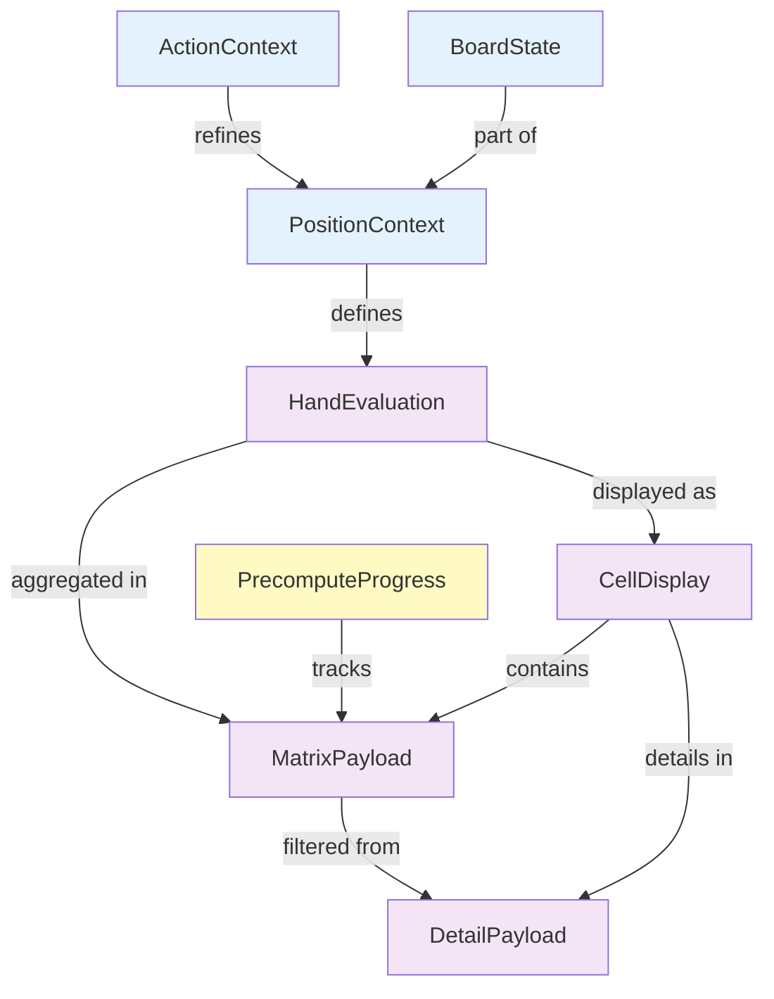
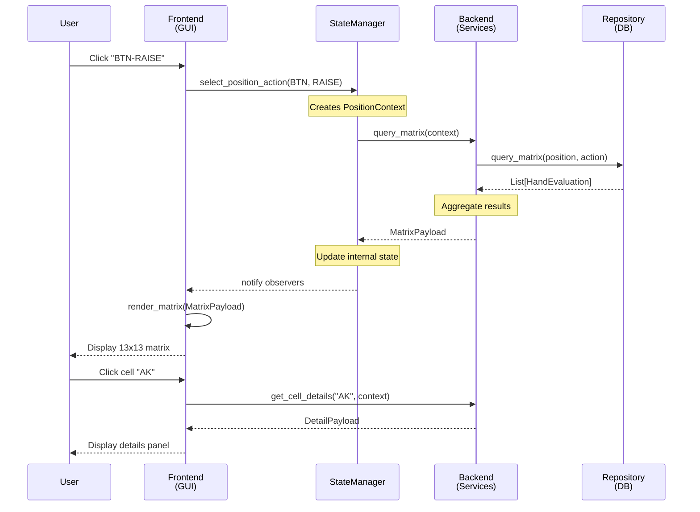

# DTOs & Shared Models - Detailed Design Index

## Overview

This folder (02_SHARED_MODELS) contains detailed specifications for each **Data Transfer Object (DTO)** and **Shared Model** used in Architecture A.

**⚠️ Important**: DTOs depend on **Domain Models** (not strings). Domain models are in the adjacent folder: [../01_DOMAIN_MODELS/](../01_DOMAIN_MODELS/)

**Navigation**: Each DTO has its own document with:
- Purpose and responsibility
- Field specifications (including domain model usage)
- Validation rules
- Code templates
- Usage examples
- Interaction diagrams

---

## 🔗 Domain Models → DTOs Relationship

**Goal**: Type safety from API boundary through business logic.

```
HTTP Request (JSON strings)
    ↓ [PARSE AT BOUNDARY]
Domain Models (Card, Hand, HandRange)
    ↓ [COMPOSE INTO DTOs]
DTO (PositionContext with Hand)
    ↓ [PASS TO BUSINESS LOGIC]
Business Logic (fully typed)
    ↓ [RETURN DTO WITH DOMAIN MODELS]
DTO (MatrixPayload with HandRange)
    ↓ [SERIALIZE AT BOUNDARY]
HTTP Response (JSON strings)
```

**Key Files**:
- **[../01_DOMAIN_MODELS/00_INDEX.md](../01_DOMAIN_MODELS/00_INDEX.md)** - Domain model architecture
- **[../04_INTEGRATION_DTOs_and_DomainModels.md](../04_INTEGRATION_DTOs_and_DomainModels.md)** - How boundaries work
- **[01_DTO_PositionContext.md](01_DTO_PositionContext.md)** - Input DTO using Hand
- **[05_DTO_MatrixPayload.md](05_DTO_MatrixPayload.md)** - Output DTO using HandRange

---

## DTO Categories

### 📥 **Input Models** (Frontend → Backend)
These models describe **what** to analyze.

| Model | Purpose | When Used |
|-------|---------|-----------|
| [PositionContext](01_DTO_PositionContext.md) | Specify a poker position to analyze | User selects position/action |
| [ActionContext](02_DTO_ActionContext.md) | Specify an action at a position | (Optional) For multi-action scenarios |

### 📤 **Output Models** (Backend → Frontend)
These models describe **analysis results**.

| Model | Purpose | When Used |
|-------|---------|-----------|
| [HandEvaluation](04_DTO_HandEvaluation.md) | Results of evaluating one hand | Single hand lookup |
| [MatrixPayload](05_DTO_MatrixPayload.md) | Complete 13x13 matrix | Display main matrix |
| [CellDisplay](06_DTO_CellDisplay.md) | Single cell formatted for rendering | Used inside MatrixPayload |
| [DetailPayload](07_DTO_DetailPayload.md) | Details for selected cell | Display detail panel |

### 📊 **Progress Models** (Status updates)
These models track **ongoing computation**.

| Model | Purpose | When Used |
|-------|---------|-----------|
| [PrecomputeProgress](08_DTO_PrecomputeProgress.md) | Computation progress | Poll during computation |

### 📋 **Enums & Constants**
Shared constants and type definitions.

| Enum | Values | Used In |
|------|--------|---------|
| [Position](09_ENUM_Position.md) | UTG, BTN, SB, BB (4-max only) | PositionContext |
| [Action](10_ENUM_Action.md) | FOLD, ALL_IN | ActionContext |
| [MetricType](11_ENUM_MetricType.md) | EQUITY, EV, WIN_LOSE, EQR | MatrixPayload, display |

---

## 🔄 Data Flow Diagram

```mermaid
graph LR
    subgraph User["👤 User Interaction"]
        UserInput["User selects<br/>position/action"]
    end
    
    subgraph Frontend["🎨 Frontend"]
        FC["Creates<br/>PositionContext"]
    end
    
    subgraph Backend["⚙️ Backend"]
        Query["Queries<br/>DB"]
        Eval["Evaluates<br/>hands"]
    end
    
    subgraph Output["📊 Output"]
        HE["HandEvaluation<br/>(per hand)"]
        MP["MatrixPayload<br/>(all hands)"]
    end
    
    subgraph Display["🖼️ Display"]
        CD["CellDisplay<br/>(per cell)"]
        DP["DetailPayload<br/>(on click)"]
    end
    
    UserInput -->|1. Input| FC
    FC -->|2. Send context| Query
    Query -->|3. Existing data| Backend
    Eval -->|4. New computations| HE
    HE -->|5. Aggregate| MP
    MP -->|6. Format| CD
    CD -->|7. Render| Display
    Display -->|8. Click cell| DP
    
    style User fill:#e1f5ff
    style Frontend fill:#f3e5f5
    style Backend fill:#f1f8e9
    style Output fill:#fff3e0
    style Display fill:#fce4ec
```



---

## 📋 DTO Interaction Matrix

Which DTOs interact with which?



---

## 🔑 Key Concepts

### Immutability (frozen=True)
Input models should be **immutable** (frozen) because:
- ✅ Thread-safe (can be shared between threads)
- ✅ Can be used as dict keys
- ✅ Can be cached/memoized
- ✅ Safe to pass around

```python
@dataclass(frozen=True)
class PositionContext:  # Cannot be modified
    position: Position
    pot_size_bb: float
```

### Validation
Each model validates its constraints:
- Equity must be [0, 1]
- Pot size must be > 0
- Probabilities must sum to 1
- Positions must be valid

Validation happens in `__post_init__`:

```python
def __post_init__(self):
    if self.equity < 0 or self.equity > 1:
        raise ValueError(f"Equity {self.equity} not in [0,1]")
```

### Format Strings
Output models use pre-formatted strings:

```python
@dataclass
class CellDisplay:
    value: str  # Pre-formatted: "45.2%", "$5.67"
    # NOT raw: float (0.452, 5.67)
```

Why? Formatting happens once in presenter layer, not repeated in GUI render loop.

---

## 🎯 Design Decisions All DTOs Make

### 1. **Float vs Decimal**
For money/equity values:
- ✅ Use `float` (simpler)
- ❌ Use `Decimal` (overkill for poker)

### 2. **String vs Enum**
For positions/actions:
- ✅ Use `Enum` (type-safe)
- ❌ Use `str` (magic strings)

### 3. **List vs Tuple vs Dict**
For collections:
- Use `List` for mutable (cells in matrix)
- Use `Tuple` for immutable (RGB colors)
- Use `Dict` for key-value (color mappings)

### 4. **Validation Strategy**
- Input models: Strict validation (frozen, check all)
- Output models: Loose validation (trust backend)
- Progress models: Minimal validation (simple updates)

---

## 📖 Reading Order

### Quick Overview (15 min)
1. This file (navigation)
2. [01_DTO_PositionContext.md](01_DTO_PositionContext.md) - The main input
3. [05_DTO_MatrixPayload.md](05_DTO_MatrixPayload.md) - The main output

### Complete Deep Dive (45 min)
1. All Input Models (01-03)
2. All Output Models (04-07)
3. Progress Models (08)
4. All Enums (09-11)

### For Implementation
Start with:
1. Enums (09-11) - Define all constant values
2. Input Models (01-03) - Define what frontend sends
3. Output Models (04-08) - Define what backend returns

---

## 🔗 How They Connect

### User Flow: "Select Position and View Matrix"

```
User clicks "BTN-RAISE"
  ↓
Frontend creates: PositionContext(position=BTN, actions=RAISE)
  ↓
Frontend calls: backend.query_matrix(context)
  ↓
Backend queries: Repository.query_matrix(context)
  ↓
Backend gets: List[HandEvaluation]
  ↓
Backend aggregates: MatrixPayload(
    cells=[CellDisplay, CellDisplay, ...],
    min_value=0.20,
    max_value=0.75
)
  ↓
Presenter formats: MatrixPayload → view_model
  ↓
Frontend renders: Components display matrix
  ↓
User clicks cell "AK"
  ↓
Frontend calls: backend.get_cell_details("AK")
  ↓
Backend returns: DetailPayload(
    hand_key="AK",
    equity=0.452,
    ...
)
  ↓
Frontend displays: Detailed statistics
```

---

## 📊 Complete Interaction Sequence



---

## 📂 File Organization in Your Project

Once you implement these DTOs:

```
shared/
├── __init__.py
├── models/
│   ├── __init__.py
│   ├── enums.py              # Position, Action, MetricType
│   ├── context_models.py     # PositionContext, ActionContext, BoardState
│   ├── result_models.py      # HandEvaluation, MatrixPayload, CellDisplay, DetailPayload
│   └── progress_models.py    # PrecomputeProgress
└── validators.py             # Custom validation functions
```

---

## ✅ Validation Checklist

For each DTO, ensure:
- [ ] Purpose is clear (what it represents)
- [ ] Fields have type hints
- [ ] Validation rules defined
- [ ] Usage example provided
- [ ] Interaction with other DTOs documented
- [ ] Code template provided
- [ ] Docstring explains contract

---

## 🚀 Next Steps

1. **Choose your starting DTO**: 
   - Start: [09_ENUM_Position.md](09_ENUM_Position.md) (simplest)
   - Or: [01_DTO_PositionContext.md](01_DTO_PositionContext.md) (main input)

2. **Read its detailed spec** (5 min per DTO)

3. **Implement it** (2 min per DTO)

4. **Move to next** (build incrementally)

---

## 📞 Questions About DTOs?

- **"What fields does X need?"** → Read its detailed document
- **"How do X and Y interact?"** → See interaction diagrams above
- **"How do I validate this?"** → See validation examples
- **"Can I modify this DTO?"** → See the design decision rationale

Each document has:
- Purpose statement
- Field specifications
- Validation rules
- Code templates
- Usage examples
- Interaction diagrams
- Common mistakes

---

**Start with [01_DTO_PositionContext.md](01_DTO_PositionContext.md) - it's the main input model and forms the foundation.** 🎯
