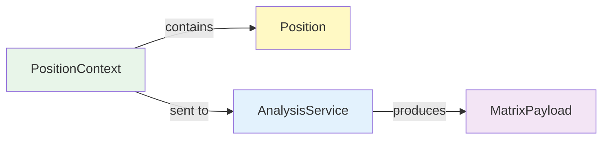

# DTO: PositionContext

## Purpose

Main input model sent from frontend to backend for analysis. Captures all information needed to analyze a poker position: your seat position, stack sizes, and number of opponents. All-in/fold is a pre-flop game only.

**Sent By**: Frontend event handler  
**Received By**: AnalysisService  
**Triggers**: Matrix analysis computation  
**Immutable**: Yes (frozen=True for thread safety)

---

## Specification

```python
from dataclasses import dataclass
from typing import Optional
from shared.enums import Position
from shared.domain.hand import Hand

@dataclass(frozen=True)  # Immutable - thread safe
class PositionContext:
    """Complete description of a poker position for all-in/fold analysis."""
    
    position: Position              # Your seat (UTG, BTN, SB, BB - 4-max only)
    num_opponents: int              # Number of opponents (1-3, max 4 players total)
    heroes_hole_cards: Optional[Hand] = None  # Hand domain model or None
    pot_size_bb: float = 1.0        # Stack size / effective stack (for EV calculation)
    
    def __post_init__(self):
        """Validate all fields."""
        if not isinstance(self.position, Position):
            raise ValueError(f"position must be Position enum, got {type(self.position)}")
        
        if self.num_opponents < 1 or self.num_opponents > 3:
            raise ValueError(f"num_opponents must be 1-3 (4 max players), got {self.num_opponents}")
        
        if self.pot_size_bb <= 0:
            raise ValueError(f"pot_size_bb must be positive, got {self.pot_size_bb}")
        
        if self.heroes_hole_cards:
            if not isinstance(self.heroes_hole_cards, Hand):
                raise ValueError(f"heroes_hole_cards must be Hand domain model, got {type(self.heroes_hole_cards)}")
```

---

## Fields

| Field | Type | Required | Default | Notes |
|-------|------|----------|---------|-------|
| `position` | `Position` | ✅ Yes | — | UTG, BTN, SB, BB (4-max only) |
| `num_opponents` | `int` | ✅ Yes | — | 1-3 opponents (4 max players) |
| `heroes_hole_cards` | `Hand \| None` | ❌ Optional | `None` | Domain model (from 01_DOMAIN_MODELS) |
| `pot_size_bb` | `float` | ❌ No | `1.0` | Effective stack in big blinds |

---

## Usage Examples

### Example 1: Heads-up Pre-Flop Analysis
```python
# User: Playing KK from UTG, heads-up (all-in/fold decision)
kontext = PositionContext(
    position=Position.UTG,
    num_opponents=1,
    heroes_hole_cards=Hand.from_strings("Kh", "Kd"),  # Hand domain model
    pot_size_bb=1.0   # Effective stack (blinds only)
)

# Analysis: Should we shove KK all-in with 1 opponent?
```

### Example 2: 3-way Pre-Flop All-in
```python
# User: Playing AQ from BTN, 3-way pre-flop all-in
context = PositionContext(
    position=Position.BTN,
    num_opponents=2,
    heroes_hole_cards=Hand.from_shorthand("AQo"),  # Creates all AQo combos, pick first
    pot_size_bb=10.0    # 10BB effective stack
)

# Analysis: Winning probability vs 2 opponents pre-flop?
```

### Example 3: 4-way Pre-Flop All-in
```python
# User: All-in from SB with 3 opponents pre-flop
context = PositionContext(
    position=Position.SB,
    num_opponents=3,
    heroes_hole_cards=Hand.from_strings("Ah", "Th"),  # Hand domain model
    pot_size_bb=25.0    # 25BB effective stack
)

# Analysis: EV of being all-in vs 3 opponents pre-flop?
```

---

## Code Template

```python
# shared/models.py

from dataclasses import dataclass
from typing import Optional
from shared.enums import Position

@dataclass(frozen=True)
class PositionContext:
    """Input for all-in/fold analysis service (pre-flop only)."""
    
    # Required fields first (position and opponent count)
    position: Position
    num_opponents: int  # 1-3 (4 max players)
    
    # Optional fields
    heroes_hole_cards: Optional[Hand] = None  # Hand domain model
    pot_size_bb: float = 1.0
    
    def __post_init__(self):
        if not isinstance(self.position, Position):
            raise ValueError(f"Invalid position: {self.position}")
        if self.num_opponents < 1 or self.num_opponents > 3:
            raise ValueError(f"num_opponents must be 1-3 (4 max players), got {self.num_opponents}")
        if self.pot_size_bb <= 0:
            raise ValueError(f"pot_size_bb must be > 0, got {self.pot_size_bb}")
    
    def opponent_count_string(self) -> str:
        """Get readable opponent count (e.g., 'Heads-up', '3-way')."""
        match self.num_opponents:
            case 1: return "Heads-up"
            case 2: return "3-way"
            case 3: return "4-way"
            case _: raise ValueError(f"Invalid opponent count: {self.num_opponents}")
```

---

## Validation Rules

```python
# Rule 1: position is required
PositionContext(num_opponents=1)  # ❌ Raises TypeError - missing position

# Rule 2: num_opponents is required and must be 1-3
PositionContext(position=Position.BTN, num_opponents=0)  # ❌ Raises ValueError (min 1)
PositionContext(position=Position.BTN, num_opponents=4)  # ❌ Raises ValueError (max 3)

# Rule 3: pot_size_bb must be positive
PositionContext(position=Position.BTN, num_opponents=1, pot_size_bb=0)  # ❌ Raises ValueError

# Rule 4: heroes_hole_cards must be Hand domain model (if provided)
PositionContext(
    position=Position.BTN,
    num_opponents=1,
    heroes_hole_cards="As Kd"  # ❌ String, not Hand!
)  # Raises ValueError

# Rule 4a: Create Hand using factories
hand = Hand.from_strings("As", "Kd")
context = PositionContext(
    position=Position.BTN,
    num_opponents=1,
    heroes_hole_cards=hand  # ✅ Hand domain model
)  # ✅ OK

# Rule 5: All valid inputs pass (minimal - all-in/fold)
PositionContext(
    position=Position.BTN,
    num_opponents=2  # 3-way table
)  # ✅ OK

# Rule 6: All valid inputs (complete - all-in/fold, pre-flop)
PositionContext(
    position=Position.UTG,
    num_opponents=3,
    heroes_hole_cards=Hand.from_strings("As", "Kh"),
    pot_size_bb=10.0
)  # ✅ OK
```

---

## Immutability (frozen=True)

```python
context = PositionContext(position=Position.BTN)

# Cannot modify - frozen dataclass
context.position = Position.UTG  # ❌ FrozenInstanceError

# This prevents accidental modifications and makes context thread-safe
```

---

## Interactions with Other Models



---

## Testing

```python
import pytest
from shared.models import PositionContext
from shared.enums import Position

def test_creation_minimal():
    """Minimal valid creation (all-in/fold)."""
    ctx = PositionContext(position=Position.BTN, num_opponents=1)
    assert ctx.position == Position.BTN
    assert ctx.num_opponents == 1
    assert ctx.pot_size_bb == 1.0
    assert ctx.heroes_hole_cards is None

def test_creation_complete():
    """Full specification (all-in/fold)."""
    hand = Hand.from_strings("As", "Kh")
    ctx = PositionContext(
        position=Position.UTG,
        num_opponents=2,
        heroes_hole_cards=hand,
        pot_size_bb=10.0
    )
    assert ctx.num_opponents == 2
    assert ctx.heroes_hole_cards == hand
    assert ctx.pot_size_bb == 10.0

def test_required_position():
    """position is required."""
    with pytest.raises(TypeError):
        PositionContext(num_opponents=1)  # Missing position

def test_required_num_opponents():
    """num_opponents is required."""
    with pytest.raises(TypeError):
        PositionContext(position=Position.BTN)  # Missing num_opponents

def test_validation_num_opponents():
    """num_opponents must be 1-3 (4 max players)."""
    with pytest.raises(ValueError):
        PositionContext(position=Position.BTN, num_opponents=0)
    
    with pytest.raises(ValueError):
        PositionContext(position=Position.BTN, num_opponents=4)

def test_validation_pot_size():
    """pot_size_bb must be positive."""
    with pytest.raises(ValueError):
        PositionContext(position=Position.BTN, num_opponents=1, pot_size_bb=0)
    
    with pytest.raises(ValueError):
        PositionContext(position=Position.BTN, num_opponents=1, pot_size_bb=-1)

def test_validation_hole_cards():
    """heroes_hole_cards must be Hand domain model (if provided)."""
    with pytest.raises(ValueError):
        PositionContext(
            position=Position.BTN,
            num_opponents=1,
            heroes_hole_cards="As Kd"  # String, not Hand
        )
    
    # Valid
    hand = Hand.from_strings("As", "Kd")
    ctx = PositionContext(
        position=Position.BTN,
        num_opponents=1,
        heroes_hole_cards=hand
    )
    assert ctx.heroes_hole_cards == hand

def test_immutability():
    """Cannot modify frozen dataclass."""
    ctx = PositionContext(position=Position.BTN, num_opponents=1)
    
    with pytest.raises(Exception):  # FrozenInstanceError
        ctx.position = Position.UTG

def test_opponent_count_string():
    """Check opponent_count_string() helper."""
    heads_up = PositionContext(position=Position.BTN, num_opponents=1)
    assert heads_up.opponent_count_string() == "Heads-up"
    
    three_way = PositionContext(position=Position.BTN, num_opponents=2)
    assert three_way.opponent_count_string() == "3-way"
    
    four_way = PositionContext(position=Position.BTN, num_opponents=3)
    assert four_way.opponent_count_string() == "4-way"
```
```

---

## Best Practices

1. **Always specify num_opponents (required)**
   ```python
   # ❌ Bad - will raise TypeError
   context = PositionContext(position=Position.BTN)
   
   # ✅ Good - provide required parameter
   context = PositionContext(position=Position.BTN, num_opponents=2)
   ```

2. **Use opponent_count_string() for UI display**
   ```python
   # ❌ Bad - hardcoded logic
   if context.num_opponents == 1:
       title = "Heads-up"
   elif context.num_opponents == 2:
       title = "3-way"
   
   # ✅ Good - use helper method
   title = context.opponent_count_string()
   ```

3. **Validate 4-player max constraint**
   ```python
   # ❌ Bad - accept invalid game size
   if user_input > 0:
       context = PositionContext(position=pos, num_opponents=user_input)
   
   # ✅ Good - enforce table limits
   if 1 <= user_input <= 3:
       context = PositionContext(position=pos, num_opponents=user_input)
   else:
       raise ValueError("4-player max (1-3 opponents)")
   ```

---

## Common Mistakes

❌ **Forgetting num_opponents is required**:
```python
# This will raise TypeError (missing required parameter)
PositionContext(position=Position.BTN, heroes_hole_cards=("As", "Kd"))
```

✅ **Always provide num_opponents**:
```python
PositionContext(
    position=Position.BTN,
    num_opponents=2,  # REQUIRED
    heroes_hole_cards=("As", "Kd")
)
```

---

❌ **Trying to use board_state (removed for pre-flop only)**:
```python
# This will raise TypeError - field was removed
context = PositionContext(position=Position.BTN, num_opponents=1)
board = context.board_state  # ❌ No such field
```

✅ **Use pot_size_bb for effective stack**:
```python
context = PositionContext(
    position=Position.BTN,
    num_opponents=1,
    pot_size_bb=15.0  # Effective stack in BB
)
# All-in equity depends on pot_size_bb, not bet amounts
```

---

❌ **Creating contexts with invalid opponent count**:
```python
# This will raise ValueError (4-player max = 3 opponents)
PositionContext(position=Position.BTN, num_opponents=7)
```

✅ **Respect 4-player maximum**:
```python
# Valid: 1-3 opponents (2-4 total players)
heads_up = PositionContext(position=Position.BTN, num_opponents=1)
three_way = PositionContext(position=Position.BTN, num_opponents=2)
four_way = PositionContext(position=Position.BTN, num_opponents=3)
```

---

## Frontend → Backend Flow

1. **User selects position**: "BTN"
2. **Frontend creates PositionContext**:
   ```python
   PositionContext(
       position=Position.BTN,
       pot_size_bb=5.0,
       num_opponents=3
   )
   ```
3. **Send to AnalysisService**:
   ```python
   matrix = analysis_service.analyze(context)
   ```
4. **Receive MatrixPayload**:
   ```python
   # Display 13x13 matrix of cells
   ```

---

**Next**: Read [02_DTO_ActionContext.md](02_DTO_ActionContext.md)
