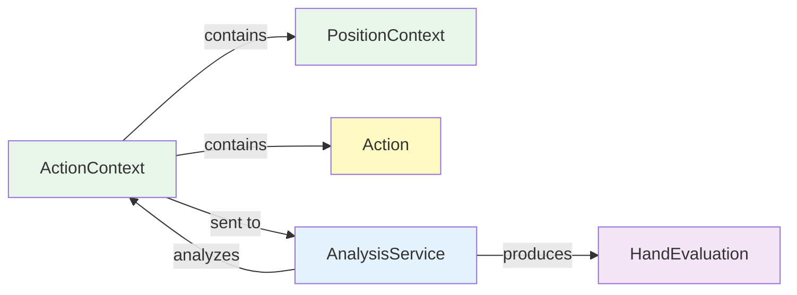
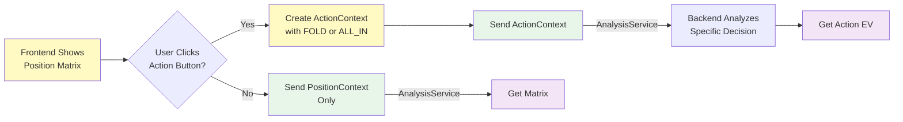

# DTO: ActionContext

## Purpose

Optional wrapper around PositionContext that adds action information for all-in/fold decision analysis. Allows evaluation of specific outcomes (FOLD vs ALL_IN).

**Sent By**: Frontend (when user selects action)  
**Received By**: AnalysisService (optional)  
**Triggers**: Action-specific equity/EV analysis  
**Immutable**: Yes (frozen=True)

---

## Specification

```python
from dataclasses import dataclass
from shared.enums import Action
from shared.models import PositionContext

@dataclass(frozen=True)
class ActionContext:
    """All-in/fold decision: position + action choice."""
    
    position_context: PositionContext
    action: Action  # FOLD or ALL_IN only
    
    def __post_init__(self):
        if not isinstance(self.position_context, PositionContext):
            raise ValueError("position_context must be PositionContext")
        
        if not isinstance(self.action, Action):
            raise ValueError("action must be Action enum")
        
        # Validate only FOLD and ALL_IN are allowed
        if self.action not in (Action.FOLD, Action.ALL_IN):
            raise ValueError(f"All-in/fold allows only FOLD or ALL_IN, got {self.action}")
```

---

## Fields

| Field | Type | Required | Notes |
|-------|------|----------|-------|
| `position_context` | `PositionContext` | ✅ Yes | The poker position |
| `action` | `Action` | ✅ Yes | FOLD or ALL_IN only |

---

## When to Use ActionContext

### ✅ Use When:
- User clicks FOLD button
- User clicks ALL_IN button
- Analyzing single action outcome
- Comparing FOLD vs ALL_IN EV

### ❌ Don't Use:
- Just showing position matrix (use PositionContext alone)
- General position analysis without specific action

---

## Usage Examples

### Example 1: User Folds
```python
# User: "I want to fold KQ from UTG with 3 opponents"
action_ctx = ActionContext(
    position_context=PositionContext(
        position=Position.UTG,
        num_opponents=2,
        heroes_hole_cards=("Kd", "Qh"),
        pot_size_bb=10.0
    ),
    action=Action.FOLD
)

# Backend: FOLD outcome = lose contribution (pot score = 0)
```

### Example 2: User Goes All-in
```python
# User: "I want to shove AK from Button heads-up"
action_ctx = ActionContext(
    position_context=PositionContext(
        position=Position.BTN,
        num_opponents=1,
        heroes_hole_cards=("As", "Kd"),
        pot_size_bb=20.0  # 20BB effective
    ),
    action=Action.ALL_IN
)

# Backend: Calculate all-in equity vs 1 opponent
```

### Example 3: Comparing Actions
```python
# User: "Show me FOLD vs ALL_IN for AK UTG vs 3"
position_ctx = PositionContext(
    position=Position.UTG,
    num_opponents=3,
    heroes_hole_cards=("As", "Kd"),
    pot_size_bb=15.0
)

# Scenario 1: FOLD
fold_action = ActionContext(
    position_context=position_ctx,
    action=Action.FOLD
)

# Scenario 2: ALL_IN
shove_action = ActionContext(
    position_context=position_ctx,
    action=Action.ALL_IN
)

# Backend analyzes both, frontend shows EV comparison
```

---

## Code Template

```python
# shared/models.py (after PositionContext)

@dataclass(frozen=True)
class ActionContext:
    """All-in/fold position + action decision."""
    
    position_context: PositionContext
    action: Action  # FOLD or ALL_IN only
    
    def __post_init__(self):
        if not isinstance(self.position_context, PositionContext):
            raise ValueError("position_context must be PositionContext")
        if not isinstance(self.action, Action):
            raise ValueError("action must be Action enum")
        
        # Enforce all-in/fold constraint: only FOLD and ALL_IN allowed
        if self.action not in (Action.FOLD, Action.ALL_IN):
            raise ValueError(f"All-in/fold allows only FOLD or ALL_IN, got {self.action}")
    
    def is_aggressive(self) -> bool:
        """Is this an aggressive action? (ALL_IN = yes, FOLD = no)"""
        return self.action == Action.ALL_IN
    
    def is_passive(self) -> bool:
        """Is this a passive action? (FOLD = yes, ALL_IN = no)"""
        return self.action == Action.FOLD
```

---

## Validation Rules

```python
# Rule 1: position_context must be valid PositionContext
ActionContext(
    position_context=None,
    action=Action.FOLD
)  # ❌ Raises ValueError

# Rule 2: action must be valid Action enum
ActionContext(
    position_context=position_ctx,
    action=None
)  # ❌ Raises ValueError

# Rule 3: Only FOLD and ALL_IN allowed (all-in/fold game)
ActionContext(
    position_context=position_ctx,
    action=Action.CALL  # ❌ Not valid for all-in/fold!
)  # Raises ValueError

# Rule 4: Valid cases pass
ActionContext(
    position_context=position_ctx,
    action=Action.FOLD  # ✅ OK
)

ActionContext(
    position_context=position_ctx,
    action=Action.ALL_IN  # ✅ OK
)
```

---

## Immutability

```python
ctx = ActionContext(
    position_context=position_ctx,
    action=Action.FOLD
)

# Cannot modify - frozen dataclass
ctx.action = Action.ALL_IN  # ❌ FrozenInstanceError
```

---

## Interactions with Other Models



---

## Testing

```python
import pytest
from shared.models import ActionContext, PositionContext
from shared.enums import Action, Position

@pytest.fixture
def position_ctx():
    """Standard all-in/fold position."""
    return PositionContext(
        position=Position.BTN,
        num_opponents=2,
        heroes_hole_cards=("As", "Kd"),
        pot_size_bb=10.0
    )

def test_creation_fold(position_ctx):
    """FOLD action creation."""
    ctx = ActionContext(
        position_context=position_ctx,
        action=Action.FOLD
    )
    assert ctx.action == Action.FOLD
    assert ctx.position_context == position_ctx

def test_creation_all_in(position_ctx):
    """ALL_IN action creation."""
    ctx = ActionContext(
        position_context=position_ctx,
        action=Action.ALL_IN
    )
    assert ctx.action == Action.ALL_IN

def test_validation_position_context_required(position_ctx):
    """position_context is required."""
    with pytest.raises(ValueError):
        ActionContext(
            position_context=None,
            action=Action.FOLD
        )

def test_validation_action_required(position_ctx):
    """action is required and valid."""
    with pytest.raises(ValueError):
        ActionContext(
            position_context=position_ctx,
            action=None
        )

def test_validation_only_fold_and_allin(position_ctx):
    """Only FOLD and ALL_IN allowed (no CALL, RAISE, etc.)."""
    # These should all raise ValueError
    invalid_actions = [Action.CALL, Action.RAISE_2X, Action.RAISE_3X, Action.RAISE_4X, Action.RAISE_5X]
    
    for invalid_action in invalid_actions:
        with pytest.raises(ValueError):
            ActionContext(
                position_context=position_ctx,
                action=invalid_action
            )

def test_is_aggressive_fold(position_ctx):
    """FOLD is not aggressive."""
    ctx = ActionContext(
        position_context=position_ctx,
        action=Action.FOLD
    )
    assert ctx.is_passive()
    assert not ctx.is_aggressive()

def test_is_aggressive_all_in(position_ctx):
    """ALL_IN is aggressive."""
    ctx = ActionContext(
        position_context=position_ctx,
        action=Action.ALL_IN
    )
    assert ctx.is_aggressive()
    assert not ctx.is_passive()

def test_immutability(position_ctx):
    """Cannot modify frozen dataclass."""
    ctx = ActionContext(
        position_context=position_ctx,
        action=Action.FOLD
    )
    
    with pytest.raises(Exception):  # FrozenInstanceError
        ctx.action = Action.ALL_IN
```

---

## Best Practices

1. **Always validate PositionContext has required fields**
   ```python
   # ❌ Bad - PositionContext might be incomplete
   ctx = ActionContext(position_context=pos, action=Action.FOLD)
   
   # ✅ Good - ensure PositionContext is valid before wrapping
   if pos.position and 1 <= pos.num_opponents <= 3:
       ctx = ActionContext(position_context=pos, action=Action.FOLD)
   ```

2. **Use is_aggressive() and is_passive() helpers**
   ```python
   # ❌ Bad - check action directly
   if ctx.action == Action.ALL_IN:
       # aggressive logic
   
   # ✅ Good - use readable methods
   if ctx.is_aggressive():
       # aggressive logic
   ```

3. **Respect all-in/fold constraint**
   ```python
   # ❌ Bad - mixing in other actions
   valid_actions = [Action.FOLD, Action.CALL, Action.RAISE_3X]
   
   # ✅ Good - only FOLD and ALL_IN
   valid_actions = [Action.FOLD, Action.ALL_IN]
   ```

---

## Common Mistakes

❌ **Trying to use actions other than FOLD/ALL_IN**:
```python
# This will raise ValueError (all-in/fold game only)
ActionContext(
    position_context=position_ctx,
    action=Action.CALL  # ❌ Not valid!
)
```

✅ **Only use FOLD or ALL_IN**:
```python
ActionContext(
    position_context=position_ctx,
    action=Action.FOLD  # ✅ Valid
)

ActionContext(
    position_context=position_ctx,
    action=Action.ALL_IN  # ✅ Valid
)
```

---

❌ **Forgetting ActionContext is optional**:
```python
# Backend needs ActionContext for action-specific analysis
# But PositionContext alone is fine for position matrix
backend.analyze(action_context)  # Only needed for action analysis
```

✅ **Use ActionContext only when needed**:
```python
# For position matrix (no action)
matrix = backend.analyze(position_context)

# For action-specific analysis (FOLD vs ALL_IN)
fold_ev = backend.analyze(ActionContext(position_context, Action.FOLD))
shove_ev = backend.analyze(ActionContext(position_context, Action.ALL_IN))
```

---

❌ **Trying to use action_amount_bb (removed)**:
```python
# This field was removed for all-in/fold (no bet sizing)
ctx = ActionContext(
    position_context=position_ctx,
    action=Action.ALL_IN,
    action_amount_bb=50.0  # ❌ No such field!
)
```

✅ **All-in is binary (no sizing)**:
```python
# ALL_IN commits entire stack (determined by pot_size_bb)
ctx = ActionContext(
    position_context=position_ctx,
    action=Action.ALL_IN  # ✅ All chips go in
)
```

---

## Flow: User Decision



---

**Next**: Read [04_DTO_HandEvaluation.md](04_DTO_HandEvaluation.md)
