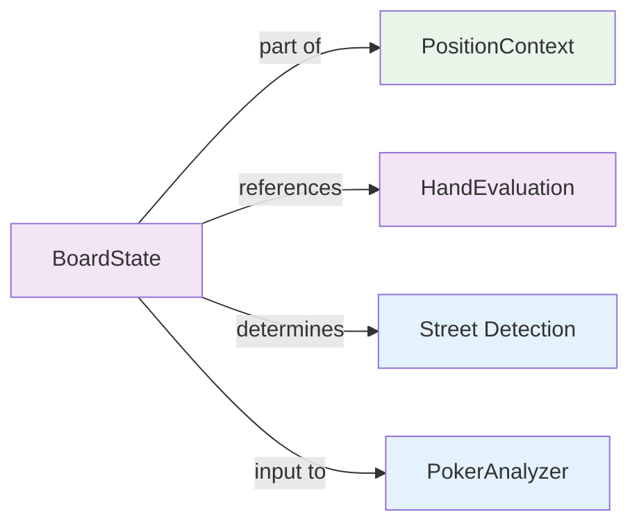
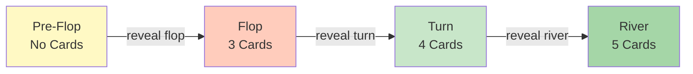

# DTO: BoardState (DEPRECATED)

## ⚠️ DEPRECATED

This class is **no longer used** in all-in/fold (AoF) game analysis. AoF is a pre-flop only game where players decide to go all-in or fold at the start of the hand. There are no post-flop decisions.

**Reason for deprecation**: `board_state` has been removed from `PositionContext` because AoF analysis never requires board state information.

---

## Specification

```python
from dataclasses import dataclass
from typing import Optional

@dataclass(frozen=True)
class BoardState:
    """Represents flop, turn, river cards."""
    
    flop: Optional[tuple[str, str, str]] = None  # 3 cards
    turn: Optional[str] = None                   # 1 card
    river: Optional[str] = None                  # 1 card
    
    def __post_init__(self):
        """Validate board state."""
        # Validate flop
        if self.flop is not None:
            if not isinstance(self.flop, (tuple, list)) or len(self.flop) != 3:
                raise ValueError(f"flop must be 3 cards, got {self.flop}")
            for card in self.flop:
                self._validate_card(card)
        
        # Validate turn
        if self.turn is not None:
            if self.flop is None:
                raise ValueError("Cannot have turn without flop")
            self._validate_card(self.turn)
        
        # Validate river
        if self.river is not None:
            if self.turn is None:
                raise ValueError("Cannot have river without turn")
            self._validate_card(self.river)
    
    @staticmethod
    def _validate_card(card: str):
        """Validate card format: 'As', 'Kh', '2d', etc."""
        if not isinstance(card, str) or len(card) != 2:
            raise ValueError(f"Invalid card format: {card}")
        
        rank = card[0]
        suit = card[1]
        
        valid_ranks = "23456789TJQKA"
        valid_suits = "hsdc"  # hearts, spades, diamonds, clubs
        
        if rank not in valid_ranks or suit not in valid_suits:
            raise ValueError(f"Invalid card: {card}")
    
    def street(self) -> str:
        """Get street: preflop/flop/turn/river."""
        if self.flop is None:
            return "preflop"
        elif self.turn is None:
            return "flop"
        elif self.river is None:
            return "turn"
        else:
            return "river"
    
    def all_cards(self) -> list[str]:
        """Get all cards on board."""
        cards = []
        if self.flop:
            cards.extend(self.flop)
        if self.turn:
            cards.append(self.turn)
        if self.river:
            cards.append(self.river)
        return cards
    
    def num_cards(self) -> int:
        """Number of cards on board."""
        return len(self.all_cards())
```

---

## Fields

| Field | Type | Required | Default | Example | Notes |
|-------|------|----------|---------|---------|-------|
| `flop` | `tuple[str, str, str] \| None` | ❌ No | `None` | `("As", "Kh", "2d")` | 3 community cards |
| `turn` | `str \| None` | ❌ No | `None` | `"Ts"` | 4th community card |
| `river` | `str \| None` | ❌ No | `None` | `"Jd"` | 5th community card |

---

## Card Format

All cards use **shorthand notation**:
- **Rank**: 2, 3, 4, 5, 6, 7, 8, 9, T (10), J, Q, K, A
- **Suit**: h (hearts), s (spades), d (diamonds), c (clubs)

**Examples**:
- "As" = Ace of Spades
- "Kh" = King of Hearts
- "2d" = Two of Diamonds
- "Tc" = Ten of Clubs

---

## Usage Examples

### Example 1: Pre-Flop (No Board)
```python
# Pre-flop analysis - no board yet
board = BoardState()  # All None
assert board.street() == "preflop"
assert board.num_cards() == 0

# Or explicitly None
board = BoardState(flop=None, turn=None, river=None)
```

### Example 2: Flop
```python
# Flop showing As Kh 2d
board = BoardState(flop=("As", "Kh", "2d"))
assert board.street() == "flop"
assert board.num_cards() == 3
```

### Example 3: Turn
```python
# Flop: As Kh 2d, Turn: Ts
board = BoardState(
    flop=("As", "Kh", "2d"),
    turn="Ts"
)
assert board.street() == "turn"
assert board.num_cards() == 4
assert board.all_cards() == ["As", "Kh", "2d", "Ts"]
```

### Example 4: River (Complete Board)
```python
# Full board: As Kh 2d Ts Jd
board = BoardState(
    flop=("As", "Kh", "2d"),
    turn="Ts",
    river="Jd"
)
assert board.street() == "river"
assert board.num_cards() == 5
assert len(board.all_cards()) == 5
```

---

## Code Template

```python
# shared/models.py (add after ActionContext)

@dataclass(frozen=True)
class BoardState:
    """Community cards specification."""
    
    flop: Optional[tuple[str, str, str]] = None
    turn: Optional[str] = None
    river: Optional[str] = None
    
    def __post_init__(self):
        # Validate flop exists if turn/river specified
        if self.turn is not None and self.flop is None:
            raise ValueError("Cannot have turn without flop")
        
        if self.river is not None and self.turn is None:
            raise ValueError("Cannot have river without turn")
        
        # Validate each card
        if self.flop:
            if len(self.flop) != 3:
                raise ValueError(f"Flop must have 3 cards")
            for card in self.flop:
                self._validate_card(card)
        
        if self.turn:
            self._validate_card(self.turn)
        
        if self.river:
            self._validate_card(self.river)
    
    @staticmethod
    def _validate_card(card: str):
        """Validate card: 'As', 'Kh', etc."""
        if not isinstance(card, str) or len(card) != 2:
            raise ValueError(f"Invalid card format: {card}")
        
        rank, suit = card[0], card[1]
        if rank not in "23456789TJQKA" or suit not in "hsdc":
            raise ValueError(f"Invalid card: {card}")
    
    def street(self) -> str:
        """Get street: preflop/flop/turn/river."""
        if self.flop is None:
            return "preflop"
        elif self.turn is None:
            return "flop"
        elif self.river is None:
            return "turn"
        else:
            return "river"
    
    def all_cards(self) -> list[str]:
        """Get all cards as flat list."""
        cards = []
        if self.flop:
            cards.extend(self.flop)
        if self.turn:
            cards.append(self.turn)
        if self.river:
            cards.append(self.river)
        return cards
    
    def num_cards(self) -> int:
        """Count cards on board."""
        return len(self.all_cards())
    
    def is_complete(self) -> bool:
        """Is board complete (all 5 cards)?"""
        return self.river is not None
    
    def display(self) -> str:
        """Format for display: 'As Kh 2d Ts Jd'."""
        return " ".join(self.all_cards())
```

---

## Validation Rules

```python
# Rule 1: Cannot have turn without flop
BoardState(turn="Ts")  # ❌ ValueError

# Rule 2: Cannot have river without turn
BoardState(flop=("As", "Kh", "2d"), river="Jd")  # ❌ ValueError

# Rule 3: Flop must have exactly 3 cards
BoardState(flop=("As", "Kh"))  # ❌ ValueError (2 cards)
BoardState(flop=("As", "Kh", "2d", "Ts"))  # ❌ ValueError (4 cards)

# Rule 4: Card format must be valid
BoardState(flop=("A", "K", "2"))  # ❌ ValueError (need suit)
BoardState(flop=("As", "Kx", "2d"))  # ❌ ValueError ("Kx" invalid suit)

# Rule 5: Valid progressions
BoardState()  # ✅ Pre-flop
BoardState(flop=("As", "Kh", "2d"))  # ✅ Flop
BoardState(flop=("As", "Kh", "2d"), turn="Ts")  # ✅ Turn
BoardState(flop=("As", "Kh", "2d"), turn="Ts", river="Jd")  # ✅ River
```

---

## Interactions with Other Models



---

## Testing

```python
import pytest
from shared.models import BoardState

def test_preflop_empty():
    """Pre-flop board is empty."""
    board = BoardState()
    assert board.street() == "preflop"
    assert board.num_cards() == 0
    assert board.all_cards() == []

def test_flop():
    """Flop with 3 cards."""
    board = BoardState(flop=("As", "Kh", "2d"))
    assert board.street() == "flop"
    assert board.num_cards() == 3
    assert board.all_cards() == ["As", "Kh", "2d"]

def test_turn():
    """Turn with 4 cards."""
    board = BoardState(
        flop=("As", "Kh", "2d"),
        turn="Ts"
    )
    assert board.street() == "turn"
    assert board.num_cards() == 4
    assert board.all_cards() == ["As", "Kh", "2d", "Ts"]

def test_river():
    """River with 5 cards."""
    board = BoardState(
        flop=("As", "Kh", "2d"),
        turn="Ts",
        river="Jd"
    )
    assert board.street() == "river"
    assert board.num_cards() == 5
    assert board.all_cards() == ["As", "Kh", "2d", "Ts", "Jd"]
    assert board.is_complete()

def test_validation_turn_needs_flop():
    """Cannot have turn without flop."""
    with pytest.raises(ValueError):
        BoardState(turn="Ts")

def test_validation_river_needs_turn():
    """Cannot have river without turn."""
    with pytest.raises(ValueError):
        BoardState(
            flop=("As", "Kh", "2d"),
            river="Jd"  # Missing turn!
        )

def test_validation_flop_card_count():
    """Flop must have exactly 3 cards."""
    with pytest.raises(ValueError):
        BoardState(flop=("As", "Kh"))  # Only 2
    
    with pytest.raises(ValueError):
        BoardState(flop=("As", "Kh", "2d", "Ts"))  # 4 cards

def test_validation_card_format():
    """Card format must be valid."""
    with pytest.raises(ValueError):
        BoardState(flop=("A", "K", "2"))  # Missing suits
    
    with pytest.raises(ValueError):
        BoardState(flop=("As", "Kx", "2d"))  # Invalid suit
    
    with pytest.raises(ValueError):
        BoardState(flop=("Xs", "Kh", "2d"))  # Invalid rank

def test_display():
    """Display format."""
    board = BoardState(
        flop=("As", "Kh", "2d"),
        turn="Ts",
        river="Jd"
    )
    assert board.display() == "As Kh 2d Ts Jd"

def test_immutability():
    """Cannot modify frozen dataclass."""
    board = BoardState(flop=("As", "Kh", "2d"))
    
    with pytest.raises(Exception):  # FrozenInstanceError
        board.flop = ("2s", "3h", "4d")
```

---

## Best Practices

1. **Use helper methods for street logic**
   ```python
   # ❌ Bad - check board multiple times
   if board.flop and not board.turn:
       # flop logic
   
   # ✅ Good - use method
   if board.street() == "flop":
       # flop logic
   ```

2. **Use display() for UI**
   ```python
   # ❌ Bad - manual formatting
   display = " ".join(list(board.flop) + [board.turn] if board.turn else [])
   
   # ✅ Good - use method
   display = board.display()
   ```

3. **Check is_complete() before calculating river decisions**
   ```python
   # ❌ Bad - assume board is complete
   evaluate_river_equity(board)
   
   # ✅ Good - verify first
   if board.is_complete():
       evaluate_river_equity(board)
   ```

---

## Common Mistakes

❌ Forgetting to provide all required cards in progression:
```python
BoardState(river="Jd")  # ❌ Missing flop and turn!
```

✅ Follow progression: flop → turn → river:
```python
BoardState(
    flop=("As", "Kh", "2d"),
    turn="Ts",
    river="Jd"
)  # ✅ All required
```

---

## Street Progression



---

**Next**: Read [04_DTO_HandEvaluation.md](04_DTO_HandEvaluation.md)
