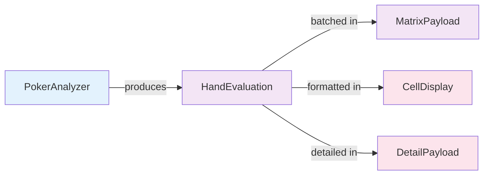

# DTO: HandEvaluation

## Purpose

Result of evaluating a single hand at a position. Contains equity, EV, win/loss probabilities, and other metrics. Returned by AnalysisService for individual hand analysis.

**Produced By**: AnalysisService, PokerAnalyzer  
**Consumed By**: MatrixPayload, CellDisplay, DetailPayload  
**Immutable**: Yes (frozen=True)

---

## Specification

```python
from dataclasses import dataclass
from typing import Optional

@dataclass(frozen=True)
class HandEvaluation:
    """Results of analyzing a single hand."""
    
    equity: float                      # 0.0 to 1.0 (share of pot won)
    equity_std: float = 0.0            # Standard deviation of equity
    ev: float = 0.0                    # Expected value in dollars
    win_probability: float = 0.0       # 0.0 to 1.0 (vs average)
    tie_probability: float = 0.0       # 0.0 to 1.0
    lose_probability: float = 0.0      # 0.0 to 1.0
    win_money: float = 0.0             # Expected $ won
    lose_money: float = 0.0            # Expected $ lost
    num_simulations: int = 0           # How many outcomes analyzed
    is_computed: bool = True           # Was this computed or estimated?
    
    def __post_init__(self):
        """Validate all probabilities."""
        # Equity must be in range
        if not (0.0 <= self.equity <= 1.0):
            raise ValueError(f"equity must be 0.0-1.0, got {self.equity}")
        
        # Probabilities must be in range
        if not (0.0 <= self.win_probability <= 1.0):
            raise ValueError(f"win_probability must be 0.0-1.0")
        
        if not (0.0 <= self.tie_probability <= 1.0):
            raise ValueError(f"tie_probability must be 0.0-1.0")
        
        if not (0.0 <= self.lose_probability <= 1.0):
            raise ValueError(f"lose_probability must be 0.0-1.0")
        
        # Probabilities should sum to ~1.0
        prob_sum = self.win_probability + self.tie_probability + self.lose_probability
        if not (0.99 <= prob_sum <= 1.01):
            raise ValueError(
                f"Probabilities must sum to 1.0, got {prob_sum}"
            )
        
        # num_simulations must be positive if computed
        if self.is_computed and self.num_simulations <= 0:
            raise ValueError("Computed evaluation needs num_simulations > 0")
```

---

## Fields

| Field | Type | Notes |
|-------|------|-------|
| `equity` | `float` | Core metric: 0.0 to 1.0 |
| `equity_std` | `float` | Standard deviation (confidence) |
| `ev` | `float` | Expected value in dollars |
| `win_probability` | `float` | Probability of winning hand |
| `tie_probability` | `float` | Probability of tie |
| `lose_probability` | `float` | Probability of losing hand |
| `win_money` | `float` | Expected dollars won |
| `lose_money` | `float` | Expected dollars lost |
| `num_simulations` | `int` | Sample size used |
| `is_computed` | `bool` | True if calculated, False if estimated |

---

## Equity Interpretation

```
Equity Range   Interpretation
0.00 - 0.20    Very weak hand
0.20 - 0.35    Weak hand
0.35 - 0.50    Marginal/slightly behind
0.50 - 0.65    Marginal/slightly ahead
0.65 - 0.80    Strong hand
0.80 - 1.00    Very strong/locked up
```

---

## Usage Examples

### Example 1: Pre-Flop AK vs Unknowns
```python
# Evaluate AK UTG with 5 opponents
evaluation = HandEvaluation(
    equity=0.523,          # AK vs 5 random hands
    equity_std=0.015,      # Confidence ±1.5%
    ev=0.15,               # +15 cents EV
    win_probability=0.52,
    tie_probability=0.03,
    lose_probability=0.45,
    num_simulations=100000,
    is_computed=True
)

# Display: "52.3% equity, +$0.15"
```

### Example 2: Flopped Top Pair
```python
# KK on QQ4 with 2 opponents remaining
evaluation = HandEvaluation(
    equity=0.78,           # Strong hand
    equity_std=0.008,      # Very confident
    ev=2.50,               # +$2.50 EV
    win_probability=0.75,
    tie_probability=0.05,
    lose_probability=0.20,
    win_money=3.75,        # Win $3.75 total
    lose_money=1.25,       # Lose $1.25 when wrong
    num_simulations=50000,
    is_computed=True
)
```

### Example 3: River Already Decided
```python
# All cards out - equity is certain (0 or 1)
evaluation = HandEvaluation(
    equity=1.0,            # Made the best hand
    equity_std=0.0,        # Certain
    ev=5.00,               # Will win $5
    win_probability=1.0,
    tie_probability=0.0,
    lose_probability=0.0,
    win_money=5.0,
    lose_money=0.0,
    num_simulations=1,     # No randomness
    is_computed=True
)
```

---

## Code Template

```python
# shared/models.py (add after BoardState)

@dataclass(frozen=True)
class HandEvaluation:
    """Single hand evaluation results."""
    
    equity: float
    equity_std: float = 0.0
    ev: float = 0.0
    win_probability: float = 0.0
    tie_probability: float = 0.0
    lose_probability: float = 0.0
    win_money: float = 0.0
    lose_money: float = 0.0
    num_simulations: int = 0
    is_computed: bool = True
    
    def __post_init__(self):
        # Validate ranges
        if not (0.0 <= self.equity <= 1.0):
            raise ValueError("equity must be 0.0-1.0")
        
        # Validate probabilities sum to 1.0
        prob_sum = self.win_probability + self.tie_probability + self.lose_probability
        if not (0.99 <= prob_sum <= 1.01):
            raise ValueError(f"Probabilities must sum to 1.0, got {prob_sum}")
        
        if self.is_computed and self.num_simulations <= 0:
            raise ValueError("Computed needs num_simulations > 0")
    
    @property
    def hand_strength(self) -> str:
        """Categorize hand strength."""
        if self.equity < 0.20:
            return "very_weak"
        elif self.equity < 0.35:
            return "weak"
        elif self.equity < 0.50:
            return "marginal_behind"
        elif self.equity < 0.65:
            return "marginal_ahead"
        elif self.equity < 0.80:
            return "strong"
        else:
            return "very_strong"
    
    def color_for_metric(self, metric: 'MetricType') -> tuple:
        """Get RGB color for metric."""
        from shared.enums import MetricType
        
        if metric == MetricType.EQUITY:
            return self._color_for_value(self.equity, 0.0, 1.0)
        elif metric == MetricType.EV:
            return self._color_for_value(self.ev, -50.0, 50.0)
        elif metric == MetricType.WIN_LOSE_PROBABILITY:
            return self._color_for_value(
                self.win_probability - self.lose_probability,
                -1.0, 1.0
            )
        return (128, 128, 128)  # Gray default
    
    @staticmethod
    def _color_for_value(value: float, min_val: float, max_val: float) -> tuple:
        """Convert value to RGB color (red → green)."""
        # Normalize to 0-1
        normalized = (value - min_val) / (max_val - min_val)
        normalized = max(0.0, min(1.0, normalized))
        
        # Red (0) → Yellow (0.5) → Green (1)
        if normalized < 0.5:
            # Red to Yellow
            r = 255
            g = int(255 * (normalized * 2))
            b = 0
        else:
            # Yellow to Green
            r = int(255 * (1 - (normalized - 0.5) * 2))
            g = 255
            b = 0
        
        return (r, g, b)
    
    def confidence(self) -> float:
        """How confident is this evaluation? (0.0 to 1.0)."""
        # Based on num_simulations and std deviation
        if not self.is_computed:
            return 0.5  # Estimates less confident
        
        # More simulations = more confidence
        confidence_from_sims = min(1.0, self.num_simulations / 100000.0)
        
        # Lower std = more confidence
        if self.equity_std > 0:
            confidence_from_std = 1.0 / (1.0 + self.equity_std * 10)
        else:
            confidence_from_std = 1.0
        
        return (confidence_from_sims + confidence_from_std) / 2.0
```

---

## Validation Rules

```python
# Rule 1: Equity in 0.0-1.0
HandEvaluation(equity=-0.1)  # ❌ ValueError
HandEvaluation(equity=1.5)   # ❌ ValueError

# Rule 2: Probabilities sum to ~1.0
HandEvaluation(
    equity=0.5,
    win_probability=0.4,
    tie_probability=0.4,
    lose_probability=0.4  # Sum = 1.2!
)  # ❌ ValueError

# Rule 3: Computed evaluations need num_simulations
HandEvaluation(
    equity=0.5,
    is_computed=True,
    num_simulations=0  # ❌ No samples!
)  # ValueError

# Rule 4: Valid evaluation
HandEvaluation(
    equity=0.523,
    win_probability=0.52,
    tie_probability=0.03,
    lose_probability=0.45,
    num_simulations=100000,
    is_computed=True
)  # ✅ OK
```

---

## Interactions with Other Models



---

## Testing

```python
import pytest
from shared.models import HandEvaluation

def test_creation_valid():
    """Valid evaluation."""
    eval = HandEvaluation(
        equity=0.52,
        win_probability=0.52,
        tie_probability=0.0,
        lose_probability=0.48,
        num_simulations=10000
    )
    assert eval.equity == 0.52

def test_validation_equity_range():
    """Equity must be 0.0-1.0."""
    with pytest.raises(ValueError):
        HandEvaluation(equity=-0.1)
    
    with pytest.raises(ValueError):
        HandEvaluation(equity=1.5)

def test_validation_probabilities_sum():
    """Probabilities must sum to 1.0."""
    with pytest.raises(ValueError):
        HandEvaluation(
            equity=0.5,
            win_probability=0.4,
            tie_probability=0.4,
            lose_probability=0.3  # Sum = 1.1!
        )

def test_validation_computed_needs_simulations():
    """Computed needs positive simulations."""
    with pytest.raises(ValueError):
        HandEvaluation(
            equity=0.5,
            is_computed=True,
            num_simulations=0
        )

def test_hand_strength_very_weak():
    """Classify very weak hand."""
    eval = HandEvaluation(equity=0.10)
    assert eval.hand_strength == "very_weak"

def test_hand_strength_strong():
    """Classify strong hand."""
    eval = HandEvaluation(equity=0.75)
    assert eval.hand_strength == "strong"

def test_color_for_equity():
    """Get color for equity metric."""
    eval = HandEvaluation(equity=0.5)
    color = eval.color_for_metric(MetricType.EQUITY)
    # 0.5 equity = mid-range, yellow-ish
    assert isinstance(color, tuple)
    assert len(color) == 3

def test_confidence_high():
    """High confidence for many simulations."""
    eval = HandEvaluation(
        equity=0.5,
        num_simulations=200000,
        equity_std=0.001,
        is_computed=True
    )
    assert eval.confidence() > 0.9

def test_confidence_estimated():
    """Low confidence for estimates."""
    eval = HandEvaluation(
        equity=0.5,
        is_computed=False
    )
    assert eval.confidence() <= 0.5

def test_immutability():
    """Cannot modify frozen dataclass."""
    eval = HandEvaluation(equity=0.5)
    
    with pytest.raises(Exception):  # FrozenInstanceError
        eval.equity = 0.6
```

---

## Best Practices

1. **Always validate on creation**
   ```python
   # ❌ Bad - might have invalid data
   eval = load_json_as_evaluation(data)
   
   # ✅ Good - validation happens automatically
   eval = HandEvaluation(**data)  # Will raise if invalid
   ```

2. **Use hand_strength() for logic**
   ```python
   # ❌ Bad - magic numbers
   if eval.equity > 0.65:
       # strong hand
   
   # ✅ Good - use enum
   if eval.hand_strength in ["strong", "very_strong"]:
       # strong hand
   ```

3. **Use confidence() for UI decisions**
   ```python
   # ❌ Bad - ignore confidence
   display_equity(eval.equity)
   
   # ✅ Good - show confidence
   if eval.confidence() > 0.8:
       display_with_high_precision(eval)
   else:
       display_with_warning(eval)
   ```

---

## Common Mistakes

❌ Forgetting to validate probabilities:
```python
HandEvaluation(
    equity=0.5,
    win_probability=0.6,
    lose_probability=0.6  # Sum = 1.2 but no tie!
)  # ❌ ValueError
```

✅ Ensure probabilities sum to 1.0:
```python
HandEvaluation(
    equity=0.5,
    win_probability=0.55,
    tie_probability=0.00,
    lose_probability=0.45  # Sum = 1.0 ✅
)
```

---

## Probability vs Equity

**Important distinction**:
- **Equity**: Long-term, risk-weighted share of pot (0.0-1.0)
- **Win Probability**: Probability of winning this specific hand (0.0-1.0)

Example:
```python
# Different stake sizes
eval1 = HandEvaluation(equity=0.5)  # 50% equity
eval2 = HandEvaluation(equity=0.5, win_probability=0.45)  # 50% equity but only 45% win (ties matter)
```

---

**Next**: Read [05_DTO_MatrixPayload.md](05_DTO_MatrixPayload.md)
