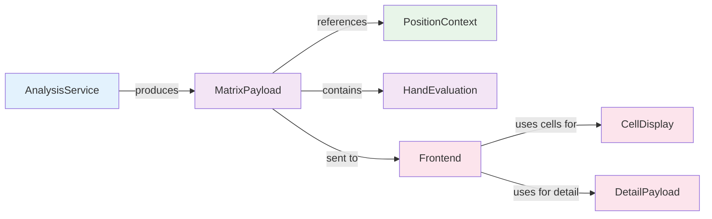

# DTO: MatrixPayload

## Purpose

Complete analysis result: all 169 poker hands (13x13 matrix) evaluated for a specific position. The primary output from AnalysisService. Contains raw evaluation data, precomputed aggregates, and metadata.

**Produced By**: AnalysisService, AnalysisEngine  
**Consumed By**: Frontend display, CellDisplay (for individual cells)  
**Immutable**: Yes (frozen=True)

---

## Specification

```python
from dataclasses import dataclass, field
from typing import Dict, Optional
from shared.enums import MetricType
from shared.models import HandEvaluation, PositionContext
from shared.domain.hand_range import HandRange

@dataclass(frozen=True)
class MatrixPayload:
    """Complete 13x13 matrix of hand evaluations."""
    
    # Matrix data: {hand_key: HandEvaluation}
    # hand_key = "AKo", "AKs", "AA", etc.
    cells: Dict[str, HandEvaluation] = field(default_factory=dict)
    
    # Metadata
    query_context: PositionContext = None  # Original request
    opponent_range: Optional[HandRange] = None  # Opponent range analyzed (e.g., "22+,AKs")
    metric: MetricType = MetricType.EQUITY  # Display metric
    
    # Precomputed aggregates
    average_equity: float = 0.0           # Average across all hands
    average_equity_pairs: float = 0.0     # Average for pairs only
    average_equity_suited: float = 0.0    # Average for suited combos
    average_equity_unsuited: float = 0.0  # Average for unsuited combos
    
    # Confidence metrics
    all_computed: bool = True             # All cells computed (vs estimated)
    total_simulations: int = 0            # Total samples across all hands
    
    # Timestamp
    computed_at: str = ""                 # ISO format timestamp
    
    def __post_init__(self):
        """Validate matrix structure."""
        if not self.cells:
            raise ValueError("Matrix must have cells")
        
        if len(self.cells) != 169:
            raise ValueError(f"Matrix must have 169 hands, got {len(self.cells)}")
        
        expected_hands = self._generate_all_hand_keys()
        actual_hands = set(self.cells.keys())
        
        if actual_hands != expected_hands:
            missing = expected_hands - actual_hands
            if missing:
                raise ValueError(f"Missing hands: {missing}")
    
    @staticmethod
    def _generate_all_hand_keys() -> set:
        """Generate all 169 poker hands."""
        hands = set()
        
        # Pairs: AA to 22
        ranks = "AKQJT98765432"
        for rank in ranks:
            hands.add(f"{rank}{rank}")
        
        # Combos: AK, AQ, etc.
        for i, rank1 in enumerate(ranks):
            for rank2 in ranks[i+1:]:
                # Suited (s)
                hands.add(f"{rank1}{rank2}s")
                # Unsuited (o)
                hands.add(f"{rank1}{rank2}o")
        
        return hands
    
    def get_hand(self, hand_key: str) -> HandEvaluation:
        """Get evaluation for specific hand."""
        if hand_key not in self.cells:
            raise KeyError(f"Hand not found: {hand_key}")
        return self.cells[hand_key]
    
    def get_all_hands_by_type(self, hand_type: str) -> Dict[str, HandEvaluation]:
        """
        Get all hands of a type: 'pair', 'suited', 'unsuited'.
        """
        hands = {}
        for key, eval in self.cells.items():
            if hand_type == "pair" and len(key) == 2:
                hands[key] = eval
            elif hand_type == "suited" and key.endswith("s"):
                hands[key] = eval
            elif hand_type == "unsuited" and key.endswith("o"):
                hands[key] = eval
        return hands
    
    def percentile_for_equity(self, equity: float) -> float:
        """
        What percentile is this equity? (0.0-1.0)
        
        Returns: percentage of hands with equity <= given equity
        """
        count = sum(
            1 for eval in self.cells.values()
            if eval.equity <= equity
        )
        return count / len(self.cells)
    
    def best_hands(self, count: int = 10) -> list[tuple[str, HandEvaluation]]:
        """Get top N hands by equity."""
        sorted_hands = sorted(
            self.cells.items(),
            key=lambda x: x[1].equity,
            reverse=True
        )
        return sorted_hands[:count]
    
    def worst_hands(self, count: int = 10) -> list[tuple[str, HandEvaluation]]:
        """Get bottom N hands by equity."""
        sorted_hands = sorted(
            self.cells.items(),
            key=lambda x: x[1].equity
        )
        return sorted_hands[:count]
    
    def hands_with_equity_above(self, threshold: float) -> list[str]:
        """Get all hands above equity threshold."""
        return [
            key for key, eval in self.cells.items()
            if eval.equity >= threshold
        ]
```

---

## Fields

| Field | Type | Contains | Notes |
|-------|------|----------|-------|
| `cells` | `Dict[str, HandEvaluation]` | 169 hands | Key: "AA", "AKs", "AKo", etc. |
| `query_context` | `PositionContext` | Original request | What was analyzed |
| `opponent_range` | `HandRange \| None` | Opponent range analyzed | e.g., "22+,AKs" from domain models |
| `metric` | `MetricType` | Display metric | EQUITY, EV, WIN_LOSE, EQR |
| `average_equity` | `float` | Aggregate | Mean equity across all |
| `average_equity_pairs` | `float` | Aggregate | Mean equity for pairs |
| `average_equity_suited` | `float` | Aggregate | Mean equity for suited |
| `average_equity_unsuited` | `float` | Aggregate | Mean equity for unsuited |
| `all_computed` | `bool` | Metadata | True if all cells computed |
| `total_simulations` | `int` | Metadata | Total samples |
| `computed_at` | `str` | Timestamp | ISO format |

---

## Usage Examples

### Example 1: Display All Hands vs Specific Range
```python
# Backend analyzes: BTN vs BB who plays "22+,AKs+,AQo+,KQo"
opponent_range = HandRange.from_shorthand("22+,AKs+,AQo+,KQo")
payload = AnalysisService.analyze(
    position_context=context,
    opponent_range=opponent_range
)

# Frontend knows exactly what range was analyzed
print(f"Analyzed vs: {payload.opponent_range.to_shorthand()}")
print(f"Opponent combos: {payload.opponent_range.combos_count()}")

# Display matrix
for hand_key, evaluation in payload.cells.items():
    color = evaluation.color_for_metric(payload.metric)
    display_cell(hand_key, evaluation, color)

# Show summary
print(f"Average equity: {payload.average_equity:.1%}")
print(f"Best hands: {payload.best_hands(3)}")
```

### Example 2: Query Specific Hands
```python
# User wants to see top hands
top_10 = payload.best_hands(10)
for hand_key, eval in top_10:
    print(f"{hand_key}: {eval.equity:.1%}")

# User wants to see suited hands
suited = payload.get_all_hands_by_type("suited")
print(f"Suited combos vs {payload.opponent_range.to_shorthand()}: {len(suited)}")
```

### Example 3: Analyze Equity Distribution
```python
# Where do premium hands stand against this opponent range?
aa_equity = payload.get_hand("AA").equity
percentile = payload.percentile_for_equity(aa_equity)
print(f"AA is in {percentile:.1%} percentile vs {payload.opponent_range.to_shorthand()}")

# How many playable hands against this specific range?
playable = payload.hands_with_equity_above(0.50)
print(f"Playable hands (>50% equity): {len(playable)}")
```

---

## Code Template

```python
# shared/models.py (add after HandEvaluation)

from datetime import datetime
from typing import Optional

@dataclass(frozen=True)
class MatrixPayload:
    """Complete hand matrix analysis result."""
    
    cells: Dict[str, HandEvaluation] = field(default_factory=dict)
    query_context: Optional[PositionContext] = None
    opponent_range: Optional[HandRange] = None  # Domain model from 01_DOMAIN_MODELS
    metric: MetricType = MetricType.EQUITY
    
    average_equity: float = 0.0
    average_equity_pairs: float = 0.0
    average_equity_suited: float = 0.0
    average_equity_unsuited: float = 0.0
    
    all_computed: bool = True
    total_simulations: int = 0
    computed_at: str = field(default_factory=lambda: datetime.utcnow().isoformat())
    
    def __post_init__(self):
        if len(self.cells) != 169:
            raise ValueError(f"Must have 169 hands, got {len(self.cells)}")
    
    @staticmethod
    def _generate_all_hand_keys() -> set:
        """Generate all 169 hand keys."""
        hands = set()
        ranks = "AKQJT98765432"
        
        # Pairs
        for rank in ranks:
            hands.add(f"{rank}{rank}")
        
        # Suited and unsuited
        for i, r1 in enumerate(ranks):
            for r2 in ranks[i+1:]:
                hands.add(f"{r1}{r2}s")
                hands.add(f"{r1}{r2}o")
        
        return hands
    
    def get_hand(self, hand_key: str) -> HandEvaluation:
        """Get evaluation for hand."""
        return self.cells[hand_key]
    
    def best_hands(self, count: int = 10) -> list[tuple[str, HandEvaluation]]:
        """Get top hands by equity."""
        return sorted(
            self.cells.items(),
            key=lambda x: x[1].equity,
            reverse=True
        )[:count]
    
    def percentile_for_equity(self, equity: float) -> float:
        """Percentile rank for equity value."""
        count = sum(1 for e in self.cells.values() if e.equity <= equity)
        return count / len(self.cells)
    
    def hands_above_threshold(self, equity: float) -> list[str]:
        """Get hands above equity threshold."""
        return [k for k, e in self.cells.items() if e.equity >= equity]
```

---

## Matrix Structure (13x13)

The matrix is organized as:
- **Rows**: Ranks A, K, Q, J, T, 9, 8, 7, 6, 5, 4, 3, 2
- **Columns**: Same ranks
- **Diagonal**: Pairs (AA, KK, QQ, ..., 22)
- **Above diagonal**: Suited (AKs, AQs, ...)
- **Below diagonal**: Unsuited (AKo, AQo, ...)

```
      A      K      Q      J      T      9      8      7      6      5      4      3      2
A    AA     AKs    AQs    AJs    ATs    A9s    A8s    A7s    A6s    A5s    A4s    A3s    A2s
K    AKo    KK     KQs    KJs    KTs    K9s    K8s    K7s    K6s    K5s    K4s    K3s    K2s
Q    AQo    KQo    QQ     QJs    QTs    Q9s    Q8s    Q7s    Q6s    Q5s    Q4s    Q3s    Q2s
J    AJo    KJo    QJo    JJ     JTs    J9s    J8s    J7s    J6s    J5s    J4s    J3s    J2s
T    ATo    KTo    QTo    JTo    TT     T9s    T8s    T7s    T6s    T5s    T4s    T3s    T2s
9    A9o    K9o    Q9o    J9o    T9o    99     98s    97s    96s    95s    94s    93s    92s
8    A8o    K8o    Q8o    J8o    T8o    98o    88     87s    86s    85s    84s    83s    82s
7    A7o    K7o    Q7o    J7o    T7o    97o    87o    77     76s    75s    74s    73s    72s
6    A6o    K6o    Q6o    J6o    T6o    96o    86o    76o    66     65s    64s    63s    62s
5    A5o    K5o    Q5o    J5o    T5o    95o    85o    75o    65o    55     54s    53s    52s
4    A4o    K4o    Q4o    J4o    T4o    94o    84o    74o    64o    54o    44     43s    42s
3    A3o    K3o    Q3o    J3o    T3o    93o    83o    73o    63o    53o    43o    33     32s
2    A2o    K2o    Q2o    J2o    T2o    92o    82o    72o    62o    52o    42o    32o    22
```

Total: 13 pairs + 78 suited + 78 unsuited = **169 hands**

---

## Validation Rules

```python
# Rule 1: Must have exactly 169 hands
payload = MatrixPayload(cells={})  # ❌ ValueError
payload = MatrixPayload(cells={...158 hands...})  # ❌ ValueError

# Rule 2: All hands must be valid keys
cells = {f"{hand}_key": HandEvaluation(...) for ... }
payload = MatrixPayload(cells=cells)  # ❌ ValueError if keys invalid

# Rule 3: Valid creation
cells = {hand: HandEvaluation(...) for hand in VALID_169_HANDS}
payload = MatrixPayload(cells=cells)  # ✅ OK
```

---

## Interactions with Other Models



---

## Testing

```python
import pytest
from shared.models import MatrixPayload, HandEvaluation, PositionContext
from shared.enums import Position, MetricType

@pytest.fixture
def valid_cells():
    """Generate valid 169 cells."""
    hands = MatrixPayload._generate_all_hand_keys()
    return {
        hand: HandEvaluation(
            equity=0.5,
            win_probability=0.5,
            lose_probability=0.5
        )
        for hand in hands
    }

def test_creation_valid(valid_cells):
    """Valid matrix creation."""
    payload = MatrixPayload(cells=valid_cells)
    assert len(payload.cells) == 169

def test_validation_hand_count(valid_cells):
    """Must have exactly 169 hands."""
    incomplete = dict(list(valid_cells.items())[:168])
    
    with pytest.raises(ValueError):
        MatrixPayload(cells=incomplete)

def test_get_hand(valid_cells):
    """Retrieve specific hand."""
    payload = MatrixPayload(cells=valid_cells)
    aa = payload.get_hand("AA")
    assert aa.equity == 0.5

def test_best_hands(valid_cells):
    """Get top hands."""
    # Make different equity values
    for i, hand in enumerate(valid_cells.keys()):
        valid_cells[hand] = HandEvaluation(
            equity=i / 169,
            win_probability=i / 169,
            lose_probability=1 - i / 169
        )
    
    payload = MatrixPayload(cells=valid_cells)
    top_10 = payload.best_hands(10)
    
    assert len(top_10) == 10
    # Should be sorted descending
    assert top_10[0][1].equity > top_10[1][1].equity

def test_percentile(valid_cells):
    """Calculate percentile."""
    payload = MatrixPayload(cells=valid_cells)
    
    # All hands have 0.5 equity
    percentile = payload.percentile_for_equity(0.5)
    
    # Should be near 50%
    assert 0.4 < percentile < 0.6

def test_hands_above_threshold(valid_cells):
    """Filter hands by equity."""
    payload = MatrixPayload(cells=valid_cells)
    
    above = payload.hands_above_threshold(0.5)
    
    # Approximately half
    assert 80 < len(above) < 90

def test_immutability(valid_cells):
    """Cannot modify frozen dataclass."""
    payload = MatrixPayload(cells=valid_cells)
    
    with pytest.raises(Exception):  # FrozenInstanceError
        payload.metric = MetricType.EV
```

---

## Best Practices

1. **Validate on creation**
   ```python
   # ❌ Bad - might have incomplete matrix
   payload = load_from_json(data)
   
   # ✅ Good - validation happens
   payload = MatrixPayload(cells=data)  # Will raise if invalid
   ```

2. **Use helper methods**
   ```python
   # ❌ Bad - manual lookup and filtering
   best = max(payload.cells.items(), key=lambda x: x[1].equity)
   
   # ✅ Good - use method
   best = payload.best_hands(1)[0]
   ```

3. **Cache percentiles**
   ```python
   # ❌ Bad - recalculate every time
   for hand in hands:
       p = payload.percentile_for_equity(hand.equity)
   
   # ✅ Good - precalculate
   percentiles = {hand: payload.percentile_for_equity(eval.equity)
                  for hand, eval in payload.cells.items()}
   ```

---

## Common Mistakes

❌ Incomplete matrix:
```python
cells = {"AA": HandEvaluation(...), "KK": HandEvaluation(...)}
MatrixPayload(cells=cells)  # ❌ Only 2 hands!
```

✅ Use helper to generate all 169:
```python
all_hands = MatrixPayload._generate_all_hand_keys()
cells = {hand: HandEvaluation(...) for hand in all_hands}
MatrixPayload(cells=cells)  # ✅ 169 hands
```

---

## Complete Hand List (169)

**Pairs (13)**: AA, KK, QQ, JJ, TT, 99, 88, 77, 66, 55, 44, 33, 22

**Broadways Suited (16)**: AKs, AQs, AJs, ATs, KQs, KJs, KTs, QJs, QTs, JTs, + 20 more...

**Broadways Unsuited (16)**: AKo, AQo, AJo, ATo, KQo, KJo, KTo, QJo, QTo, JTo + 20 more...

(+ all other ranked combinations = 169 total)

---

**Next**: Read [06_DTO_CellDisplay.md](06_DTO_CellDisplay.md)
