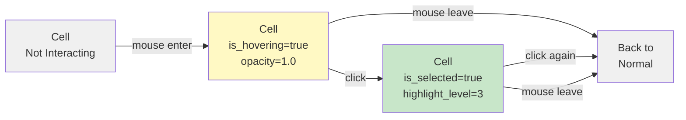
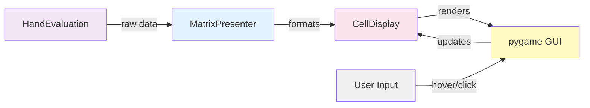

# DTO: CellDisplay

## Purpose

Formatted, display-ready version of a single cell in the matrix. Contains pre-calculated colors, text formatting, and rendering hints. Bridges HandEvaluation (raw data) to GUI layer (rendering).

**Produced By**: MatrixPresenter  
**Consumed By**: Frontend GUI, pygame rendering  
**Immutable**: Yes (frozen=True)

---

## Specification

```python
from dataclasses import dataclass
from typing import Optional
from shared.enums import MetricType

@dataclass(frozen=True)
class CellDisplay:
    """Formatted cell ready for rendering."""
    
    hand_key: str                       # "AA", "AKs", "AKo"
    metric_value: float                 # 0.523 for 52.3%
    display_text: str                   # "52.3%" or "$5.67"
    
    # Colors
    background_color: tuple             # RGB (255, 200, 50)
    text_color: tuple                   # RGB (0, 0, 0) or (255, 255, 255)
    border_color: tuple                 # RGB (100, 100, 100)
    
    # Display hints
    is_computed: bool = True            # Computed vs estimated
    confidence: float = 1.0             # 0.0-1.0 confidence indicator
    show_border: bool = False           # Highlight border?
    highlight_level: int = 0            # 0=none, 1=low, 2=medium, 3=high
    
    # Interaction
    opacity: float = 1.0                # 0.0-1.0 for fading
    is_hovering: bool = False           # Currently mouse hovering?
    is_selected: bool = False           # User selected?
    
    # Optional secondary info
    tooltip_text: Optional[str] = None  # "52.3% equity (201k sims)"
    secondary_text: Optional[str] = None  # "+$5.67"
    
    def __post_init__(self):
        """Validate all color tuples."""
        for color in [self.background_color, self.text_color, self.border_color]:
            if not isinstance(color, tuple) or len(color) != 3:
                raise ValueError(f"Colors must be RGB tuples, got {color}")
            
            for component in color:
                if not (0 <= component <= 255):
                    raise ValueError(f"Color component must be 0-255, got {component}")
        
        if not (0.0 <= self.confidence <= 1.0):
            raise ValueError(f"Confidence must be 0.0-1.0, got {self.confidence}")
        
        if not (0.0 <= self.opacity <= 1.0):
            raise ValueError(f"Opacity must be 0.0-1.0, got {self.opacity}")
        
        if not (0 <= self.highlight_level <= 3):
            raise ValueError(f"Highlight level must be 0-3, got {self.highlight_level}")
```

---

## Fields

| Field | Type | Notes |
|-------|------|-------|
| `hand_key` | `str` | "AA", "AKs", "AKo" |
| `metric_value` | `float` | Raw value (0.523) |
| `display_text` | `str` | Formatted ("52.3%") |
| `background_color` | `tuple` | RGB (255, 200, 50) |
| `text_color` | `tuple` | RGB (0, 0, 0) |
| `border_color` | `tuple` | RGB (100, 100, 100) |
| `is_computed` | `bool` | True if calculated |
| `confidence` | `float` | 0.0-1.0 |
| `show_border` | `bool` | Highlight border |
| `highlight_level` | `int` | 0-3 intensity |
| `opacity` | `float` | 0.0-1.0 |
| `is_hovering` | `bool` | Mouse over |
| `is_selected` | `bool` | User selected |
| `tooltip_text` | `str \| None` | Hover text |
| `secondary_text` | `str \| None` | Extra info |

---

## Usage Examples

### Example 1: Standard Cell (Equity Metric)
```python
# Equity 52.3% - yellow-ish color
cell = CellDisplay(
    hand_key="AKs",
    metric_value=0.523,
    display_text="52.3%",
    background_color=(200, 200, 100),  # Yellow
    text_color=(0, 0, 0),              # Black text
    border_color=(100, 100, 100),
    is_computed=True,
    confidence=0.98,
    tooltip_text="52.3% equity (100k sims)"
)

# Render: Yellow cell, "52.3%" text
```

### Example 2: Weak Hand with Low Confidence
```python
# Estimated weak hand - faded, dashed border
cell = CellDisplay(
    hand_key="9To",
    metric_value=0.35,
    display_text="35%",
    background_color=(200, 100, 100),  # Light red
    text_color=(100, 0, 0),            # Dark red
    border_color=(150, 0, 0),
    is_computed=False,                 # Estimated!
    confidence=0.60,                   # Lower confidence
    opacity=0.7,                       # Slightly faded
    show_border=True,
    highlight_level=1,                 # Low highlight (dashed)
    tooltip_text="~35% (estimated)"
)
```

### Example 3: Selected Cell with Details
```python
# User selected AA - show detailed info
cell = CellDisplay(
    hand_key="AA",
    metric_value=0.85,
    display_text="85%",
    background_color=(0, 200, 0),      # Green
    text_color=(255, 255, 255),        # White
    border_color=(0, 100, 0),
    is_selected=True,
    highlight_level=3,                 # High highlight
    show_border=True,
    tooltip_text="AA: 85% equity, +$45 EV",
    secondary_text="+$45"
)
```

### Example 4: Hovering Cell
```python
# User hovering over AKo
cell = CellDisplay(
    hand_key="AKo",
    metric_value=0.48,
    display_text="48%",
    background_color=(200, 150, 100),  # Orange
    text_color=(0, 0, 0),
    border_color=(150, 75, 0),
    is_hovering=True,
    highlight_level=2,                 # Medium highlight
    opacity=1.0,                       # Full opacity when hovering
    tooltip_text="AKo: 48% equity"
)
```

---

## Code Template

```python
# shared/models.py (add after MatrixPayload)

@dataclass(frozen=True)
class CellDisplay:
    """Formatted cell for GUI rendering."""
    
    hand_key: str
    metric_value: float
    display_text: str
    background_color: tuple
    text_color: tuple
    border_color: tuple
    
    is_computed: bool = True
    confidence: float = 1.0
    show_border: bool = False
    highlight_level: int = 0
    opacity: float = 1.0
    is_hovering: bool = False
    is_selected: bool = False
    
    tooltip_text: Optional[str] = None
    secondary_text: Optional[str] = None
    
    def __post_init__(self):
        # Validate colors
        for color in [self.background_color, self.text_color, self.border_color]:
            if not (isinstance(color, tuple) and len(color) == 3):
                raise ValueError(f"Invalid color: {color}")
            if not all(0 <= c <= 255 for c in color):
                raise ValueError("Color components must be 0-255")
        
        if not (0.0 <= self.confidence <= 1.0):
            raise ValueError("Confidence must be 0.0-1.0")
    
    @property
    def is_premium_hand(self) -> bool:
        """Is this a premium hand (high equity)?"""
        return self.metric_value >= 0.70
    
    @property
    def is_weak_hand(self) -> bool:
        """Is this a weak hand (low equity)?"""
        return self.metric_value <= 0.35
    
    @property
    def is_marginal_hand(self) -> bool:
        """Is this marginal (around 50%)?"""
        return 0.35 < self.metric_value < 0.70
    
    def darken_background(self, factor: float = 0.8) -> tuple:
        """Get darkened background (for selected state)."""
        return tuple(int(c * factor) for c in self.background_color)
    
    def get_border_width(self) -> int:
        """Get border width based on highlight level."""
        widths = {0: 0, 1: 1, 2: 2, 3: 3}
        return widths[self.highlight_level]
    
    def get_border_style(self) -> str:
        """Get border style: solid/dashed."""
        if self.is_computed:
            return "solid"
        else:
            return "dashed"  # Estimated hands get dashed border
```

---

## Color Strategies

### By Metric Type

**Equity (0.0 → 1.0)**:
```
0.0  → Red (255, 0, 0)
0.25 → Orange (255, 128, 0)
0.50 → Yellow (255, 255, 0)
0.75 → Light green (128, 255, 0)
1.0  → Green (0, 255, 0)
```

**EV (-$50 → +$50)**:
```
-$50 → Red (255, 0, 0)
$0   → Yellow (255, 255, 0)
+$50 → Green (0, 255, 0)
```

**Win/Lose (-1.0 → +1.0)**:
```
-1.0 → Red (255, 0, 0)
0.0  → Yellow (255, 255, 0)
+1.0 → Green (0, 255, 0)
```

### Selection States

```python
# Normal cell
background = NORMAL_COLOR

# Hovering
background = lighten(NORMAL_COLOR, 1.2)
border_width = 2

# Selected
background = darken(NORMAL_COLOR, 0.7)
border_width = 3
highlight_level = 3
```

---

## Interaction Flow



---

## Validation Rules

```python
# Rule 1: Colors must be valid RGB tuples
CellDisplay(
    hand_key="AA",
    ...,
    background_color=(255, 0)  # ❌ Only 2 values!
)  # ValueError

# Rule 2: Color components 0-255
CellDisplay(
    hand_key="AA",
    ...,
    background_color=(255, 0, 300)  # ❌ 300 > 255!
)  # ValueError

# Rule 3: Confidence 0.0-1.0
CellDisplay(
    hand_key="AA",
    ...,
    confidence=1.5  # ❌ > 1.0!
)  # ValueError

# Rule 4: Valid creation
CellDisplay(
    hand_key="AA",
    metric_value=0.85,
    display_text="85%",
    background_color=(0, 200, 0),
    text_color=(255, 255, 255),
    border_color=(0, 100, 0),
    confidence=0.95
)  # ✅ OK
```

---

## Interactions with Other Models



---

## Testing

```python
import pytest
from shared.models import CellDisplay

def test_creation_valid():
    """Valid cell creation."""
    cell = CellDisplay(
        hand_key="AA",
        metric_value=0.85,
        display_text="85%",
        background_color=(0, 200, 0),
        text_color=(255, 255, 255),
        border_color=(0, 100, 0)
    )
    assert cell.hand_key == "AA"

def test_validation_color_format():
    """Colors must be RGB tuples."""
    with pytest.raises(ValueError):
        CellDisplay(
            hand_key="AA",
            ...,
            background_color=(255, 0)  # Only 2 values!
        )

def test_validation_color_range():
    """Color components 0-255."""
    with pytest.raises(ValueError):
        CellDisplay(
            hand_key="AA",
            ...,
            background_color=(255, 0, 300)  # 300 > 255!
        )

def test_validation_confidence():
    """Confidence 0.0-1.0."""
    with pytest.raises(ValueError):
        CellDisplay(
            hand_key="AA",
            ...,
            confidence=1.5
        )

def test_hand_strength_premium():
    """Identify premium hands."""
    cell = CellDisplay(
        hand_key="AA",
        metric_value=0.85,
        ...,
        background_color=(0, 255, 0),
        text_color=(0, 0, 0),
        border_color=(0, 100, 0)
    )
    assert cell.is_premium_hand
    assert not cell.is_weak_hand
    assert not cell.is_marginal_hand

def test_hand_strength_weak():
    """Identify weak hands."""
    cell = CellDisplay(
        hand_key="9To",
        metric_value=0.25,
        ...,
        background_color=(255, 0, 0),
        text_color=(100, 0, 0),
        border_color=(150, 0, 0)
    )
    assert cell.is_weak_hand
    assert not cell.is_premium_hand

def test_hand_strength_marginal():
    """Identify marginal hands."""
    cell = CellDisplay(
        hand_key="AKo",
        metric_value=0.48,
        ...,
        background_color=(200, 150, 100),
        text_color=(0, 0, 0),
        border_color=(100, 75, 0)
    )
    assert cell.is_marginal_hand
    assert not cell.is_premium_hand
    assert not cell.is_weak_hand

def test_darken_background():
    """Calculate darkened color."""
    cell = CellDisplay(
        hand_key="AA",
        ...,
        background_color=(100, 200, 100)
    )
    darkened = cell.darken_background(0.8)
    assert darkened == (80, 160, 80)

def test_border_width():
    """Get border width by highlight level."""
    for level in range(4):
        cell = CellDisplay(
            hand_key="AA",
            ...,
            background_color=(0, 0, 0),
            text_color=(0, 0, 0),
            border_color=(0, 0, 0),
            highlight_level=level
        )
        expected = {0: 0, 1: 1, 2: 2, 3: 3}[level]
        assert cell.get_border_width() == expected

def test_border_style_computed():
    """Computed hands have solid border."""
    cell = CellDisplay(
        hand_key="AA",
        ...,
        background_color=(0, 0, 0),
        text_color=(0, 0, 0),
        border_color=(0, 0, 0),
        is_computed=True
    )
    assert cell.get_border_style() == "solid"

def test_border_style_estimated():
    """Estimated hands have dashed border."""
    cell = CellDisplay(
        hand_key="AA",
        ...,
        background_color=(0, 0, 0),
        text_color=(0, 0, 0),
        border_color=(0, 0, 0),
        is_computed=False
    )
    assert cell.get_border_style() == "dashed"

def test_immutability():
    """Cannot modify frozen dataclass."""
    cell = CellDisplay(
        hand_key="AA",
        ...,
        background_color=(0, 0, 0),
        text_color=(0, 0, 0),
        border_color=(0, 0, 0)
    )
    
    with pytest.raises(Exception):  # FrozenInstanceError
        cell.is_selected = True
```

---

## Best Practices

1. **Use property methods for categorization**
   ```python
   # ❌ Bad - magic number
   if cell.metric_value >= 0.70:
       highlight = True
   
   # ✅ Good - use property
   if cell.is_premium_hand:
       highlight = True
   ```

2. **Pre-calculate all display data**
   ```python
   # ❌ Bad - calculate color every frame
   color = calculate_color(evaluation.equity)
   
   # ✅ Good - pre-calculated in CellDisplay
   color = cell.background_color
   ```

3. **Use border style to indicate confidence**
   ```python
   # ❌ Bad - ignore is_computed
   draw_border(cell, style="solid")
   
   # ✅ Good - reflect confidence
   draw_border(cell, style=cell.get_border_style())
   ```

---

## Common Mistakes

❌ Creating colors outside 0-255:
```python
CellDisplay(
    ...,
    background_color=(300, 100, 50)  # ❌ 300 > 255!
)
```

✅ Always validate color ranges:
```python
rgb = tuple(min(255, max(0, c)) for c in color)
CellDisplay(..., background_color=rgb)  # ✅ Safe
```

---

**Next**: Read [07_DTO_DetailPayload.md](07_DTO_DetailPayload.md)
