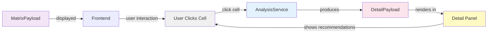

# DTO: DetailPayload

## Purpose

Detailed analysis when user clicks a cell to see more information. Contains full statistics, breakdowns by opponent count, and contextual recommendations.

**Produced By**: AnalysisService, DetailPresenter  
**Consumed By**: Frontend detail view component  
**Immutable**: Yes (frozen=True)

---

## Specification

```python
from dataclasses import dataclass, field
from typing import Optional, Dict
from shared.models import HandEvaluation

@dataclass(frozen=True)
class DetailPayload:
    """Detailed view for selected cell."""
    
    # Hand info
    hand_key: str                              # "AA", "AKs", "AKo"
    hand_name: str                             # "Pocket Aces", "Ace-King Suited"
    
    # Core evaluation
    evaluation: HandEvaluation                 # Full evaluation
    
    # Breakdowns by opponent count
    by_opponent_count: Dict[int, HandEvaluation] = field(default_factory=dict)
    
    # Range analysis
    hands_better: int = 0                      # Number of hands with higher equity
    hands_worse: int = 0                       # Number of hands with lower equity
    hands_similar: int = 0                     # Within 5% of this equity
    percentile_rank: float = 0.0               # 0.0-1.0 (where does this rank)
    
    # Recommendations
    recommendation: str = ""                   # "FOLD", "CALL", "RAISE", "SHOVE"
    recommendation_reason: str = ""            # Explanation
    
    # Additional stats
    expected_position_ev: float = 0.0          # EV if you always had this hand
    vs_field_ev: float = 0.0                   # EV vs opponent range
    
    # Metadata
    detail_computed_at: str = ""               # Timestamp
    
    def __post_init__(self):
        """Validate hand key and evaluation."""
        if not self.hand_key or len(self.hand_key) < 2:
            raise ValueError(f"Invalid hand_key: {self.hand_key}")
        
        if self.percentile_rank < 0.0 or self.percentile_rank > 1.0:
            raise ValueError(f"percentile_rank must be 0.0-1.0")
        
        if self.hands_better < 0 or self.hands_better > 169:
            raise ValueError(f"hands_better must be 0-169")
    
    @property
    def hand_rank(self) -> int:
        """Rank of this hand (1-169, 1 = best)."""
        return self.hands_worse + 1
    
    @property
    def is_premium(self) -> bool:
        """Is this a premium hand? (top 10%)."""
        return self.evaluation.equity >= 0.70
    
    @property
    def is_weak(self) -> bool:
        """Is this a weak hand? (bottom 10%)."""
        return self.evaluation.equity <= 0.35
    
    @property
    def recommendation_type(self) -> str:
        """Extract action from recommendation: FOLD/CALL/RAISE/SHOVE."""
        if "FOLD" in self.recommendation:
            return "FOLD"
        elif "SHOVE" in self.recommendation:
            return "SHOVE"
        elif "RAISE" in self.recommendation:
            return "RAISE"
        elif "CALL" in self.recommendation:
            return "CALL"
        else:
            return "UNKNOWN"
```

---

## Fields

| Field | Type | Purpose |
|-------|------|---------|
| `hand_key` | `str` | Hand identifier |
| `hand_name` | `str` | Human-readable name |
| `evaluation` | `HandEvaluation` | Full stats |
| `by_opponent_count` | `Dict[int, HandEvaluation]` | Equity vs 1-6 opponents |
| `hands_better` | `int` | Hands with higher equity |
| `hands_worse` | `int` | Hands with lower equity |
| `hands_similar` | `int` | Within 5% equity |
| `percentile_rank` | `float` | 0.0-1.0 ranking |
| `recommendation` | `str` | "FOLD", "RAISE 3X", etc |
| `recommendation_reason` | `str` | Why this action |
| `expected_position_ev` | `float` | EV with this hand always |
| `vs_field_ev` | `float` | EV vs likely range |
| `detail_computed_at` | `str` | Timestamp |

---

## Usage Examples

### Example 1: Premium Hand Detail (AA)
```python
detail = DetailPayload(
    hand_key="AA",
    hand_name="Pocket Aces",
    evaluation=HandEvaluation(
        equity=0.87,
        ev=3.50,
        win_probability=0.85,
        ...
    ),
    by_opponent_count={
        1: HandEvaluation(equity=0.95, ...),
        2: HandEvaluation(equity=0.89, ...),
        3: HandEvaluation(equity=0.85, ...),
        4: HandEvaluation(equity=0.82, ...),
        5: HandEvaluation(equity=0.79, ...),
        6: HandEvaluation(equity=0.77, ...),
    },
    hands_better=0,
    hands_worse=168,
    hands_similar=1,
    percentile_rank=1.0,
    recommendation="RAISE 2.5X",
    recommendation_reason="Strongest hand, wants to build pot",
    expected_position_ev=3.50,
    vs_field_ev=2.85
)

# Display:
# Pocket Aces: 87% equity
# Rank: 1st best
# Recommendation: Raise to 2.5x big blind
# EV: +$3.50
```

### Example 2: Marginal Hand Detail (AKo)
```python
detail = DetailPayload(
    hand_key="AKo",
    hand_name="Ace-King Offsuit",
    evaluation=HandEvaluation(
        equity=0.48,
        ev=0.05,
        win_probability=0.47,
        ...
    ),
    by_opponent_count={
        1: HandEvaluation(equity=0.65, ...),
        2: HandEvaluation(equity=0.52, ...),
        3: HandEvaluation(equity=0.45, ...),
        4: HandEvaluation(equity=0.40, ...),
        5: HandEvaluation(equity=0.36, ...),
        6: HandEvaluation(equity=0.33, ...),
    },
    hands_better=47,
    hands_worse=121,
    hands_similar=12,
    percentile_rank=0.72,
    recommendation="RAISE 3X",
    recommendation_reason="Strong broadway, but vulnerable to high pairs",
    expected_position_ev=0.05,
    vs_field_ev=-0.12
)

# Display:
# Ace-King Offsuit: 48% equity
# Rank: 72nd percentile
# Better hands: 47
# Recommendation: Raise to 3x (vulnerable to pairs)
# EV: Break-even (+$0.05)
```

### Example 3: Weak Hand Detail (9To)
```python
detail = DetailPayload(
    hand_key="9To",
    hand_name="Nine-Ten Offsuit",
    evaluation=HandEvaluation(
        equity=0.28,
        ev=-0.45,
        win_probability=0.25,
        ...
    ),
    by_opponent_count={
        1: HandEvaluation(equity=0.42, ...),
        2: HandEvaluation(equity=0.32, ...),
        3: HandEvaluation(equity=0.25, ...),
        4: HandEvaluation(equity=0.20, ...),
        5: HandEvaluation(equity=0.17, ...),
        6: HandEvaluation(equity=0.15, ...),
    },
    hands_better=145,
    hands_worse=24,
    hands_similar=3,
    percentile_rank=0.14,
    recommendation="FOLD",
    recommendation_reason="Below average hand, poor equity progression",
    expected_position_ev=-0.45,
    vs_field_ev=-0.67
)

# Display:
# Nine-Ten Offsuit: 28% equity
# Rank: 14th percentile (weak hand)
# Better hands: 145
# Recommendation: FOLD (weak)
# EV: -$0.45
```

---

## Code Template

```python
# shared/models.py (add after CellDisplay)

from datetime import datetime

@dataclass(frozen=True)
class DetailPayload:
    """Detailed analysis for selected cell."""
    
    hand_key: str
    hand_name: str
    evaluation: HandEvaluation
    by_opponent_count: Dict[int, HandEvaluation] = field(default_factory=dict)
    
    hands_better: int = 0
    hands_worse: int = 0
    hands_similar: int = 0
    percentile_rank: float = 0.0
    
    recommendation: str = ""
    recommendation_reason: str = ""
    
    expected_position_ev: float = 0.0
    vs_field_ev: float = 0.0
    
    detail_computed_at: str = field(
        default_factory=lambda: datetime.utcnow().isoformat()
    )
    
    def __post_init__(self):
        if not self.hand_key:
            raise ValueError("hand_key required")
        if not (0.0 <= self.percentile_rank <= 1.0):
            raise ValueError("percentile_rank must be 0.0-1.0")
    
    @property
    def hand_rank(self) -> int:
        """Position in ranking (1-169)."""
        return self.hands_worse + 1
    
    @property
    def is_premium(self) -> bool:
        """Top 10% hands."""
        return self.percentile_rank >= 0.90
    
    @property
    def is_weak(self) -> bool:
        """Bottom 10% hands."""
        return self.percentile_rank <= 0.10
    
    def get_equity_by_opponents(self, num_opponents: int) -> Optional[float]:
        """Get equity for specific opponent count."""
        if num_opponents in self.by_opponent_count:
            return self.by_opponent_count[num_opponents].equity
        return None
    
    def equity_trend(self) -> str:
        """Does equity improve or worsen with more opponents?"""
        equity_1 = self.get_equity_by_opponents(1)
        equity_6 = self.get_equity_by_opponents(6)
        
        if equity_1 is None or equity_6 is None:
            return "unknown"
        
        if equity_6 > equity_1:
            return "improves"
        elif equity_6 < equity_1:
            return "declines"
        else:
            return "stable"
```

---

## Hand Name Mapping

```python
HAND_NAMES = {
    "AA": "Pocket Aces",
    "KK": "Pocket Kings",
    "QQ": "Pocket Queens",
    "JJ": "Pocket Jacks",
    "TT": "Pocket Tens",
    "99": "Pocket Nines",
    "88": "Pocket Eights",
    "77": "Pocket Sevens",
    "66": "Pocket Sixes",
    "55": "Pocket Fives",
    "44": "Pocket Fours",
    "33": "Pocket Threes",
    "22": "Pocket Deuces",
    "AKs": "Ace-King Suited",
    "AKo": "Ace-King Offsuit",
    "AQs": "Ace-Queen Suited",
    # ... etc for all 169
}
```

---

## Recommendation Logic

```python
def calculate_recommendation(
    evaluation: HandEvaluation,
    position: Position,
    pot_odds: float
) -> str:
    """Determine recommended action."""
    
    # Fold threshold: equity < pot odds
    if evaluation.equity < pot_odds:
        return "FOLD"
    
    # Premium hands
    if evaluation.equity >= 0.70:
        return "RAISE 3X" if pot_odds < 0.5 else "RAISE 5X"
    
    # Strong hands
    elif evaluation.equity >= 0.50:
        return "RAISE 2.5X"
    
    # Marginal hands
    elif evaluation.equity >= 0.40:
        is_position_late = position in {Position.BTN, Position.SB}
        return "RAISE 2X" if is_position_late else "FOLD"
    
    # Weak hands
    else:
        return "FOLD"
```

---

## Validation Rules

```python
# Rule 1: hand_key required
DetailPayload(hand_key="", hand_name="Test", ...)  # ❌ ValueError

# Rule 2: percentile_rank 0.0-1.0
DetailPayload(..., percentile_rank=1.5)  # ❌ ValueError

# Rule 3: hands_better + hands_worse ≤ 169
DetailPayload(..., hands_better=100, hands_worse=100)  # ❌ Sum=200>169

# Rule 4: Valid creation
DetailPayload(
    hand_key="AA",
    hand_name="Pocket Aces",
    evaluation=HandEvaluation(...),
    hands_better=0,
    hands_worse=168,
    percentile_rank=1.0,
    recommendation="RAISE 3X"
)  # ✅ OK
```

---

## Interactions with Other Models



---

## Testing

```python
import pytest
from shared.models import DetailPayload, HandEvaluation
from shared.enums import Position

@pytest.fixture
def premium_detail():
    return DetailPayload(
        hand_key="AA",
        hand_name="Pocket Aces",
        evaluation=HandEvaluation(
            equity=0.87,
            ev=3.50,
            win_probability=0.85,
            tie_probability=0.02,
            lose_probability=0.13,
            num_simulations=100000
        ),
        hands_better=0,
        hands_worse=168,
        hands_similar=1,
        percentile_rank=1.0,
        recommendation="RAISE 3X"
    )

def test_creation_valid(premium_detail):
    """Valid detail creation."""
    assert premium_detail.hand_key == "AA"
    assert premium_detail.is_premium

def test_validation_hand_key():
    """hand_key required."""
    with pytest.raises(ValueError):
        DetailPayload(
            hand_key="",
            hand_name="Test",
            evaluation=HandEvaluation(equity=0.5)
        )

def test_validation_percentile():
    """percentile_rank must be 0.0-1.0."""
    with pytest.raises(ValueError):
        DetailPayload(
            hand_key="AA",
            hand_name="Aces",
            evaluation=HandEvaluation(equity=0.5),
            percentile_rank=1.5  # > 1.0!
        )

def test_hand_rank(premium_detail):
    """Calculate hand rank."""
    assert premium_detail.hand_rank == 1  # hands_worse=168, so rank=1

def test_is_premium(premium_detail):
    """Identify premium hands."""
    assert premium_detail.is_premium

def test_is_weak():
    """Identify weak hands."""
    weak = DetailPayload(
        hand_key="9To",
        hand_name="Nine-Ten Offsuit",
        evaluation=HandEvaluation(equity=0.28),
        percentile_rank=0.14
    )
    assert weak.is_weak
    assert not weak.is_premium

def test_get_equity_by_opponents():
    """Retrieve equity for opponent count."""
    detail = DetailPayload(
        hand_key="AA",
        hand_name="Pocket Aces",
        evaluation=HandEvaluation(equity=0.87),
        by_opponent_count={
            1: HandEvaluation(equity=0.95),
            3: HandEvaluation(equity=0.85),
            6: HandEvaluation(equity=0.77)
        }
    )
    
    assert detail.get_equity_by_opponents(1) == 0.95
    assert detail.get_equity_by_opponents(3) == 0.85
    assert detail.get_equity_by_opponents(6) == 0.77
    assert detail.get_equity_by_opponents(2) is None

def test_equity_trend_declines():
    """Equity declines with more opponents."""
    detail = DetailPayload(
        hand_key="AA",
        hand_name="Pocket Aces",
        evaluation=HandEvaluation(equity=0.87),
        by_opponent_count={
            1: HandEvaluation(equity=0.95),
            6: HandEvaluation(equity=0.77)
        }
    )
    assert detail.equity_trend() == "declines"

def test_immutability():
    """Cannot modify frozen dataclass."""
    detail = DetailPayload(
        hand_key="AA",
        hand_name="Aces",
        evaluation=HandEvaluation(equity=0.5),
    )
    
    with pytest.raises(Exception):  # FrozenInstanceError
        detail.recommendation = "FOLD"
```

---

## Best Practices

1. **Use properties for categorization**
   ```python
   # ❌ Bad - magic numbers
   if detail.percentile_rank >= 0.90:
       highlight = "premium"
   
   # ✅ Good - use property
   if detail.is_premium:
       highlight = "premium"
   ```

2. **Use helper for opponent-specific equity**
   ```python
   # ❌ Bad - manual lookup
   if num_opponents in detail.by_opponent_count:
       eq = detail.by_opponent_count[num_opponents].equity
   
   # ✅ Good - use method
   eq = detail.get_equity_by_opponents(num_opponents)
   ```

3. **Show equity trend visually**
   ```python
   # Get trend for UI
   trend = detail.equity_trend()  # "improves", "declines", "stable"
   if trend == "improves":
       show_up_arrow()
   ```

---

## Common Mistakes

❌ Forgetting to validate percentile:
```python
DetailPayload(
    ...,
    percentile_rank=150  # ❌ Way over 1.0!
)
```

✅ Always validate in 0.0-1.0 range:
```python
percentile = max(0.0, min(1.0, raw_percentile))
DetailPayload(..., percentile_rank=percentile)  # ✅ Safe
```

---

**Next**: Read [08_DTO_PrecomputeProgress.md](08_DTO_PrecomputeProgress.md)
