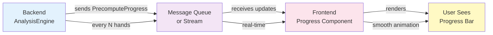

# DTO: PrecomputeProgress

## Purpose

Progress tracking for long-running matrix computations. Contains percentage complete, estimated time remaining, current status, and error information. Sent periodically to frontend during analysis.

**Produced By**: PrecomputeService, AnalysisEngine  
**Consumed By**: Frontend progress bar component  
**Immutable**: Yes (frozen=True)  
**Purpose**: Real-time feedback during computation

---

## Specification

```python
from dataclasses import dataclass
from typing import Optional
from datetime import datetime

@dataclass(frozen=True)
class PrecomputeProgress:
    """Real-time progress of computation."""
    
    # Progress tracking
    percentage_complete: float                  # 0.0 to 100.0
    hands_evaluated: int                        # How many hands done
    hands_total: int = 169                      # Total hands to evaluate
    
    # Time tracking
    elapsed_seconds: float = 0.0                # How long so far
    estimated_remaining_seconds: float = 0.0   # ETA countdown
    
    # Current status
    current_hand: str = ""                      # "AA", "AKs", etc.
    current_stage: str = ""                     # "preflop_analysis", "equity_calc", etc.
    simulations_this_hand: int = 0              # Sample count for current hand
    
    # Performance metrics
    hands_per_second: float = 0.0               # Processing speed
    average_samples_per_hand: int = 0           # Avg simulations per hand
    
    # Status
    is_paused: bool = False                     # Computation paused?
    error_occurred: bool = False                # Did error happen?
    error_message: str = ""                     # Error details
    
    # Cancellation
    is_cancelled: bool = False                  # User cancelled?
    
    # Metadata
    started_at: str = ""                        # ISO timestamp
    progress_updated_at: str = ""               # Latest update
    
    def __post_init__(self):
        """Validate progress values."""
        if not (0.0 <= self.percentage_complete <= 100.0):
            raise ValueError(f"percentage must be 0-100, got {self.percentage_complete}")
        
        if not (0 <= self.hands_evaluated <= self.hands_total):
            raise ValueError(f"evaluated ({self.hands_evaluated}) cannot exceed total ({self.hands_total})")
        
        if self.elapsed_seconds < 0:
            raise ValueError(f"elapsed_seconds cannot be negative")
        
        if self.error_occurred and not self.error_message:
            raise ValueError("error_occurred=True requires error_message")
    
    @property
    def is_complete(self) -> bool:
        """Is computation fully done?"""
        return self.percentage_complete >= 100.0
    
    @property
    def is_active(self) -> bool:
        """Is computation currently running?"""
        return not self.is_paused and not self.is_cancelled and not self.is_complete
    
    @property
    def eta_time_string(self) -> str:
        """Format remaining time as human-readable string."""
        if self.estimated_remaining_seconds <= 0:
            return "< 1 second"
        
        remaining = self.estimated_remaining_seconds
        
        if remaining < 60:
            return f"{int(remaining)} seconds"
        elif remaining < 3600:
            minutes = int(remaining / 60)
            seconds = int(remaining % 60)
            return f"{minutes}m {seconds}s"
        else:
            hours = int(remaining / 3600)
            minutes = int((remaining % 3600) / 60)
            return f"{hours}h {minutes}m"
    
    def progress_bar_string(self, width: int = 30) -> str:
        """Generate simple text progress bar."""
        filled = int((self.percentage_complete / 100.0) * width)
        bar = "█" * filled + "░" * (width - filled)
        return f"[{bar}] {self.percentage_complete:.0f}%"
    
    def get_status_message(self) -> str:
        """Get user-friendly status message."""
        if self.is_cancelled:
            return "Cancelled"
        elif self.error_occurred:
            return f"Error: {self.error_message}"
        elif self.is_complete:
            return "Complete"
        elif self.is_paused:
            return "Paused"
        elif self.is_active:
            return f"Running: {self.percentage_complete:.0f}% ({self.current_hand})"
        else:
            return "Idle"
```

---

## Fields

| Field | Type | Notes |
|-------|------|-------|
| `percentage_complete` | `float` | 0.0 to 100.0 |
| `hands_evaluated` | `int` | Count done |
| `hands_total` | `int` | Always 169 |
| `elapsed_seconds` | `float` | Time so far |
| `estimated_remaining_seconds` | `float` | ETA countdown |
| `current_hand` | `str` | "AA", "AKs", etc |
| `current_stage` | `str` | "equity_calc" |
| `simulations_this_hand` | `int` | Sample count |
| `hands_per_second` | `float` | Speed metric |
| `average_samples_per_hand` | `int` | Avg samples |
| `is_paused` | `bool` | Paused? |
| `error_occurred` | `bool` | Error happened? |
| `error_message` | `str` | Error description |
| `is_cancelled` | `bool` | User cancelled? |
| `started_at` | `str` | ISO timestamp |
| `progress_updated_at` | `str` | Latest update |

---

## Usage Examples

### Example 1: Just Started (0%)
```python
progress = PrecomputeProgress(
    percentage_complete=0.0,
    hands_evaluated=0,
    hands_total=169,
    elapsed_seconds=0.5,
    estimated_remaining_seconds=120.0,
    current_hand="AA",
    current_stage="initializing",
    started_at="2024-01-15T10:30:00Z",
    progress_updated_at="2024-01-15T10:30:00.5Z"
)

# Display: "Initializing... [░░░░░░░░░░░░░░░░░░░░░░░░░░░░] 0%"
#          "ETA: ~2 minutes"
```

### Example 2: Quarter Way (25%)
```python
progress = PrecomputeProgress(
    percentage_complete=25.0,
    hands_evaluated=42,
    hands_total=169,
    elapsed_seconds=30.0,
    estimated_remaining_seconds=90.0,
    current_hand="AQs",
    current_stage="equity_calculation",
    simulations_this_hand=15000,
    hands_per_second=1.4,
    average_samples_per_hand=8900,
    progress_updated_at="2024-01-15T10:30:30Z"
)

# Display: "[██████████░░░░░░░░░░░░░░░░] 25%"
#          "42/169 hands evaluated"
#          "Speed: 1.4 hands/sec | ETA: 1m 30s"
```

### Example 3: Almost Done (95%)
```python
progress = PrecomputeProgress(
    percentage_complete=95.0,
    hands_evaluated=160,
    hands_total=169,
    elapsed_seconds=110.0,
    estimated_remaining_seconds=6.0,
    current_hand="32o",
    current_stage="final_validation",
    simulations_this_hand=8500,
    hands_per_second=1.45,
    average_samples_per_hand=8800,
    progress_updated_at="2024-01-15T10:31:50Z"
)

# Display: "[██████████████████████████░] 95%"
#          "160/169 hands evaluated"
#          "Speed: 1.45 hands/sec | ETA: < 10 seconds"
```

### Example 4: Error During Computation
```python
progress = PrecomputeProgress(
    percentage_complete=47.0,
    hands_evaluated=79,
    hands_total=169,
    elapsed_seconds=65.0,
    estimated_remaining_seconds=0.0,
    current_hand="JTo",
    current_stage="equity_calculation",
    error_occurred=True,
    error_message="Database connection lost",
    progress_updated_at="2024-01-15T10:31:05Z"
)

# Display: "❌ Error: Database connection lost"
#          "Progress: 47% (79/169 hands)"
#          "Failed at: JTo"
```

### Example 5: Paused
```python
progress = PrecomputeProgress(
    percentage_complete=60.0,
    hands_evaluated=101,
    hands_total=169,
    elapsed_seconds=80.0,
    estimated_remaining_seconds=53.0,
    current_hand="QTo",
    current_stage="equity_calculation",
    is_paused=True,
    progress_updated_at="2024-01-15T10:31:20Z"
)

# Display: "⏸ Paused at 60%"
#          "101/169 hands evaluated"
#          "Resume to continue..."
```

---

## Code Template

```python
# shared/models.py (add after DetailPayload)

from datetime import datetime

@dataclass(frozen=True)
class PrecomputeProgress:
    """Progress update for long-running computation."""
    
    percentage_complete: float
    hands_evaluated: int
    hands_total: int = 169
    
    elapsed_seconds: float = 0.0
    estimated_remaining_seconds: float = 0.0
    
    current_hand: str = ""
    current_stage: str = ""
    simulations_this_hand: int = 0
    
    hands_per_second: float = 0.0
    average_samples_per_hand: int = 0
    
    is_paused: bool = False
    error_occurred: bool = False
    error_message: str = ""
    is_cancelled: bool = False
    
    started_at: str = ""
    progress_updated_at: str = field(
        default_factory=lambda: datetime.utcnow().isoformat()
    )
    
    def __post_init__(self):
        if not (0.0 <= self.percentage_complete <= 100.0):
            raise ValueError("percentage must be 0-100")
        
        if not (0 <= self.hands_evaluated <= self.hands_total):
            raise ValueError("evaluated cannot exceed total")
        
        if self.error_occurred and not self.error_message:
            raise ValueError("error_occurred needs error_message")
    
    @property
    def is_complete(self) -> bool:
        """Is computation done?"""
        return self.percentage_complete >= 100.0
    
    @property
    def is_active(self) -> bool:
        """Is currently running?"""
        return (
            not self.is_paused and
            not self.is_cancelled and
            not self.error_occurred and
            not self.is_complete
        )
    
    @property
    def eta_time_string(self) -> str:
        """Human-readable ETA."""
        if self.estimated_remaining_seconds <= 0:
            return "< 1 second"
        
        remaining = self.estimated_remaining_seconds
        if remaining < 60:
            return f"{int(remaining)}s"
        elif remaining < 3600:
            m = int(remaining / 60)
            s = int(remaining % 60)
            return f"{m}m {s}s"
        else:
            h = int(remaining / 3600)
            m = int((remaining % 3600) / 60)
            return f"{h}h {m}m"
    
    def progress_bar_string(self, width: int = 30) -> str:
        """Text progress bar."""
        filled = int((self.percentage_complete / 100.0) * width)
        bar = "█" * filled + "░" * (width - filled)
        return f"[{bar}] {self.percentage_complete:.0f}%"
    
    def get_status_message(self) -> str:
        """User-friendly status."""
        if self.is_cancelled:
            return "Cancelled"
        elif self.error_occurred:
            return f"Error: {self.error_message}"
        elif self.is_complete:
            return "Complete"
        elif self.is_paused:
            return "Paused"
        elif self.is_active:
            return f"Running: {self.percentage_complete:.0f}%"
        else:
            return "Idle"
```

---

## Validation Rules

```python
# Rule 1: percentage 0-100
PrecomputeProgress(percentage_complete=-1)  # ❌ ValueError
PrecomputeProgress(percentage_complete=150)  # ❌ ValueError

# Rule 2: evaluated ≤ total
PrecomputeProgress(hands_evaluated=200, hands_total=169)  # ❌ ValueError

# Rule 3: Error needs message
PrecomputeProgress(
    error_occurred=True,
    error_message=""  # ❌ No message!
)  # ValueError

# Rule 4: Valid progress
PrecomputeProgress(
    percentage_complete=50.0,
    hands_evaluated=84,
    hands_total=169,
    current_hand="QQ",
    elapsed_seconds=45.0,
    estimated_remaining_seconds=45.0
)  # ✅ OK
```

---

## Frontend Integration Pattern



---

## Testing

```python
import pytest
from shared.models import PrecomputeProgress

def test_creation_valid():
    """Valid progress creation."""
    progress = PrecomputeProgress(
        percentage_complete=50.0,
        hands_evaluated=84,
        elapsed_seconds=45.0
    )
    assert progress.percentage_complete == 50.0

def test_validation_percentage():
    """percentage must be 0-100."""
    with pytest.raises(ValueError):
        PrecomputeProgress(percentage_complete=-1)
    
    with pytest.raises(ValueError):
        PrecomputeProgress(percentage_complete=150)

def test_validation_evaluated():
    """evaluated ≤ total."""
    with pytest.raises(ValueError):
        PrecomputeProgress(
            hands_evaluated=200,
            hands_total=169
        )

def test_validation_error_message():
    """Error needs message."""
    with pytest.raises(ValueError):
        PrecomputeProgress(
            percentage_complete=50,
            hands_evaluated=84,
            error_occurred=True,
            error_message=""  # ❌ Empty!
        )

def test_is_complete_at_100():
    """Complete when percentage ≥ 100."""
    progress = PrecomputeProgress(
        percentage_complete=100.0,
        hands_evaluated=169
    )
    assert progress.is_complete

def test_is_active_running():
    """Active when running (not paused/error/cancelled)."""
    progress = PrecomputeProgress(
        percentage_complete=50.0,
        hands_evaluated=84,
        is_paused=False,
        error_occurred=False,
        is_cancelled=False
    )
    assert progress.is_active

def test_is_active_paused():
    """Not active when paused."""
    progress = PrecomputeProgress(
        percentage_complete=50.0,
        hands_evaluated=84,
        is_paused=True
    )
    assert not progress.is_active

def test_eta_time_string_seconds():
    """Format ETA in seconds."""
    progress = PrecomputeProgress(
        percentage_complete=50.0,
        hands_evaluated=84,
        estimated_remaining_seconds=30.0
    )
    assert progress.eta_time_string == "30s"

def test_eta_time_string_minutes():
    """Format ETA in minutes."""
    progress = PrecomputeProgress(
        percentage_complete=50.0,
        hands_evaluated=84,
        estimated_remaining_seconds=90.0  # 1.5 minutes
    )
    assert progress.eta_time_string == "1m 30s"

def test_eta_time_string_hours():
    """Format ETA in hours."""
    progress = PrecomputeProgress(
        percentage_complete=50.0,
        hands_evaluated=84,
        estimated_remaining_seconds=5400.0  # 1.5 hours
    )
    assert progress.eta_time_string == "1h 30m"

def test_progress_bar_string():
    """Generate progress bar."""
    progress = PrecomputeProgress(
        percentage_complete=50.0,
        hands_evaluated=84,
        estimated_remaining_seconds=45.0
    )
    bar = progress.progress_bar_string(width=20)
    assert "█" in bar
    assert "░" in bar
    assert "50%" in bar

def test_status_message_running():
    """Status message when running."""
    progress = PrecomputeProgress(
        percentage_complete=50.0,
        hands_evaluated=84,
        current_hand="QQ"
    )
    msg = progress.get_status_message()
    assert "50%" in msg

def test_status_message_error():
    """Status message for error."""
    progress = PrecomputeProgress(
        percentage_complete=50.0,
        hands_evaluated=84,
        error_occurred=True,
        error_message="Connection lost"
    )
    msg = progress.get_status_message()
    assert "Error" in msg
    assert "Connection lost" in msg

def test_status_message_paused():
    """Status message when paused."""
    progress = PrecomputeProgress(
        percentage_complete=50.0,
        hands_evaluated=84,
        is_paused=True
    )
    assert progress.get_status_message() == "Paused"

def test_immutability():
    """Cannot modify frozen dataclass."""
    progress = PrecomputeProgress(
        percentage_complete=50.0,
        hands_evaluated=84
    )
    
    with pytest.raises(Exception):  # FrozenInstanceError
        progress.percentage_complete = 75.0
```

---

## Best Practices

1. **Use is_active property**
   ```python
   # ❌ Bad - multiple checks
   if not progress.is_paused and not progress.error_occurred:
       continue_computation()
   
   # ✅ Good - one property
   if progress.is_active:
       continue_computation()
   ```

2. **Use helper for UI text**
   ```python
   # ❌ Bad - format every time
   display_eta = f"{remaining // 60}m {remaining % 60}s"
   
   # ✅ Good - use method
   display_eta = progress.eta_time_string
   ```

3. **Use progress_bar_string for display**
   ```python
   # ❌ Bad - manual bar creation
   bar = "█" * 10 + "░" * 20
   
   # ✅ Good - use method
   bar = progress.progress_bar_string(width=30)
   ```

---

## Common Mistakes

❌ Forgetting error_message when error_occurred=True:
```python
PrecomputeProgress(
    percentage_complete=50,
    hands_evaluated=84,
    error_occurred=True,
    error_message=""  # ❌ Empty!
)  # ValueError
```

✅ Always provide error message:
```python
PrecomputeProgress(
    percentage_complete=50,
    hands_evaluated=84,
    error_occurred=True,
    error_message="Connection timeout"  # ✅ Descriptive
)
```

---

## WebSocket Integration Example

Backend sends progress periodically:
```python
# Backend every 5 hands
async def compute_with_progress():
    for i, hand in enumerate(hands):
        evaluate_hand(hand)
        
        if i % 5 == 0:
            progress = PrecomputeProgress(
                percentage_complete=(i / 169) * 100,
                hands_evaluated=i,
                current_hand=hand,
                elapsed_seconds=elapsed,
                estimated_remaining_seconds=remaining
            )
            await websocket.send(progress.to_json())
```

Frontend receives and updates:
```python
# Frontend WebSocket handler
async def on_progress(progress: PrecomputeProgress):
    update_progress_bar(progress.percentage_complete)
    update_eta_label(progress.eta_time_string)
    update_current_hand_label(progress.current_hand)
```

---

**Next**: All 11 DTOs complete! Read the [00_INDEX.md](00_INDEX.md) summary to see the complete picture.
