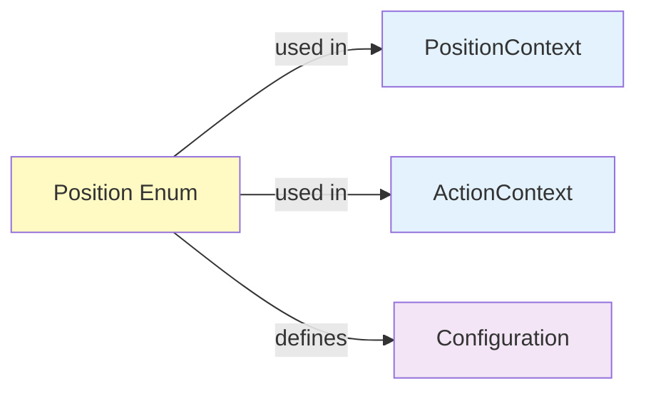

# Enum: Position

## Purpose

Define all valid poker table positions. Provides type safety instead of magic strings like `"button"`, `"cutoff"`, etc.

**Used By**: PositionContext, everywhere position is needed  
**Immutable**: Yes  
**Validation**: Enum enforces valid values at creation

---

## Specification

```python
from enum import Enum

class Position(str, Enum):
    """Poker table position (4 positions for 4-max all-in/fold)."""
    
    # 4-max all-in/fold: only 4 seats
    UTG = "utg"      # Under the gun (first to act pre-flop)
    BTN = "btn"      # Button (best position post-flop)
    SB = "sb"        # Small blind
    BB = "bb"        # Big blind
```

### Why `str` Enum?

```python
# Option A: class Position(str, Enum)
position = Position.BTN
str(position)  # "btn" ✅ Works!
position.value  # "btn"

# Option B: class Position(Enum)
position = Position.BTN
str(position)  # "Position.BTN" ❌ Not ideal for display
position.value  # "btn"
```

Inheriting from `str` makes Position values directly usable as strings.

---

## Fields

| Field | Type | Example | Notes |
|-------|------|---------|-------|
| name | str | `"BTN"` | Position name |
| value | str | `"btn"` | String representation |

---

## Usage Examples

```python
# Create by name
pos = Position.BTN
pos = Position["BTN"]

# Create by value
pos = Position("btn")

# Check membership
if Position.BTN in [Position.BTN, Position.CO, Position.HJ]:
    print("Late position")

# Convert to/from string
position_str = "btn"
pos = Position(position_str)  # Position.BTN

# All positions
for pos in Position:
    print(pos.value)  # btn, co, hj, ...

# Group by position type (4-max all-in/fold)
EARLY_POSITIONS = {Position.UTG}
LATE_POSITIONS = {Position.BTN}
BLIND_POSITIONS = {Position.SB, Position.BB}
```

---

## Code Template

```python
# shared/enums.py

from enum import Enum

class Position(str, Enum):
    """Poker table position (4-max all-in/fold)."""
    
    UTG = "utg"      # Early position (first to act pre-flop)
    BTN = "btn"      # Late position (button, last pre-flop)
    SB = "sb"        # Small blind (second to act pre-flop)
    BB = "bb"        # Big blind (third to act pre-flop)
    
    @classmethod
    def early_positions(cls):
        """Return early positions."""
        return {cls.UTG}
    
    @classmethod
    def late_positions(cls):
        """Return late positions."""
        return {cls.BTN}
    
    @classmethod
    def blind_positions(cls):
        """Return blind positions."""
        return {cls.SB, cls.BB}
```

---

## Validation

Enum enforces valid values automatically:

```python
# Valid
pos = Position.BTN  # ✅ OK
pos = Position("btn")  # ✅ OK

# Invalid
pos = Position.GARBAGE  # ❌ AttributeError
pos = Position("garbage")  # ❌ ValueError
```

---

## Configuration Mapping for 4-Max

For all-in/fold 4-max games, seat positions rotate among 4 players:

```python
# 4-max all-in/fold: exactly 4 seats (UTG, BTN, SB, BB)

# Full game: 4 players
FULL_4_PLAYERS = {
    1: Position.UTG,     # Player 1 (early)
    2: Position.BTN,     # Player 2 (button/late)
    3: Position.SB,      # Player 3 (small blind)
    4: Position.BB,      # Player 4 (big blind)
}

# Heads-up (2 players)
HEADS_UP = {
    1: Position.BTN,     # Button (also small blind in heads-up)
    2: Position.BB,      # Big blind
}

# 3-way (3 players)
THREE_WAY = {
    1: Position.UTG,     # Early position
    2: Position.BTN,     # Button
    3: Position.BB,      # Big blind (SB folds or is empty)
}
```

---

## Related Models

- **PositionContext**: Uses Position as main identifier, supports 4-max (num_opponents: 1-3)
- **ActionContext**: Action combined with Position

---

## Testing

```python
import pytest
from shared.enums import Position

def test_position_creation_by_name():
    pos = Position.BTN
    assert pos.value == "btn"

def test_position_creation_by_value():
    pos = Position("btn")
    assert pos == Position.BTN

def test_position_string_conversion():
    pos = Position.BTN
    assert str(pos) == "btn"  # Because it inherits from str
    assert pos.value == "btn"

def test_all_positions_invalid():
    with pytest.raises(ValueError):
        Position("invalid_position")

def test_position_enumeration():
    """6 positions for all-in/fold (UTG, HJ, CO, BTN, SB, BB)."""
    positions = list(Position)
    assert len(positions) == 4  # UTG, BTN, SB, BB

def test_position_early():
    assert Position("utg") == Position.UTG

def test_position_late():
    positions = [Position.CO, Position.BTN]
    assert Position.BTN in positions

def test_all_positions_in_groups():
    """Verify position grouping methods."""
    early = Position.early_positions()
    middle = Position.middle_positions()
    late = Position.late_positions()
    blind = Position.blind_positions()
    
    assert Position.UTG in early
    assert Position.HJ in middle
    assert Position.CO in late and Position.BTN in late
    assert Position.SB in blind and Position.BB in blind
    
    # All positions accounted for
    all_grouped = early | middle | late | blind
    assert len(all_grouped) == 6
```

---

## Interactions with Other Models



---

## Best Practices

1. **Use enum, not string**
   ```python
   # ❌ Bad
   if position == "btn":
       ...
   
   # ✅ Good
   if position == Position.BTN:
       ...
   ```

2. **Use named members**
   ```python
   # ❌ Bad
   positions = ["btn", "co", "hj"]
   
   # ✅ Good
   positions = [Position.BTN, Position.CO, Position.HJ]
   ```

3. **Inherit from str for serialization**
   ```python
   # Can serialize directly
   json.dumps({"position": Position.BTN})
   ```

---

## Common Mistakes

❌ Using string instead of enum:
```python
context = PositionContext(position="btn")  # Wrong type
```

✅ Use enum:
```python
context = PositionContext(position=Position.BTN)  # Correct
```

---

**Next**: Read [10_ENUM_Action.md](10_ENUM_Action.md)
