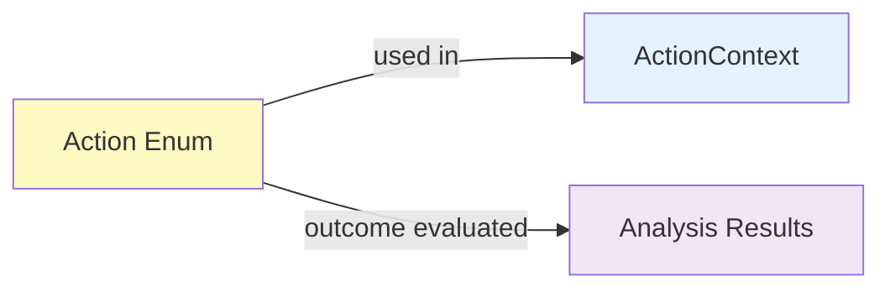

# Enum: Action

## Purpose

Define valid poker actions at a position. Each action represents a decision the player can make.

**Used By**: ActionContext, configuration, action selection  
**Immutable**: Yes  
**Validation**: Enum enforces valid values

---

## Specification

```python
from enum import Enum

class Action(str, Enum):
    """All-in/fold poker action."""
    
    # Basic actions (all-in/fold only - FOLD or commit all chips)
    FOLD = "fold"                # Don't play the hand
    ALL_IN = "all_in"            # Commit all remaining chips
```

---

---

## Context: All-In/Fold Constraint

In **all-in/fold** games:
- Only two actions available: FOLD or ALL_IN
- ❌ No CHECK (no opportunity to pass without betting)
- ❌ No CALL (not applicable - you commit all chips or fold)
- ❌ No RAISE or MIN_RAISE (no bet sizing - just all-in or nothing)
- ✅ FOLD - Decline to play the hand, lose opportunity
- ✅ ALL_IN - Commit all remaining chips (binary decision)

Every decision is binary: Play (ALL_IN with all chips at risk) or Don't Play (FOLD).

---

## Action Decision Matrix

| Situation | Facing Bet | Facing All-In | No Action to You |
|-----------|-----------|---------------|------------------|
| **You Act First** | FOLD or ALL_IN | FOLD or ALL_IN | FOLD or ALL_IN (any time) |
| **Facing Bet/All-In** | FOLD or ALL_IN | FOLD or ALL_IN | N/A |
| **Example** | Opponent bets | Opponent shoves | Your turn, clean hand |
| **Valid Actions** | FOLD, ALL_IN | FOLD, ALL_IN | FOLD, ALL_IN |

---

## Fields

| Field | Type | Example | Notes |
|-------|------|---------|-------|
| name | str | `"FOLD"`or `"ALL_IN"` | Action name |
| value | str | `"fold"` or `"all_in"` | String representation |

---

## Usage Examples

```python
# Create by name
action = Action.FOLD
action = Action.ALL_IN

# Create from name
action = Action["FOLD"]
action = Action["ALL_IN"]

# Create by value
action = Action("fold")
action = Action("all_in")

# Check if passive (fold) or aggressive (all-in)
if action == Action.FOLD:
    print("Passive - exit the hand")
elif action == Action.ALL_IN:
    print("Aggressive - commit all chips")

# Check all valid actions
for action in Action:
    print(action.value)  # fold, all_in

# Group by type
PASSIVE_ACTIONS = {Action.FOLD}
AGGRESSIVE_ACTIONS = {Action.ALL_IN}
# All actions
for action in Action:
    print(action.value)  # fold, all_in

# Group by type
PASSIVE_ACTIONS = {Action.FOLD}
AGGRESSIVE_ACTIONS = {Action.ALL_IN}
```

---

## Code Template

```python
# shared/enums.py

from enum import Enum

class Action(str, Enum):
    """All-in/fold action (FOLD or ALL_IN)."""
    
    FOLD = "fold"            # Don't play the hand
    ALL_IN = "all_in"        # Commit all chips
    
    @property
    def is_fold(self) -> bool:
        """Is this a fold action?"""
        return self == Action.FOLD
    
    @property
    def is_passive(self) -> bool:
        """Is this a passive action? (FOLD = yes)"""
        return self == Action.FOLD
    
    @property
    def is_aggressive(self) -> bool:
        """Is this an aggressive action? (ALL_IN = yes)"""
        return self == Action.ALL_IN
    
    @property
    def is_all_in(self) -> bool:
        """Is this an all-in action?"""
        return self == Action.ALL_IN
```

---

## Validation

Enum enforces valid values automatically:

```python
# Valid
action = Action.FOLD  # ✅ OK
action = Action.ALL_IN  # ✅ OK
action = Action("fold")  # ✅ OK
action = Action["FOLD"]  # ✅ OK

# Invalid
action = Action.CALL  # ❌ AttributeError (not in all-in/fold)
action = Action("call")  # ❌ ValueError (invalid for all-in/fold)
action = Action.RAISE_3X  # ❌ AttributeError (removed)
```

---

## All-In/Fold: Simple Action Set

Unlike traditional poker with many actions, all-in/fold has only two:

```python
# Traditional poker (not all-in/fold)
TRADITIONAL = [
    Action.FOLD,
    Action.CALL,
    Action.CHECK,
    Action.MIN_RAISE,
    Action.RAISE_2X,
    Action.RAISE_3X,
    # ... etc (many bet sizes)
]

# All-in/fold (simplified)
ALL_IN_FOLD = [
    Action.FOLD,      # Don't play
    Action.ALL_IN,    # Commit all chips
]
```

This simplicity makes all-in/fold analysis tractable: for each hand and position, you evaluate only two outcomes: FOLD or ALL_IN.


# Big blind (facing raise)
BIG_BLIND_ACTIONS = [
    Action.FOLD,
    Action.CALL,
    Action.RAISE_2X,
    Action.RAISE_3X,
    Action.ALL_IN,
]
```

This simplicity makes all-in/fold analysis tractable: for each hand and position, you evaluate only two outcomes: FOLD or ALL_IN.

---

## Interactions with Other Models



---

## Testing

```python
import pytest
from shared.enums import Action

def test_action_creation_fold():
    """Create FOLD action."""
    action = Action.FOLD
    assert action.value == "fold"
    assert action == Action["FOLD"]
    assert action == Action("fold")

def test_action_creation_all_in():
    """Create ALL_IN action."""
    action = Action.ALL_IN
    assert action.value == "all_in"
    assert action == Action["ALL_IN"]
    assert action == Action("all_in")

def test_action_only_two():
    """All-in/fold has exactly 2 actions."""
    actions = list(Action)
    assert len(actions) == 2
    assert Action.FOLD in actions
    assert Action.ALL_IN in actions

def test_action_properties_fold():
    """FOLD action properties."""
    action = Action.FOLD
    assert action.is_fold
    assert action.is_passive
    assert not action.is_aggressive
    assert not action.is_all_in

def test_action_properties_all_in():
    """ALL_IN action properties."""
    action = Action.ALL_IN
    assert not action.is_fold
    assert not action.is_passive
    assert action.is_aggressive
    assert action.is_all_in

def test_invalid_action():
    """Non-existent actions raise ValueError."""
    with pytest.raises(ValueError):
        Action("invalid_action")
    
    with pytest.raises(ValueError):
        Action("call")  # Not valid in all-in/fold
    
    with pytest.raises(ValueError):
        Action("raise_3x")  # No raises in all-in/fold
    
    with pytest.raises(AttributeError):
        Action.CALL  # Doesn't exist
```

---

## Best Practices

1. **Use is_passive/is_aggressive properties**
   ```python
   # ❌ Bad - hardcoded check
   if action == Action.FOLD:
       handle_passive()
   
   # ✅ Good - use property
   if action.is_passive:
       handle_passive()
   ```

2. **Check only FOLD and ALL_IN**
   ```python
   # ❌ Bad - checking for invalid actions
   if action in {Action.CALL, Action.RAISE_3X, Action.CHECK}:
       # This will never be true in all-in/fold
   
   # ✅ Good - only valid actions
   if action in {Action.FOLD, Action.ALL_IN}:
       process_action(action)
   ```

3. **Simplify action logic**
   ```python
   # ❌ Bad - complex nested conditions
   if action == Action.CALL:
       ...
   elif action == Action.CHECK:
       ...
   elif action.startswith("raise_"):
       ...
   
   # ✅ Good - binary decision
   if action.is_passive:  # FOLD
       fold_outcome()
   else:  # ALL_IN
       all_in_outcome()
   ```

---

## Common Mistakes

❌ **Trying to use actions that don't exist in all-in/fold**:
```python
# These will raise AttributeError or ValueError
if action == Action.CALL:
    match_bet()

if action == Action.RAISE_3X:
    bet_3x()

if action == Action.CHECK:
    pass_action()
```

✅ **Use only FOLD and ALL_IN**:
```python
# All-in/fold: only two decisions
if action == Action.FOLD:
    fold()
elif action == Action.ALL_IN:
    go_all_in()
else:
    raise ValueError(f"Invalid action: {action}")
```

---

❌ **Assuming complex action sequences**:
```python
# Don't assume multi-action betting rounds
actions_in_sequence = [Action.CALL, Action.RAISE_2X, Action.CALL]
```

✅ **Single binary decision**:
```python
# All-in/fold: one decision, two outcomes
decision = Action.FOLD or Action.ALL_IN
```

---

**Next**: Read [11_ENUM_MetricType.md](11_ENUM_MetricType.md)
