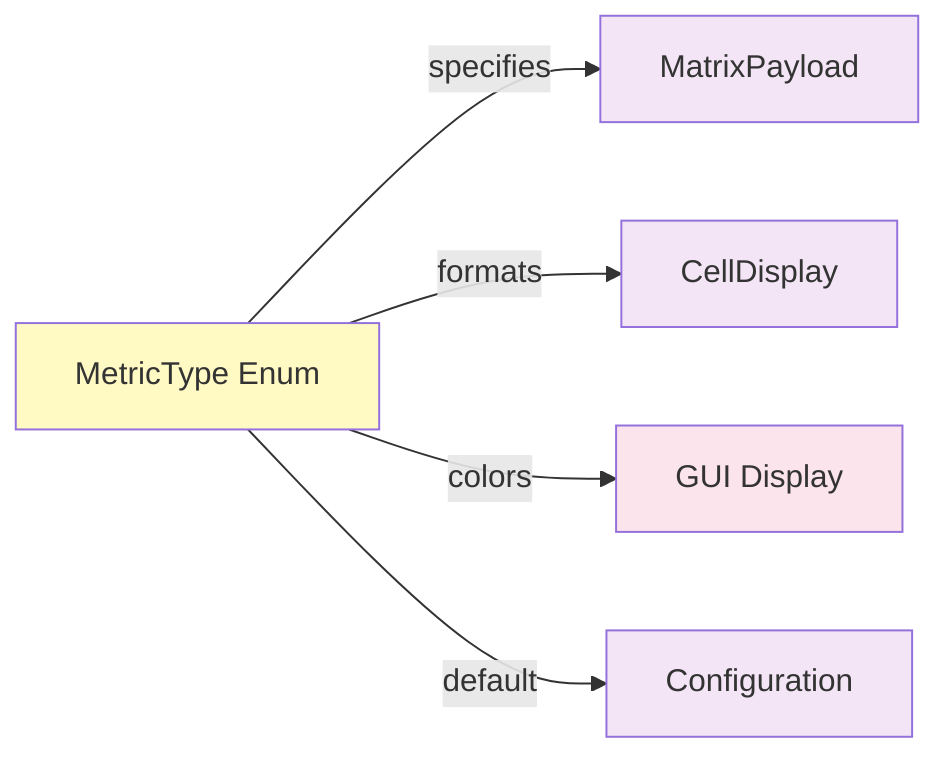

# Enum: MetricType

## Purpose

Define which metric to display in the matrix. Users can switch between different analysis metrics to view different aspects of hand strength.

**Used By**: MatrixPayload, display selection, formatting  
**Immutable**: Yes  
**Validation**: Enum enforces valid values

---

## Specification

```python
from enum import Enum

class MetricType(str, Enum):
    """Analysis metric for display in matrix."""
    
    # Probability metrics
    WIN_LOSE_PROBABILITY = "win_lose"  # Win probability vs lose probability
    EQUITY = "equity"                  # Pot equity (share of winning)
    
    # Value metrics
    EV = "ev"                          # Expected value in dollars
    EQR = "eqr"                        # Equity to Risk Ratio
```

---

## Metric Explanations

### 1. **WIN_LOSE_PROBABILITY**
Probability of winning vs losing the hand.

```
Range: -1 (always lose) to 1 (always win)
Display: "-20%" (20% worse), "+35%" (35% better)
Usage: Quick visual - green if positive, red if negative
```

### 2. **EQUITY**
How much of the pot-on-average your hand wins.

```
Range: 0.0 to 1.0 (0% to 100%)
Display: "45.2%"
Usage: Most common metric in poker
```

### 3. **EV (Expected Value)**
Dollar expected value of the hand given current bet sizes.

```
Range: Can be negative or positive ($)
Display: "$5.67", "-$2.34"
Usage: Accounting for stack sizes and bet sizing
```

### 4. **EQR (Equity to Risk Ratio)**
Equity divided by the risk. Higher = better risk/reward.

```
Range: 0.0 to ∞
Display: "0.9" (risk 1, gain 0.9x)
Formula: EQR = (Equity * Pot) / BetAmount
Usage: Risk/reward assessment
```

---

## Fields

| Field | Type | Example | Notes |
|-------|------|---------|-------|
| name | str | `"EQUITY"` | Metric name |
| value | str | `"equity"` | String representation |

---

## Usage Examples

```python
# Select metric
metric = MetricType.EQUITY
metric = MetricType("equity")
metric = MetricType[" EQUITY"]

# Format value based on metric
def format_value(value: float, metric: MetricType) -> str:
    if metric == MetricType.EQUITY:
        return f"{value:.1%}"  # "45.2%"
    elif metric == MetricType.EV:
        return f"${value:.2f}"  # "$5.67"
    elif metric == MetricType.EQR:
        return f"{value:.2f}"   # "0.92"
    elif metric == MetricType.WIN_LOSE_PROBABILITY:
        return f"{value:+.1%}"  # "+35.0%", "-20.0%"

# Iterate all metrics
for metric in MetricType:
    print(f"{metric.name}: {metric.value}")
```

---

## Code Template

```python
# shared/enums.py (add below Action enum)

class MetricType(str, Enum):
    """Analysis metric for display."""
    
    WIN_LOSE_PROBABILITY = "win_lose"
    EQUITY = "equity"
    EV = "ev"
    EQR = "eqr"
    
    def format_value(self, value: float) -> str:
        """Format value for display based on metric type."""
        if self == MetricType.EQUITY:
            return f"{value:.1%}"
        elif self == MetricType.EV:
            return f"${value:.2f}"
        elif self == MetricType.EQR:
            return f"{value:.2f}"
        elif self == MetricType.WIN_LOSE_PROBABILITY:
            return f"{value:+.1%}"
        else:
            return str(value)
    
    @property
    def is_percentage(self) -> bool:
        """Is this metric a percentage-based value?"""
        return self in {MetricType.EQUITY, MetricType.WIN_LOSE_PROBABILITY}
    
    @property
    def is_currency(self) -> bool:
        """Is this metric a dollar value?"""
        return self == MetricType.EV
    
    @property
    def display_name(self) -> str:
        """Human-readable display name."""
        mapping = {
            MetricType.EQUITY: "Equity",
            MetricType.EV: "EV ($)",
            MetricType.EQR: "Equity/Risk",
            MetricType.WIN_LOSE_PROBABILITY: "Win/Lose %",
        }
        return mapping[self]
    
    def get_value_range(self) -> tuple:
        """Get typical min/max range for this metric."""
        ranges = {
            MetricType.EQUITY: (0.0, 1.0),
            MetricType.EV: (-50.0, 50.0),  # Estimate
            MetricType.EQR: (0.0, 2.0),    # Estimate
            MetricType.WIN_LOSE_PROBABILITY: (-1.0, 1.0),
        }
        return ranges.get(self, (0.0, 1.0))
```

---

## Color Mapping by Metric

Each metric needs its own color scale:

```python
# Equity: 0% (red) to 100% (green)
EQUITY_COLORS = {
    0.0: (255, 0, 0),        # Red (0%)
    0.25: (255, 255, 0),     # Yellow (25%)
    0.50: (0, 255, 0),       # Green (50%)
    0.75: (0, 128, 0),       # DarkGreen (75%)
    1.0: (0, 0, 0),          # Black (100%)
}

# EV: Negative (red) to positive (green) $$
EV_COLORS = {
    -50.0: (255, 0, 0),      # Red (large loss)
    0.0: (255, 255, 0),      # Yellow (break-even)
    50.0: (0, 255, 0),       # Green (large gain)
}

# EQR: Low (red) to high (green)
EQR_COLORS = {
    0.0: (255, 0, 0),        # Red (bad ratio)
    0.5: (255, 255, 0),      # Yellow (moderate)
    1.0: (0, 255, 0),        # Green (good ratio)
    2.0: (0, 128, 0),        # Dark green (excellent)
}

# Win/Lose: Negative (red) to positive (green)
WIN_LOSE_COLORS = {
    -1.0: (255, 0, 0),       # Red (always lose)
    0.0: (255, 255, 0),      # Yellow (break-even)
    1.0: (0, 255, 0),        # Green (always win)
}
```

---

## Validation

Enum enforces valid values automatically:

```python
# Valid
metric = MetricType.EQUITY  # ✅ OK
metric = MetricType("equity")  # ✅ OK

# Invalid
metric = MetricType.UNDEFINED  # ❌ AttributeError
metric = MetricType("undefined")  # ❌ ValueError
```

---

## Interactions with Other Models



---

## Testing

```python
import pytest
from shared.enums import MetricType

def test_metric_creation():
    metric = MetricType.EQUITY
    assert metric.value == "equity"

def test_metric_formatting():
    assert MetricType.EQUITY.format_value(0.452) == "45.2%"
    assert MetricType.EV.format_value(5.67) == "$5.67"
    assert MetricType.EQR.format_value(0.92) == "0.92"
    assert MetricType.WIN_LOSE_PROBABILITY.format_value(0.35) == "+35.0%"

def test_metric_properties():
    assert MetricType.EQUITY.is_percentage
    assert MetricType.EV.is_currency
    assert not MetricType.EV.is_percentage

def test_metric_display_names():
    assert MetricType.EQUITY.display_name == "Equity"
    assert MetricType.EV.display_name == "EV ($)"

def test_metric_ranges():
    eq_min, eq_max = MetricType.EQUITY.get_value_range()
    assert eq_min == 0.0
    assert eq_max == 1.0

def test_all_metrics_have_format():
    for metric in MetricType:
        formatted = metric.format_value(0.5)
        assert isinstance(formatted, str)
        assert len(formatted) > 0
```

---

## Best Practices

1. **Use properties for categorization**
   ```python
   # ❌ Bad
   if metric in {MetricType.EQUITY, MetricType.WIN_LOSE_PROBABILITY}:
       format_as_percentage = True
   
   # ✅ Good
   if metric.is_percentage:
       format_as_percentage = True
   ```

2. **Use helper method for formatting**
   ```python
   # ❌ Bad
   if metric == MetricType.EQUITY:
       display = f"{value:.1%}"
   elif metric == MetricType.EV:
       display = f"${value:.2f}"
   
   # ✅ Good
   display = metric.format_value(value)
   ```

3. **Use display_name for UI**
   ```python
   # ❌ Bad
   label = metric.value.upper()  # "EQUITY"
   
   # ✅ Good
   label = metric.display_name  # "Equity"
   ```

---

## Common Mistakes

❌ Hardcoding format strings:
```python
if metric == "equity":
    display = f"{value:.1%}"
```

✅ Use enum method:
```python
display = metric.format_value(value)
```

---

**Next**: Read [01_DTO_PositionContext.md](01_DTO_PositionContext.md)
