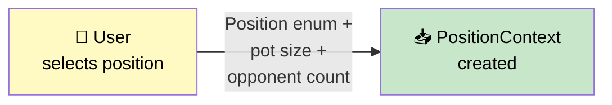
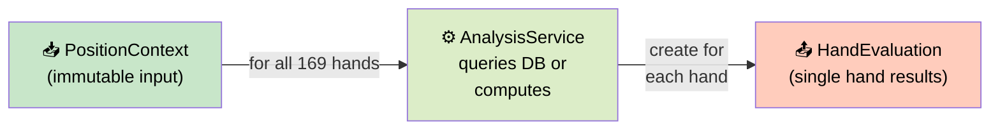
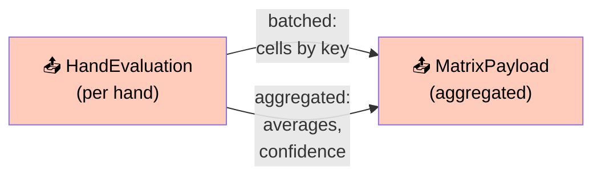
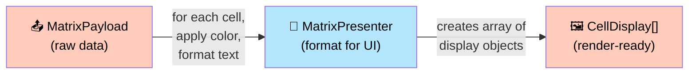
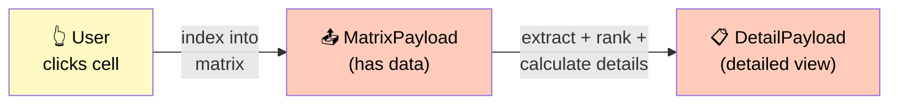
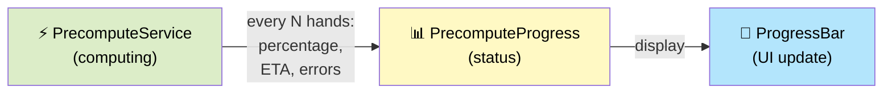

# Component Architecture with DTOs

Enhanced component diagram showing where all DTOs and Enums belong in Architecture A.

---

## Architecture A: Complete Component View with Data Models

```mermaid
graph TB
    subgraph Frontend["🎨 FRONTEND LAYER (gui/)"]
        subgraph FrontendCore["Frontend Core"]
            GW["👁️ GuiWindow<br/>(pygame event loop)"]
            SM["🗄️ StateManager<br/>(view state, user selections)"]
            EH["⚡ EventHandler<br/>(event routing, actions)"]
        end
        
        subgraph Components["UI Components"]
            MP["🟨 MatrixPanel<br/>(13x13 grid render)"]
            DP["📋 DetailPanel<br/>(cell stats)"]
            CP["🎛️ ControlPanel<br/>(position/action selector)"]
            PP["📊 PlotPanel<br/>(convergence)"]
        end
        
        subgraph Presenters["Data Presenters<br/>(format for UI)"]
            MatrixPresenter["🎨 MatrixPresenter<br/>HandEvaluation →<br/>CellDisplay[]"]
            DetailPresenter["🎨 DetailPresenter<br/>HandEvaluation +<br/>MatrixPayload →<br/>DetailPayload"]
        end
    end
    
    subgraph Backend["⚙️ BACKEND LAYER (backend/)"]
        subgraph BizLogic["Business Logic"]
            Solver["🧮 AllInFoldGTOSolver<br/>(pure poker math)"]
            Analyzer["📈 PokerAnalyzer<br/>(hand evaluation)"]
        end
        
        subgraph Services["Analysis Services"]
            AnalysisService["🔧 AnalysisService<br/>(query/evaluate facade)"]
            PrecomputeService["⚡ PrecomputeService<br/>(batch computation)"]
        end
        
        subgraph DataLayer["Data Access"]
            Repo["📚 Repository<br/>(query interface)"]
            Agg["📊 AggregationEngine<br/>(statistics)"]
        end
        
        subgraph DB["Database"]
            ORM["🗄️ SQLAlchemy Models<br/>(GameState, MatrixCell)"]
            DBConn["🔌 DatabaseConnection<br/>(engine, sessions)"]
        end
    end
    
    subgraph Shared["📦 SHARED MODELS (shared/)"]
        subgraph InputDTOs["📥 INPUT Models<br/>(Frontend → Backend)"]
            PC["PositionContext<br/>position, num_opponents,<br/>hole_cards, pot_size_bb"]
            AC["ActionContext<br/>position_context +<br/>action (FOLD/ALL_IN)"]
        end
        
        subgraph Enums["📋 ENUMS<br/>(Type Safety)"]
            POS["Position<br/>UTG, BTN,<br/>SB, BB (4-max only)"]
            ACT["Action<br/>FOLD, ALL_IN<br/>(all-in/fold only)"]
            MT["MetricType<br/>EQUITY, EV,<br/>WIN_LOSE,<br/>EQR"]
        end
        
        subgraph OutputDTOs["📤 OUTPUT Models<br/>(Backend → Frontend)"]
            HE["HandEvaluation<br/>equity, ev,<br/>win/tie/lose_prob,<br/>confidence"]
            MP["MatrixPayload<br/>cells[hand_key],<br/>averages,<br/>metadata"]
            CD["CellDisplay<br/>display_text,<br/>colors, opacity,<br/>is_computed"]
            DP["DetailPayload<br/>hand_name, rank,<br/>by_opponent_count,<br/>recommendation"]
        end
        
        subgraph ProgressDTOs["📊 PROGRESS Models<br/>(Status Updates)"]
            PP["PrecomputeProgress<br/>percentage_complete,<br/>eta, current_hand,<br/>error_message"]
        end
        
        subgraph Config["⚙️ Configuration<br/>(Settings)"]
            GameConfig["GameConfig"]
            DBConfig["DatabaseConfig"]
            PrecomputeConfig["PrecomputeConfig"]
        end
    end
    
    %% Input flow
    GW -->|1. User Input| SM
    SM -->|2. Creates| PC
    SM -->|2. Optionally Creates| AC
    EH -->|routes| SM
    CP -->|uses| POS
    CP -->|uses| ACT
    
    %% Display flow
    SM -->|3. Sends PositionContext| AnalysisService
    AnalysisService -->|4. Returns MatrixPayload| MatrixPresenter
    MatrixPresenter -->|5. Transforms to CellDisplay| MP
    MP -->|renders| GW
    
    %% Detail flow
    MP -->|user clicks cell| DP
    MatrixPayload -->|detail data| DetailPresenter
    DetailPresenter -->|creates| DetailPayload
    DetailPayload -->|displays| DP
    
    %% Progress flow
    PrecomputeService -->|periodic| PP
    PP -->|displays in| CP
    
    %% Backend data flow
    AnalysisService -->|queries via PositionContext| Repo
    PrecomputeService -->|iterates| Solver
    Solver -->|produces raw results| Analyzer
    Analyzer -->|creates| HE
    HE -->|batched in| MatrixPayload
    Repo -->|reads/writes| ORM
    ORM -->|queries| DBConn
    
    %% DTO usage annotations
    PC -.->|contains| BS
    AC -.->|wraps| PC
    HE -.->|formatted as| CD
    HE -.->|batched in| MP
    MP -.->|cell data| DetailPayload
    MP -.->|uses| MT
    DetailPayload -.->|based on| HE
    
    %% Styling
    style Frontend fill:#e1f5ff,stroke:#01579b,stroke-width:2px,color:#000
    style Backend fill:#f1f8e9,stroke:#33691e,stroke-width:2px,color:#000
    style Shared fill:#fff3e0,stroke:#e65100,stroke-width:2px,color:#000
    
    style InputDTOs fill:#c8e6c9,stroke:#2e7d32,stroke-width:1px,color:#000
    style OutputDTOs fill:#ffccbc,stroke:#bf360c,stroke-width:1px,color:#000
    style ProgressDTOs fill:#fff9c4,stroke:#f57f17,stroke-width:1px,color:#000
    style Enums fill:#e0bee7,stroke:#512da8,stroke-width:1px,color:#000
    
    style FrontendCore fill:#b3e5fc,stroke:#01579b,color:#000
    style Components fill:#b3e5fc,stroke:#01579b,color:#000
    style Presenters fill:#b3e5fc,stroke:#01579b,color:#000
    
    style BizLogic fill:#dcedc8,stroke:#33691e,color:#000
    style Services fill:#dcedc8,stroke:#33691e,color:#000
    style DataLayer fill:#dcedc8,stroke:#33691e,color:#000
    style DB fill:#dcedc8,stroke:#33691e,color:#000
```



---

## DTO Flow Stages

### Stage 1️⃣: User Selection → PositionContext


### Stage 2️⃣: PositionContext → Backend Analysis


### Stage 3️⃣: HandEvaluation → MatrixPayload


### Stage 4️⃣: MatrixPayload → Display (CellDisplay)


### Stage 5️⃣: User Clicks Cell → DetailPayload


### Stage 6️⃣: Precompute Progress Tracking


---

## DTO Cross-Reference

### Input DTOs
```
PositionContext
  ├─ Contains: Position (enum)
  ├─ Contains: BoardState (optional)
  └─ Used by: AnalysisService, PrecomputeService
  
ActionContext
  ├─ Contains: PositionContext
  ├─ Contains: Action (enum)
  └─ Used by: AnalysisService (multi-action analysis)
  
BoardState
  ├─ Contains: flop/turn/river cards (strings)
  └─ Used by: PositionContext (nested)
```

### Output DTOs
```
HandEvaluation
  ├─ Contains: MetricType (enum reference)
  ├─ Formatted as: CellDisplay
  ├─ Batched in: MatrixPayload
  └─ Part of: DetailPayload
  
MatrixPayload
  ├─ Contains: 169 × HandEvaluation
  ├─ Contains: MetricType (display metric)
  ├─ Formats to: CellDisplay[] (via presenter)
  └─ For detail: DetailPayload
  
CellDisplay
  ├─ Based on: HandEvaluation + styling
  ├─ Contains: background_color, text_color
  └─ Rendered by: MatrixPanel
  
DetailPayload
  ├─ Based on: HandEvaluation + MatrixPayload
  ├─ Contains: recommendation (string)
  ├─ Contains: percentile_rank
  └─ Rendered by: DetailPanel
```

### Progress DTOs
```
PrecomputeProgress
  ├─ percentage_complete (0-100)
  ├─ hands_evaluated (current count)
  ├─ estimated_remaining_seconds
  ├─ current_hand (being computed)
  ├─ error_message (if failure)
  └─ Consumed by: ProgressBar component
```

### Enums
```
Position
  ├─ Values: UTG, HJ, CO, BTN, SB, BB
  ├─ Used in: PositionContext
  └─ Selected by: ControlPanel

Action
  ├─ Values: FOLD, CALL, RAISE_2X-5X, ALL_IN
  ├─ Used in: ActionContext
  └─ Selected by: ControlPanel

MetricType
  ├─ Values: EQUITY, EV, WIN_LOSE_PROBABILITY, EQR
  ├─ Used in: MatrixPayload (display choice)
  └─ Selected by: ControlPanel
```

---

## Data Flow Summary

```
USER INPUT (GUI)
    ↓
Creates PositionContext + optional ActionContext
    ↓
Frontend sends to AnalysisService
    ↓
Backend evaluates all 169 hands → HandEvaluation[]
    ↓
Aggregates → MatrixPayload
    ↓
MatrixPresenter converts → CellDisplay[]
    ↓
MatrixPanel renders colors + text
    ↓
User clicks cell → DetailPresenter creates DetailPayload
    ↓
DetailPanel shows analysis + recommendation
```

---

## Implementation Checklist

When building components, ensure:

- [ ] **PositionContext** created from GUI selections (Position enum + numbers)
- [ ] **ActionContext** wrapper for multi-action scenarios (contains PositionContext + Action enum)
- [ ] **BoardState** properly validated (flop → turn → river progression)
- [ ] **HandEvaluation** created by PokerAnalyzer for each hand
- [ ] **MatrixPayload** aggregates all 169 HandEvaluation objects
- [ ] **CellDisplay** properly formatted with colors from HandEvaluation
- [ ] **DetailPayload** enriched with rankings and recommendations
- [ ] **PrecomputeProgress** sent periodically during batch compute
- [ ] All DTOs are immutable (frozen=True)
- [ ] All enums (Position, Action, MetricType) used consistently
- [ ] Presenters properly transform HandEvaluation → CellDisplay
- [ ] DetailPresenter creates DetailPayload from HandEvaluation + MatrixPayload

---

## Key Design Patterns

### 1. **Immutability at Boundaries**
- Input DTOs (PositionContext, ActionContext, BoardState) are **frozen**
- Output DTOs (HandEvaluation, MatrixPayload) are **frozen**
- Enums provide type safety

### 2. **Presenter Layer**
- Presenters transform raw data (HandEvaluation) → display-ready (CellDisplay)
- Separates business logic from rendering

### 3. **Progress Tracking**
- PrecomputeProgress streamed during computation
- Frontend updates UI in real-time

### 4. **Enum Safety**
- Position, Action, MetricType prevent invalid values
- Enums provide properties for categorization

---

## File Organization

```
shared/models/
  ├── context.py          # PositionContext, ActionContext
  ├── board.py            # BoardState
  ├── evaluation.py       # HandEvaluation
  ├── payloads.py         # MatrixPayload, CellDisplay, DetailPayload
  ├── progress.py         # PrecomputeProgress
  └── enums.py            # Position, Action, MetricType

frontend/presenters/
  ├── __init__.py
  ├── base.py             # BasePresenter
  ├── matrix_presenter.py # HandEvaluation → CellDisplay[]
  └── detail_presenter.py # HandEvaluation + MatrixPayload → DetailPayload

frontend/components/
  ├── matrix_panel.py     # Renders CellDisplay[]
  ├── detail_panel.py     # Renders DetailPayload
  └── control_panel.py    # Position/Action/Metric selectors
```

---

See individual DTO documentation in this folder for complete specifications:
- 01_DTO_PositionContext.md
- 02_DTO_ActionContext.md
- 03_DTO_BoardState.md
- 04_DTO_HandEvaluation.md
- 05_DTO_MatrixPayload.md
- 06_DTO_CellDisplay.md
- 07_DTO_DetailPayload.md
- 08_DTO_PrecomputeProgress.md
- 09_ENUM_Position.md
- 10_ENUM_Action.md
- 11_ENUM_MetricType.md
