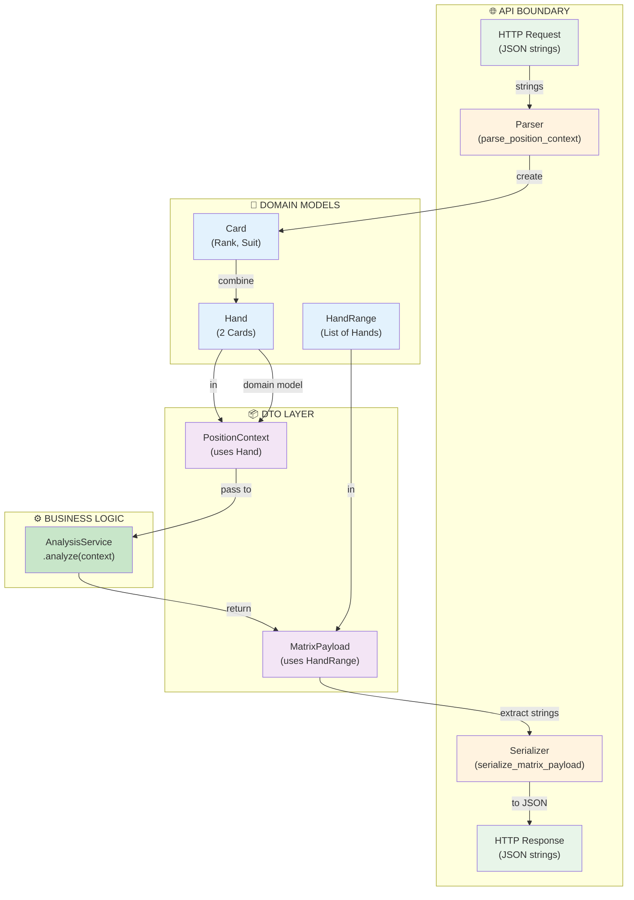
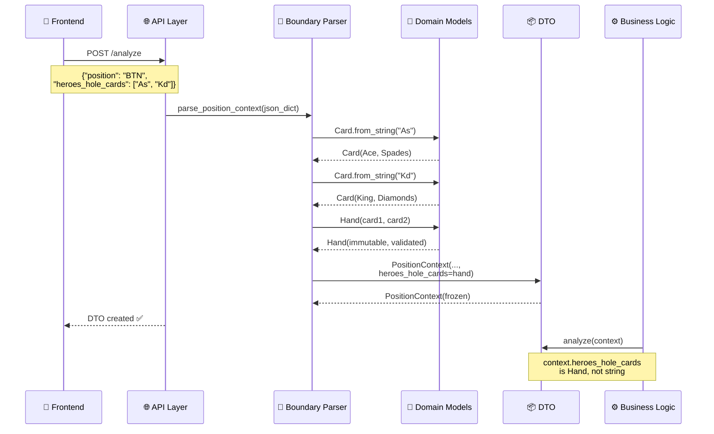
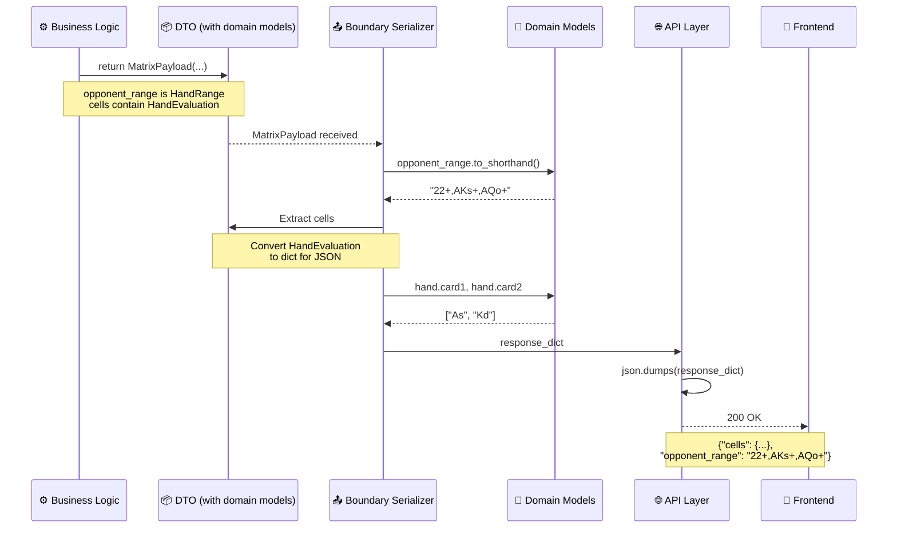
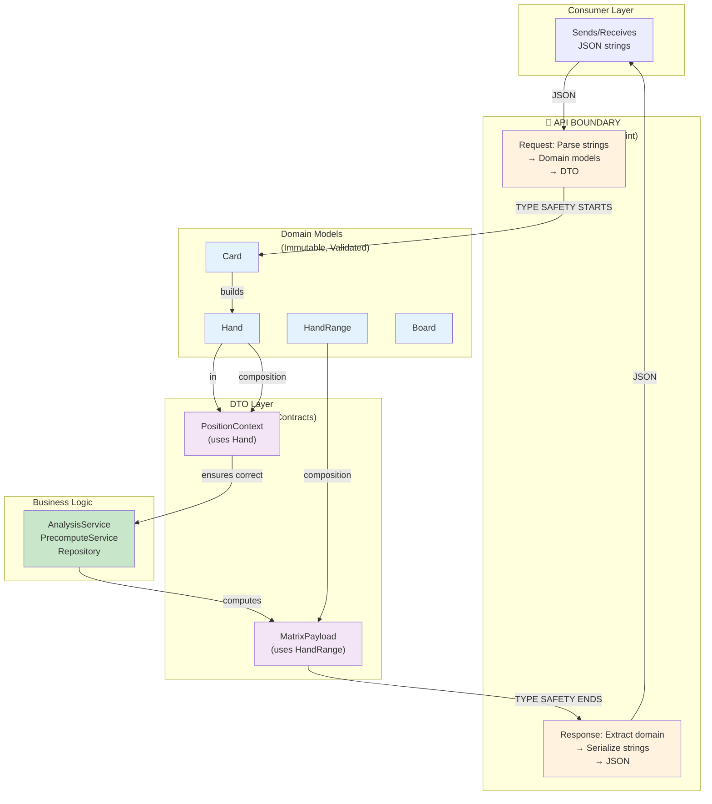
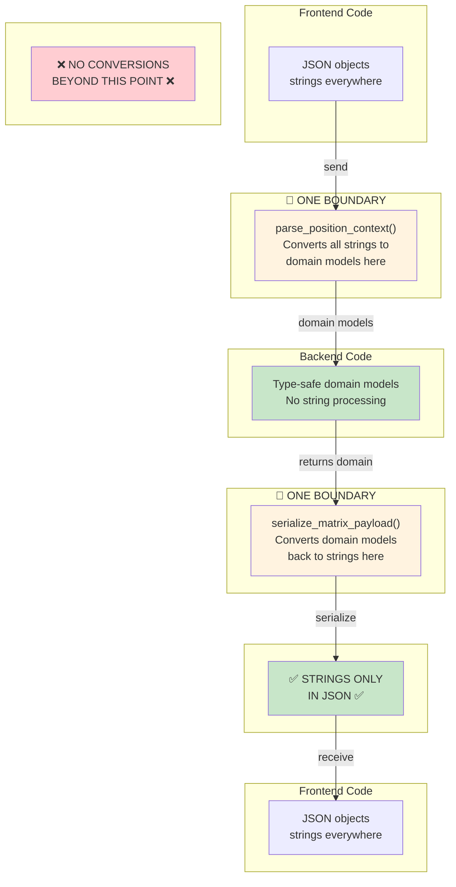
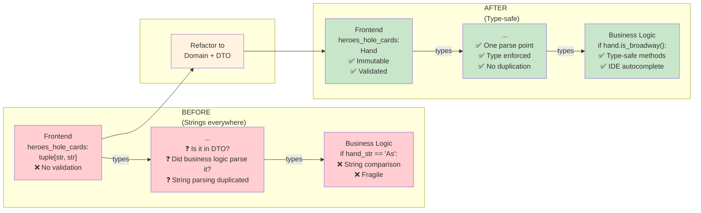

# Integration: DTOs ↔ Domain Models

## Purpose

This document shows how the **boundary between API/transport and business logic** works. DTOs receive strings from HTTP requests/responses and convert them to domain models for type-safe processing.

---

## Architecture Overview

```
User/Frontend Request
│
├─ JSON: {"position": "BTN", "num_opponents": 2, "heroes_hole_cards": ["As", "Kd"]}
│
├─ **API BOUNDARY** ← Conversion happens here
│  ├─ Parse strings to Card objects
│  └─ Create Hand domain model
│
├─ DTO: PositionContext with Hand
│  └─ Type-safe, immutable, validated
│
├─ **Business Logic** (uses domain models)
│  ├─ AnalysisService.analyze(context.heroes_hole_cards)
│  └─ Returns MatrixPayload with HandRange
│
├─ **API BOUNDARY** ← Serialization happens here
│  ├─ Hand.to_strings() → ["As", "Kd"]
│  └─ HandRange.to_shorthand() → "22+,AKs"
│
└─ JSON Response: {"cells": {...}, "opponent_range": "22+,AKs"}
```

### Mermaid: Layered Architecture



---

## Request Flow: String → DTO → Domain

### Sequence Diagram: Request Parsing



The API layer **must** convert strings to domain models:

```python
from shared.domain.card import Card
from shared.domain.hand import Hand
from shared.enums import Position
from shared.models import PositionContext

def parse_position_context(data: dict) -> PositionContext:
    """Convert JSON dict to DTO with domain models."""
    
    # Parse position enum
    position = Position[data["position"]]  # BTN → Position.BTN
    
    # Parse opponent count
    num_opponents = int(data["num_opponents"])
    
    # Parse hero hand (if provided)
    heroes_hole_cards = None
    if "heroes_hole_cards" in data and data["heroes_hole_cards"]:
        heroes_hole_cards = Hand.from_strings(
            data["heroes_hole_cards"][0],  # "As"
            data["heroes_hole_cards"][1]   # "Kd"
        )
        if heroes_hole_cards is None:
            raise ValueError(f"Invalid cards: {data['heroes_hole_cards']}")
    
    # Parse pot size
    pot_size_bb = float(data.get("pot_size_bb", 1.0))
    
    # Create DTO (validated at construction)
    return PositionContext(
        position=position,
        num_opponents=num_opponents,
        heroes_hole_cards=heroes_hole_cards,
        pot_size_bb=pot_size_bb
    )
```

**Is this type-safe?** ✅ Yes - domain models are immutable and validated

---

### Step 3: Business Logic (Type-Safe)

Now business logic can trust the data:

```python
def analyze(context: PositionContext) -> MatrixPayload:
    """Analyze position - context is fully validated."""
    
    # heroes_hole_cards is Hand or None, never string
    if context.heroes_hole_cards:
        # Safe to use Hand methods
        is_pair = context.heroes_hole_cards.is_pair()
        is_broadway = context.heroes_hole_cards.is_broadway()
        
        # Can create HandRange if needed
        range_containing_hand = HandRange.from_shorthand("22+,AKs+")
        contains = range_containing_hand.contains_hand(context.heroes_hole_cards)
    
    # Analyze...
    cells = compute_matrix(context)
    
    # Return DTO with domain models
    opponent_range = HandRange.from_shorthand("22+,AKo+,A9s+")
    
    return MatrixPayload(
        cells=cells,
        query_context=context,
        opponent_range=opponent_range,
        metric=MetricType.EQUITY
    )
```

**Domain models throughout business logic** ✅

---

## Response Flow: DTO → String → JSON

### Sequence Diagram: Response Serialization



### Round-Trip Conversion: String ↔ Domain Model ↔ String

Lossless conversions ensure data integrity across the API boundary:

| Conversion | From | To | Method | Properties |
|---|---|---|---|---|
| **Card** | `"As"` (string) | `Card(Rank.ACE, Suit.SPADES)` | `Card.from_string()` | Rank (2-A), Suit (4 types) |
| **Card** | `Card(Rank.ACE, Suit.SPADES)` | `"As"` (string) | `str(card)` | Round-trip lossless |
| **Hand** | `["As", "Kd"]` (array) | `Hand(Card.ACE_SPADES, Card.KING_DIAMONDS)` | `Hand.from_strings()` | 169 combinations verified |
| **Hand** | `Hand(...)` | `["As", "Kd"]` (array) | `hand.to_strings()` | Exact string recovery |
| **HandRange** | `"22+,AKs"` (notation) | `HandRange({...})` (169+ hands) | `HandRange.from_shorthand()` | Notation parsing verified |
| **HandRange** | `HandRange({...})` | `"22+,AKs"` (notation) | `range.to_shorthand()` | Canonical form recovery |

Convert domain models back to strings for JSON:

```python
from dataclasses import asdict
from typing import Any

def serialize_matrix_payload(payload: MatrixPayload) -> dict:
    """Convert DTO with domain models to JSON-serializable dict."""
    
    # Serialize cells (HandEvaluation objects)
    cells_dict = {
        hand_key: asdict(evaluation)
        for hand_key, evaluation in payload.cells.items()
    }
    
    # Serialize hero hand back to strings
    hero_cards = None
    if payload.query_context.heroes_hole_cards:
        hero_hand = payload.query_context.heroes_hole_cards
        hero_cards = [str(hero_hand.card1), str(hero_hand.card2)]
    
    # Serialize opponent range back to shorthand
    opponent_range_str = None
    if payload.opponent_range:
        opponent_range_str = payload.opponent_range.to_shorthand()
    
    return {
        "cells": cells_dict,
        "query_context": {
            "position": payload.query_context.position.name,
            "num_opponents": payload.query_context.num_opponents,
            "heroes_hole_cards": hero_cards,
            "pot_size_bb": payload.query_context.pot_size_bb
        },
        "opponent_range": opponent_range_str,
        "metric": payload.metric.name,
        "average_equity": payload.average_equity,
        "computed_at": payload.computed_at
    }
```

---

### Step 3: Frontend Receives JSON

```json
{
  "cells": {
    "AA": {"equity": 0.752, "ev": 1.50, ...},
    "AKs": {"equity": 0.621, "ev": 1.24, ...},
    ...
  },
  "query_context": {
    "position": "BTN",
    "num_opponents": 2,
    "heroes_hole_cards": ["As", "Kd"],
    "pot_size_bb": 10.0
  },
  "opponent_range": "22+,AKs+,AQo+,KQo",
  "metric": "EQUITY",
  "average_equity": 0.515,
  "computed_at": "2026-04-02T14:30:00Z"
}
```

**Clear, semantic, JSON-compatible** ✅

---

## Full Request-Response Example

### Scenario: User Analyzes UTG vs BB

**Frontend:**
```python
# User selects: UTG position, 2 opponents, KK, 5BB stack
request = {
    "position": "UTG",
    "num_opponents": 2,
    "heroes_hole_cards": ["Kh", "Kd"],
    "pot_size_bb": 5.0
}
```

**API Receiving:**
```python
from flask import Flask, request as flask_request

@app.post("/analyze")
def analyze_endpoint():
    # Step 1: Parse JSON
    data = flask_request.json
    
    # Step 2: Boundary conversion (strings → domain models)
    context = parse_position_context(data)
    # context.heroes_hole_cards is now Hand (immutable)
    
    # Step 3: Call business logic
    payload = AnalysisService.analyze(context)
    # payload has Handler domain models
    
    # Step 4: Boundary serialization (domain models → strings)
    response = serialize_matrix_payload(payload)
    
    return response, 200
```

**Business Logic:**
```python
class AnalysisService:
    @staticmethod
    def analyze(context: PositionContext) -> MatrixPayload:
        """Analyze position using domain models."""
        
        # Can confidently use Hand properties
        if context.heroes_hole_cards.is_pair():
            print("Pair analysis...")
        
        # Detect opponent range from position
        if context.position == Position.BTN:
            opponent_range = HandRange.from_shorthand("22+,A2s+,K9s+,QTs+,JTs,A9o+,KJo+,QJo")
        else:
            opponent_range = HandRange.from_shorthand("22+,A2s+,KJo+")
        
        # Compute equity vs range
        matrix = compute_all_hands(context, opponent_range)
        
        return MatrixPayload(
            cells=matrix,
            query_context=context,
            opponent_range=opponent_range,
            metric=MetricType.EQUITY
        )
```

**Frontend Receives:**
```python
{
    "cells": {
        "AA": {"equity": 0.58, "ev": 2.9, ...},
        "KK": {"equity": 0.53, "ev": 2.65, ...},
        ...
    },
    "opponent_range": "22+,A2s+,K9s+,QTs+,JTs,A9o+,KJo+,QJo",
    ...
}
```

---

## Design Principles

### 1. **One Conversion Point Per Direction**

```text
Frontend JSON
     ↓
Parse once at boundary → DTO with domain models
     ↓
Business logic (never strings)
     ↓
Serialize once at boundary → JSON
     ↓
Frontend JSON
```

**Never convert mid-business-logic** - do it at boundaries only.

### Layer Responsibilities Diagram



---

### 2. **Domain Models Are Internal**

```python
# ✅ Good - domain model used internally
def analyze_hand(hand: Hand) -> float:
    """Business logic takes typed Hand."""
    return hand.is_broadway() and hand.is_suited()

# ❌ Bad - domain model exposed to client
def api_analyze(hand_str: str) -> str:
    """API should convert at boundary."""
    return "..." if hand_str == "AKs" else "..."
```

---

### 3. **Validation Happens at DTO Construction**

```python
# ✅ Good - boundary validates
context = PositionContext(
    position=Position.BTN,
    num_opponents=2,
    heroes_hole_cards=Hand.from_strings("As", "Kd")  # Validated here
)

# ❌ Bad - validation deep in logic
def analyze(position_str, opponents, cards_str_list):
    # Validation scattered throughout function
    if len(cards_str_list) != 2:
        raise ValueError(...)
    ...
```

### Boundary Responsibility Diagram



---

### 4. **Round-Trip Fidelity**

Domain models can losslessly convert to/from strings:

```python
# String → Hand → String (perfect round-trip)
original = "As Kd"
hand = Hand.from_strings("As", "Kd")
result = f"{hand.card1} {hand.card2}"
assert result == original  # ✅

# String → HandRange → String (perfect round-trip)
original = "22+,AKs+,AQo+"
range = HandRange.from_shorthand(original)
result = range.to_shorthand()
assert result == original  # ✅
```

---

## Common Pitfalls & Solutions

### Pitfall 1: Passing Strings Through DTOs

```python
# ❌ BAD - strings in DTO defeats type safety
@dataclass
class PositionContext:
    heroes_hole_cards: str  # "As Kd" - no validation

# ✅ GOOD - domain models in DTO
@dataclass
class PositionContext:
    heroes_hole_cards: Optional[Hand]  # Validated Hand
```

---

### Pitfall 2: Loose Conversion at Boundaries

```python
# ❌ BAD - conversion scattered, error-prone
def analyze(raw_json):
    cards = raw_json.get("heroes_hole_cards", [])
    hand = None
    if cards:
        hand = (cards[0], cards[1])  # Tuple, not Hand!
    # ... logic uses weak hand type

# ✅ GOOD - strict boundary conversion
def analyze_endpoint():
    context = parse_position_context(request.json)  # Raises on invalid
    # ... logic uses Hand
```

---

### Pitfall 3: Forgetting to Serialize

```python
# ❌ BAD - returning domain models in JSON
def analyze():
    payload = MatrixPayload(...)
    return payload  # ❌ Hand objects not JSON-serializable

# ✅ GOOD - serialize at boundary
def analyze():
    payload = MatrixPayload(...)
    return serialize_matrix_payload(payload)  # JSON dict
```

---

## Testing Integration

### Test 1: Boundary Conversion Succeeds

```python
def test_parse_position_context_valid():
    """Boundary conversion works for valid input."""
    data = {
        "position": "BTN",
        "num_opponents": 2,
        "heroes_hole_cards": ["As", "Kd"],
        "pot_size_bb": 10.0
    }
    
    context = parse_position_context(data)
    
    assert context.position == Position.BTN
    assert isinstance(context.heroes_hole_cards, Hand)
    assert context.heroes_hole_cards.card1 == Card.from_string("As")
```

---

### Test 2: Boundary Rejects Invalid Input

```python
def test_parse_position_context_invalid_card():
    """Boundary conversion rejects invalid cards."""
    data = {
        "position": "BTN",
        "num_opponents": 2,
        "heroes_hole_cards": ["Zx", "Kd"],  # Invalid card
        "pot_size_bb": 10.0
    }
    
    with pytest.raises(ValueError):
        parse_position_context(data)
```

---

### Test 3: Serialization Round-Trips

```python
def test_serialize_matrix_payload():
    """Serialization produces valid JSON."""
    payload = MatrixPayload(...)
    
    serialized = serialize_matrix_payload(payload)
    
    # Must be JSON-serializable
    json_str = json.dumps(serialized)
    
    # Must contain expected fields
    assert "cells" in serialized
    assert "opponent_range" in serialized
    assert isinstance(serialized["opponent_range"], str)  # Shorthand
```

---

## Summary

### Type Safety Evolution Diagram



### Layer Responsibilities

| Layer | Type | Validation | Mutability | Examples |
|-------|------|-----------|-----------|----------|
| **API Request** | `JSON` | None yet | Mutable | `{"position": "BTN", ...}` |
| **DTO** | `PositionContext` | ✅ Type-safe | Immutable | `PositionContext(position=Position.BTN, ...)` |
| **Domain** | `Hand`, `HandRange` | ✅ Immutable | Immutable | `Hand.from_strings("As", "Kd")` |
| **Business** | Services | ✅ Type-safe | Immutable | Analyzed results with `HandRange` |
| **API Response** | `JSON` | ✅ Serialized | Mutable | `{"opponent_range": "22+,AKs", ...}` |

**Key Insight**: Domain models are the "middle ground" between JSON (flexible, untyped) and business logic (rigid, typed). They provide bridge validation and remain immutable throughout.

