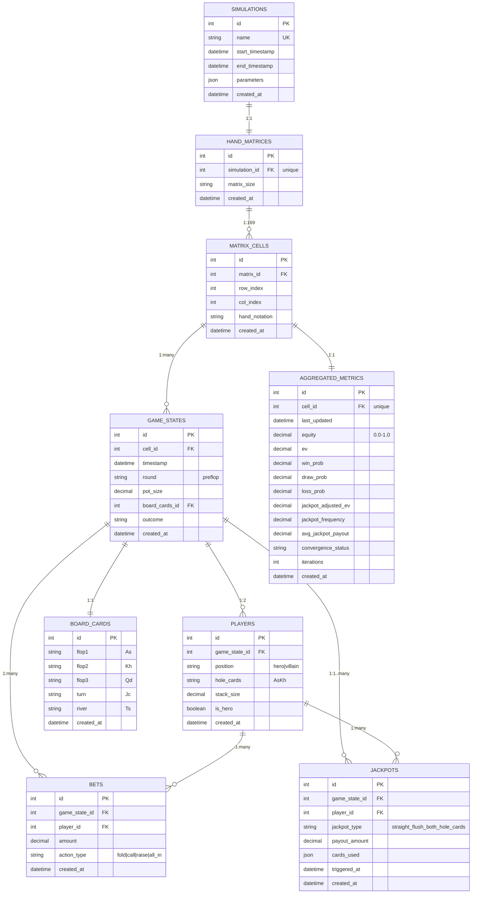

# AOF GTO Browser - Database Schema for Phase 1.3

## Overview

This document adapts the **normalized relational schema** from `specs/001-normalized-db-schema` for AOF (All-In-Or-Fold) poker solver integration in Phase 1.3 prototyping.

The normalized schema provides:
- ✅ 9 interconnected tables for complete game state archival
- ✅ Jackpot event tracking (GGPoker, PokerStars, etc.)
- ✅ Convergence analysis via timestamped historical data
- ✅ Support for complex queries (replay, analysis, aggregation)
- ✅ Strong data integrity with foreign key constraints and ACID transactions

---

## Entity Relationship Diagram



---

## Table Schema (SQLAlchemy Models)

### 1. **Simulations** - Monte Carlo Simulation Run Metadata

```sql
CREATE TABLE simulations (
    id INTEGER PRIMARY KEY AUTOINCREMENT,
    name TEXT UNIQUE NOT NULL,
    start_timestamp DATETIME NOT NULL,
    end_timestamp DATETIME,
    parameters JSON NOT NULL,  -- {iterations, convergence_threshold, seed, ...}
    created_at DATETIME DEFAULT CURRENT_TIMESTAMP
);
```

**Purpose**: Top-level container for a complete simulation run  
**Fields**:
- `name`: Unique ID for this simulation (e.g., "BTN_vs_BB_100k_iter_2026-04-03T14:30")
- `start_timestamp`: When simulation began
- `end_timestamp`: When simulation completed (NULL if running)
- `parameters`: JSON with solver settings
  ```json
  {
    "max_iterations": 100000,
    "convergence_threshold": 0.001,
    "random_seed": 42,
    "solver": "aof_poker",
    "position": "BTN",
    "num_opponents": 1,
    "stack_bb": 100,
    "pot_bb": 1.5,
    "game_type": "CASH"
  }
  ```

---

### 2. **HandMatrices** - 13×13 Hand Matchup Grid

```sql
CREATE TABLE hand_matrices (
    id INTEGER PRIMARY KEY AUTOINCREMENT,
    simulation_id INTEGER UNIQUE NOT NULL,
    matrix_size TEXT DEFAULT '13x13' NOT NULL,
    created_at DATETIME DEFAULT CURRENT_TIMESTAMP,
    FOREIGN KEY (simulation_id) REFERENCES simulations(id) 
        ON DELETE CASCADE
);
```

**Purpose**: Represents the 13×13 grid (169 hands) for a simulation  
**Fields**:
- `simulation_id`: Links to parent Simulation (one matrix per simulation)
- `matrix_size`: Usually '13x13' but allows future expansion

---

### 3. **MatrixCells** - Individual Hand Matchups (169 total)

```sql
CREATE TABLE matrix_cells (
    id INTEGER PRIMARY KEY AUTOINCREMENT,
    matrix_id INTEGER NOT NULL,
    row_index INTEGER NOT NULL,  -- 0-12 (AA, AKs, AQs, ..., 22)
    col_index INTEGER NOT NULL,  -- 0-12 (AA, AKs, AQs, ..., 22)
    hand_notation TEXT NOT NULL,  -- "AKs", "KQo", "77", etc.
    created_at DATETIME DEFAULT CURRENT_TIMESTAMP,
    FOREIGN KEY (matrix_id) REFERENCES hand_matrices(id) 
        ON DELETE CASCADE,
    UNIQUE (matrix_id, row_index, col_index)
);
```

**Purpose**: Individual cell in the hand matrix (e.g., AKs in position row 0)  
**Fields**:
- `row_index / col_index`: Matrix coordinates (0-12)
- `hand_notation`: Canonical form ("AKs", "KQo", "77", etc.)
- One row per hand (169 cells total per simulation)

---

### 4. **GameStates** - Individual Simulated Hand Records

```sql
CREATE TABLE game_states (
    id INTEGER PRIMARY KEY AUTOINCREMENT,
    cell_id INTEGER NOT NULL,
    timestamp DATETIME NOT NULL,
    round TEXT DEFAULT 'preflop' NOT NULL,  -- all-in-or-fold only
    pot_size DECIMAL(10,2) NOT NULL,
    board_cards_id INTEGER NOT NULL,
    outcome TEXT,  -- 'hero_win', 'hero_loss', 'draw'
    created_at DATETIME DEFAULT CURRENT_TIMESTAMP,
    FOREIGN KEY (cell_id) REFERENCES matrix_cells(id) 
        ON DELETE CASCADE,
    FOREIGN KEY (board_cards_id) REFERENCES board_cards(id) 
        ON DELETE CASCADE,
    INDEX(cell_id, timestamp)
);
```

**Purpose**: One record per simulated hand within a cell  
**Fields**:
- `cell_id`: Which hand matchup is being simulated (AKs vs 72o, etc.)
- `timestamp`: When this hand was simulated (enables convergence tracking)
- `pot_size`: Pot size at decision point (BB units)
- `board_cards_id`: Community cards dealt (FK to BoardCards)
- `outcome`: Result for equity calculation

---

### 5. **Players** - Hole Cards & Stack Info for Each Hand

```sql
CREATE TABLE players (
    id INTEGER PRIMARY KEY AUTOINCREMENT,
    game_state_id INTEGER NOT NULL,
    position TEXT NOT NULL,  -- 'hero' or 'villain'
    hole_cards TEXT NOT NULL,  -- "AsKh", "2d7c", etc.
    stack_size DECIMAL(10,2) NOT NULL,  -- in BB
    is_hero BOOLEAN DEFAULT FALSE NOT NULL,
    created_at DATETIME DEFAULT CURRENT_TIMESTAMP,
    FOREIGN KEY (game_state_id) REFERENCES game_states(id) 
        ON DELETE CASCADE
);
```

**Purpose**: Hole card details for hero and villain in each hand  
**Fields**:
- `position`: 'hero' or 'villain'
- `hole_cards`: The specific 2 cards dealt (e.g., "AsKh")
- `stack_size`: Player's stack in BB (enables all-in calculations)
- `is_hero`: Boolean flag for quick filtering

---

### 6. **Bets** - All-In Betting Actions

```sql
CREATE TABLE bets (
    id INTEGER PRIMARY KEY AUTOINCREMENT,
    game_state_id INTEGER NOT NULL,
    player_id INTEGER NOT NULL,
    amount DECIMAL(10,2) NOT NULL,  -- BB units
    action_type TEXT NOT NULL,  -- 'fold', 'call', 'raise', 'all_in'
    created_at DATETIME DEFAULT CURRENT_TIMESTAMP,
    FOREIGN KEY (game_state_id) REFERENCES game_states(id) 
        ON DELETE CASCADE,
    FOREIGN KEY (player_id) REFERENCES players(id) 
        ON DELETE CASCADE
);
```

**Purpose**: Betting actions within each hand (fold, call, all-in)  
**Fields**:
- `amount`: Bet size in BB
- `action_type`: Type of action taken
- Enables replay of exact betting sequences

---

### 7. **BoardCards** - Community Cards Dealt

```sql
CREATE TABLE board_cards (
    id INTEGER PRIMARY KEY AUTOINCREMENT,
    flop1 TEXT NOT NULL,  -- "As", "Kh", etc.
    flop2 TEXT NOT NULL,
    flop3 TEXT NOT NULL,
    turn TEXT NOT NULL,
    river TEXT NOT NULL,
    created_at DATETIME DEFAULT CURRENT_TIMESTAMP
);
```

**Purpose**: The 5 community cards dealt (flop, turn, river)  
**Fields**:
- All 5 cards in standard format ("As", "2h", etc.)
- Enables equity calculations even in all-in-or-fold context

---

### 8. **Jackpots** - Special Payout Events

```sql
CREATE TABLE jackpots (
    id INTEGER PRIMARY KEY AUTOINCREMENT,
    game_state_id INTEGER NOT NULL,
    player_id INTEGER NOT NULL,
    jackpot_type TEXT NOT NULL,  -- 'straight_flush_both_hole_cards', 'quads', etc.
    payout_amount DECIMAL(10,2) NOT NULL,
    cards_used JSON NOT NULL,  -- {"hole_cards": ["As", "Kh"], "board": ["2s", "3s", "4s", "5s", "6s"]}
    triggered_at DATETIME DEFAULT CURRENT_TIMESTAMP,
    created_at DATETIME DEFAULT CURRENT_TIMESTAMP,
    FOREIGN KEY (game_state_id) REFERENCES game_states(id) 
        ON DELETE CASCADE,
    FOREIGN KEY (player_id) REFERENCES players(id) 
        ON DELETE CASCADE,
    INDEX(jackpot_type, triggered_at)
);
```

**Purpose**: Track special payout events (GGPoker bonuses, WPT jackpots, etc.)  
**Fields**:
- `jackpot_type`: Type of bonus triggered
- `payout_amount`: EV impact of this jackpot
- `cards_used`: JSON with exact cards forming the bonus hand
- Enables jackpot-adjusted EV calculations

---

### 9. **AggregatedMetrics** - Summary Statistics Per Cell

```sql
CREATE TABLE aggregated_metrics (
    id INTEGER PRIMARY KEY AUTOINCREMENT,
    cell_id INTEGER UNIQUE NOT NULL,
    last_updated DATETIME NOT NULL,
    equity DECIMAL(5,4),  -- 0.0000 to 1.0000
    ev DECIMAL(10,4),  -- Expected value ($ or BB)
    win_prob DECIMAL(5,4),  -- Win probability
    draw_prob DECIMAL(5,4),  -- Draw probability
    loss_prob DECIMAL(5,4),  -- Loss probability
    jackpot_adjusted_ev DECIMAL(10,4),  -- EV including jackpot payouts
    jackpot_frequency DECIMAL(5,4),  -- Frequency of jackpot in simulations
    avg_jackpot_payout DECIMAL(10,2),  -- Average jackpot payout when triggered
    convergence_status TEXT,  -- 'converged', 'converging', 'not_started'
    iterations INTEGER,  -- Number of MC samples for this cell
    created_at DATETIME DEFAULT CURRENT_TIMESTAMP,
    FOREIGN KEY (cell_id) REFERENCES matrix_cells(id) 
        ON DELETE CASCADE
);
```

**Purpose**: Pre-computed summary statistics per cell (for fast matrix display)  
**Fields**:
- `equity`: Win probability vs opponent range
- `ev`: Expected value in money units
- `jackpot_adjusted_ev`: EV adjusted for platform-specific jackpots
- `convergence_status`: Whether this cell has converged to stable values
- Queryable index for quick matrix rendering

---

## Key Design Decisions

### 1. **Normalization for Flexibility**
- Rather than storing a flat "matrix results" table, we normalize into 9 tables
- This allows:
  - Convergence analysis (query by timestamp)
  - Game replay (reconstruct full hand history)
  - Jackpot analysis (pivot on jackpot events)
  - Future extensions (add new features without schema changes)

### 2. **GameStates as Time Series**
- Each cell has many GameStates (one per simulated hand)
- `GameStates.timestamp` enables convergence tracking
- Can query: "Show me equity convergence for AKs from 10k to 100k iterations"

### 3. **Jackpots as First-Class Citizens**
- Separate table because jackpots are:
  - Optional (not every hand triggers jackpots)
  - Many-to-one (multiple jackpots per hand possible)
  - Platform-specific (each poker site has different rules)
- `jackpot_adjusted_ev` accounts for their impact

### 4. **AggregatedMetrics for Performance**
- Pre-computed summary stats (equity, EV, convergence)
- Used for quick matrix rendering in GUI
- Updated together with GameStates
- Prevents recalculating across millions of records

### 5. **Immutable Historical Data**
- Once inserted, records are not updated
- New runs create new Simulations
- Enables audit trail and comparison across solver versions

---

## Query Examples

### Convergence Analysis
```sql
-- How did equity for AKs converge from 10k to 100k iterations?
SELECT 
    gs.timestamp,
    COUNT(*) as iterations,
    ROUND(SUM(CASE WHEN gs.outcome = 'hero_win' THEN 1 ELSE 0 END) / COUNT(*), 4) as equity
FROM game_states gs
JOIN matrix_cells mc ON gs.cell_id = mc.id
WHERE mc.hand_notation = 'AKs'
  AND gs.cell_id = ?
GROUP BY DATE(gs.timestamp)
ORDER BY gs.timestamp;
```

### Jackpot Frequency Analysis
```sql
-- Which hands trigger jackpots most often?
SELECT 
    mc.hand_notation,
    COUNT(j.id) as jackpot_count,
    COUNT(j.id) / COUNT(gs.id) as frequency,
    AVG(j.payout_amount) as avg_payout
FROM game_states gs
JOIN matrix_cells mc ON gs.cell_id = mc.id
LEFT JOIN jackpots j ON gs.id = j.game_state_id
WHERE j.id IS NOT NULL
GROUP BY mc.hand_notation
ORDER BY frequency DESC;
```

### Jackpot-Adjusted EV Rankings
```sql
-- What's the EV impact of jackpots on each hand?
SELECT 
    mc.hand_notation,
    am.equity,
    am.ev as base_ev,
    am.jackpot_adjusted_ev,
    (am.jackpot_adjusted_ev - am.ev) as jackpot_ev_impact,
    am.jackpot_frequency
FROM aggregated_metrics am
JOIN matrix_cells mc ON am.cell_id = mc.id
WHERE am.matrix_id = ?
ORDER BY am.jackpot_adjusted_ev DESC;
```

### Game Replay
```sql
-- Replay a specific hand (all actions and outcomes)
SELECT 
    gs.id as game_id,
    p.position,
    p.hole_cards,
    p.stack_size,
    b.action_type,
    b.amount,
    bc.flop1, bc.flop2, bc.flop3, bc.turn, bc.river,
    gs.outcome
FROM game_states gs
JOIN matrix_cells mc ON gs.cell_id = mc.id
LEFT JOIN players p ON gs.id = p.game_state_id
LEFT JOIN bets b ON gs.id = b.game_state_id
LEFT JOIN board_cards bc ON gs.board_cards_id = bc.id
WHERE mc.hand_notation LIKE '%AKs%'
ORDER BY gs.timestamp, p.is_hero DESC;
```

---

## Implementation Phases

### Phase 1.3a: Schema Definition (SQLAlchemy Models)
- [ ] Create SQLAlchemy ORM models for all 9 tables
- [ ] Define relationships and constraints
- [ ] Set up Alembic migrations
- [ ] Write schema tests

### Phase 1.3b: Repository Layer
- [ ] CRUD operations for each table
- [ ] Bulk insert for GameStates (performance critical)
- [ ] Complex query methods (convergence, jackpot analysis)
- [ ] Transaction management

### Phase 1.3c: Integration with AOF Solver
- [ ] Store simulation metadata (Simulations table)
- [ ] Record each simulated hand (GameStates, Players, BoardCards)
- [ ] Track jackpot events (Jackpots table)
- [ ] Compute aggregated metrics (AggregatedMetrics)

### Phase 2: Analysis & Querying
- [ ] Convergence analysis service
- [ ] Jackpot frequency analyzer
- [ ] EV calculator with jackpot adjustment
- [ ] Data export/reporting

---

## Performance Considerations

### Indexes
```sql
CREATE INDEX idx_game_states_cell_timestamp 
    ON game_states(cell_id, timestamp);

CREATE INDEX idx_matrix_cells_simulation 
    ON matrix_cells(matrix_id);

CREATE INDEX idx_jackpots_type_timestamp 
    ON jackpots(jackpot_type, triggered_at);

CREATE INDEX idx_board_cards_created 
    ON board_cards(created_at);
```

### Bulk Insert Strategy
- Use batch inserts for GameStates (100-1000 at a time)
- Defer index creation until after initial load
- Transaction per batch of cells

### Query Optimization
- Eager load relationships when needed
- Aggregate metrics pre-computed for fast matrix display
- Pagination for large result sets
- Cache frequently-accessed calculations

---

## Technology Stack

- **Database**: SQLite (built-in, simple) or PostgreSQL (scalable)
- **ORM**: SQLAlchemy 2.0+
- **Migrations**: Alembic
- **Python Version**: 3.10+

---

## Next Steps

1. **Define SQLAlchemy models** based on schema above
2. **Create Alembic migration** for initial schema
3. **Write repository methods** for CRUD and complex queries
4. **Integrate with AOF solver** to populate data
5. **Build analysis services** consuming from repository
