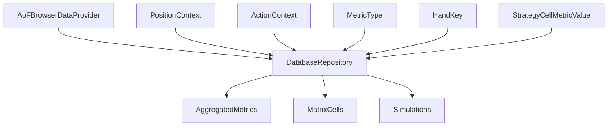

# Data Model: Database Schema Browser Integration

**Feature**: 001-db-schema-browser-integration  
**Date**: 2026-03-17  
**Status**: Complete  

## Overview

The data model defines how the browser's conceptual entities map to the normalized database schema from 001-normalized-db-schema. The integration creates a mapping layer that translates poker-specific browsing contexts into efficient database queries while maintaining the browser's existing data model interface.

## Entity-Relationship Diagram



## Browser Data Model Entities

### PositionContext
**Purpose**: Defines currently selected player perspective for strategy lookup  
**Mapping**: Translates to position parameter in AggregatedMetrics queries  
**Fields**:
  - id: enum {UTG, BTN, SB, BB}
  - label: string
  - sort_order: integer
**Validation rules**:
  - Must be one of exactly four supported values
**Database Relationship**:
  - Maps to position metadata stored in AggregatedMetrics or derived from simulation parameters

### ActionContext  
**Purpose**: Defines selected decision branch (fold/all-in) to display in matrix  
**Mapping**: Translates to action filter in database queries  
**Fields**:
  - id: enum {FOLD, ALL_IN}
  - label: string
**Validation rules**:
  - Must be one of two supported values
**Database Relationship**:
  - Filters AggregatedMetrics by action context

### MetricType
**Purpose**: Defines the meaning and formatting rules for matrix values  
**Mapping**: Determines which AggregatedMetrics column to select  
**Fields**:
  - id: enum {WIN_LOSE_PROBABILITY, EV, EQUITY, EQR}
  - label: string
  - display_format: enum {percent, decimal, signed_decimal}
  - db_column: string (maps to AggregatedMetrics column name)
**Validation rules**:
  - Must be one of the four spec-required options
**Database Relationship**:
  - Maps directly to AggregatedMetrics columns (equity, jackpot_adjusted_ev, etc.)

### HandKey
**Purpose**: Canonical identifier for a matrix hand cell  
**Mapping**: Translates to MatrixCells via row_index/col_index  
**Fields**:
  - key: string (examples: AA, AKs, AKo, 72o)
  - row_rank: enum {A,K,Q,J,T,9,8,7,6,5,4,3,2}
  - col_rank: enum {A,K,Q,J,T,9,8,7,6,5,4,3,2}
  - suitedness: enum {PAIR, SUITED, OFFSUIT}
**Validation rules**:
  - Exactly 169 unique keys must exist in matrix topology
  - Pair keys use identical ranks and suitedness=PAIR
**Database Relationship**:
  - Maps to MatrixCells.matrix_id, MatrixCells.row_index, MatrixCells.col_index

### StrategyCellMetricValue
**Purpose**: Stores displayable value and status for one hand under specific context  
**Mapping**: Retrieved from AggregatedMetrics via complex joins  
**Fields**:
  - position: PositionContext.id
  - action: ActionContext.id
  - metric: MetricType.id
  - hand_key: HandKey.key
  - value: float | null
  - status: enum {AVAILABLE, MISSING, INVALID}
  - source_tag: string | null
  - updated_at: datetime
**Validation rules**:
  - Composite uniqueness: (position, action, metric, hand_key)
  - If status=AVAILABLE, value must be non-null and finite
**Database Relationship**:
  - Retrieved via JOIN: MatrixCells → AggregatedMetrics with position/action filtering

## Database Schema Integration

### AggregatedMetrics Table Mapping
- **equity**: Maps to MetricType.WIN_LOSE_PROBABILITY and MetricType.EQUITY
- **jackpot_adjusted_ev**: Maps to MetricType.EV and MetricType.EQR
- **convergence_status**: Used for data availability validation
- **last_updated**: Maps to StrategyCellMetricValue.updated_at

### Query Patterns

#### Matrix Data Retrieval
```sql
SELECT 
    mc.row_index,
    mc.col_index,
    am.equity,
    am.jackpot_adjusted_ev,
    am.last_updated
FROM MatrixCells mc
JOIN AggregatedMetrics am ON mc.id = am.cell_id
JOIN HandMatrices hm ON mc.matrix_id = hm.id
JOIN Simulations s ON hm.simulation_id = s.id
WHERE s.parameters LIKE '%position:UTG%'
  AND s.parameters LIKE '%action:fold%'
  AND am.convergence_status = 'CONVERGED'
ORDER BY mc.row_index, mc.col_index
```

#### Position-Based Filtering
- Position context stored in simulation parameters JSON
- Requires JSON parsing or dedicated position column (research decision: use parameters for flexibility)

#### Action-Based Filtering  
- Action context derived from simulation configuration
- Maps to betting patterns in Bets table

## Data Integrity Rules

### Foreign Key Constraints
- All browser queries must resolve to valid MatrixCells/AggregatedMetrics relationships
- Invalid hand keys result in MISSING status
- Database constraint violations result in INVALID status

### Business Rules
- Position/Action/Metric combinations must exist in simulation data
- Missing data gracefully degrades to empty matrix cells
- Concurrent updates handled via database transactions

## Performance Considerations

### Indexes Required
- MatrixCells: (matrix_id, row_index, col_index)
- AggregatedMetrics: (cell_id, convergence_status)
- Simulations: parameters JSON index for position/action filtering

### Query Optimization
- Use prepared statements for repeated matrix queries
- Implement database connection pooling for concurrent users
- Cache frequently accessed metadata (hand keys, position mappings)