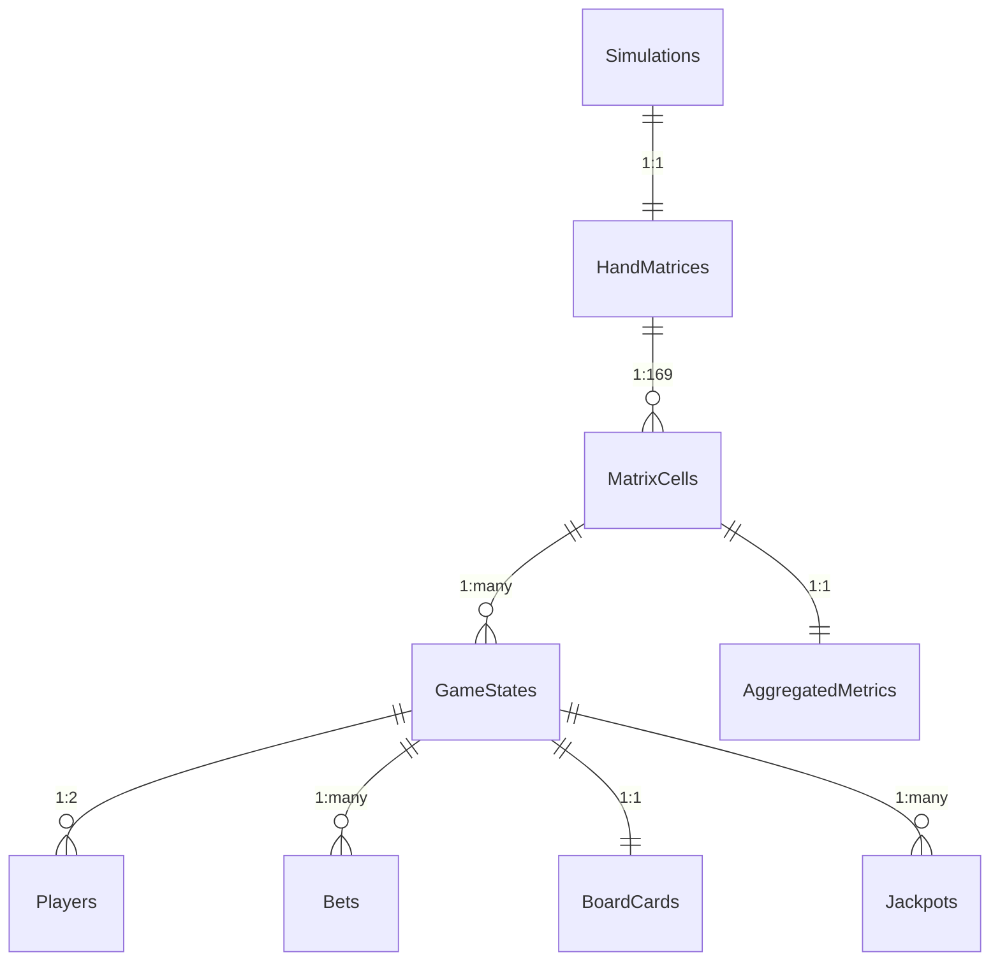

# Data Model: Normalized Relational Database Schema

**Feature**: 001-normalized-db-schema  
**Date**: 2026-03-15  
**Status**: Complete  

## Overview

The data model implements a normalized relational schema for all-in-or-fold poker simulation data storage. It uses 9 interconnected tables to capture simulation runs, game states, player actions, and analytical metrics while maintaining data integrity and supporting complex queries.

## Entity-Relationship Diagram

## Table Specifications

### Simulations
**Purpose**: Tracks individual Monte Carlo simulation runs  
**Relationships**: One-to-one with HandMatrices  
**Constraints**:
- `id`: Primary Key, Auto-increment INTEGER
- `name`: UNIQUE TEXT(255), not null
- `start_timestamp`: DATETIME, not null
- `end_timestamp`: DATETIME, nullable
- `parameters`: JSON, not null (simulation settings)

### HandMatrices
**Purpose**: Represents the 13x13 matrix structure for each simulation  
**Relationships**: One-to-many with MatrixCells, one-to-one with Simulations  
**Constraints**:
- `id`: Primary Key, Auto-increment INTEGER
- `simulation_id`: Foreign Key to Simulations.id, UNIQUE, not null
- `matrix_size`: TEXT(10), default '13x13', not null
- `created_at`: DATETIME, default CURRENT_TIMESTAMP, not null

### MatrixCells
**Purpose**: Individual cells in the hand matrix representing specific hand matchups  
**Relationships**: One-to-many with GameStates, one-to-one with AggregatedMetrics, many-to-one with HandMatrices  
**Constraints**:
- `id`: Primary Key, Auto-increment INTEGER
- `matrix_id`: Foreign Key to HandMatrices.id, not null
- `row_index`: INTEGER, 0-12, not null
- `col_index`: INTEGER, 0-12, not null
- `hand_combination`: TEXT(50), not null (e.g., "AsKh vs QdJd")
- UNIQUE constraint on (matrix_id, row_index, col_index)

### GameStates
**Purpose**: Detailed records of each simulated hand with outcomes  
**Relationships**: Many-to-one with MatrixCells, one-to-many with Players/Bets/Jackpots, one-to-one with BoardCards  
**Constraints**:
- `id`: Primary Key, Auto-increment INTEGER
- `cell_id`: Foreign Key to MatrixCells.id, not null
- `timestamp`: DATETIME, not null
- `round`: TEXT(10), default 'preflop', not null
- `pot_size`: DECIMAL(10,2), not null
- `board_cards`: Foreign Key to BoardCards.id, not null
- `outcome`: TEXT(20), nullable (win/loss indicators)

### Players
**Purpose**: Player information and hole cards for each game state  
**Relationships**: Many-to-one with GameStates  
**Constraints**:
- `id`: Primary Key, Auto-increment INTEGER
- `game_state_id`: Foreign Key to GameStates.id, not null
- `position`: TEXT(10), not null (hero/villain)
- `hole_cards`: TEXT(10), not null (e.g., "AsKh")
- `stack_size`: DECIMAL(10,2), not null
- `is_hero`: BOOLEAN, default FALSE, not null

### Bets
**Purpose**: All-in betting actions recorded for each game state  
**Relationships**: Many-to-one with GameStates and Players  
**Constraints**:
- `id`: Primary Key, Auto-increment INTEGER
- `game_state_id`: Foreign Key to GameStates.id, not null
- `player_id`: Foreign Key to Players.id, not null
- `amount`: DECIMAL(10,2), not null
- `action_type`: TEXT(10), default 'raise', not null (fold/call/raise)

### BoardCards
**Purpose**: Community cards dealt for each hand  
**Relationships**: One-to-one with GameStates  
**Constraints**:
- `id`: Primary Key, Auto-increment INTEGER
- `flop1`: TEXT(2), not null
- `flop2`: TEXT(2), not null
- `flop3`: TEXT(2), not null
- `turn`: TEXT(2), not null
- `river`: TEXT(2), not null

### Jackpots
**Purpose**: Special payout events triggered by specific hand combinations  
**Relationships**: Many-to-one with GameStates and Players  
**Constraints**:
- `id`: Primary Key, Auto-increment INTEGER
- `game_state_id`: Foreign Key to GameStates.id, not null
- `player_id`: Foreign Key to Players.id, not null
- `jackpot_type`: TEXT(50), not null (e.g., 'straight_flush_both_hole_cards')
- `payout_amount`: DECIMAL(10,2), not null
- `cards_used`: JSON, not null (specific cards forming jackpot)
- `triggered_at`: DATETIME, default CURRENT_TIMESTAMP, not null

### AggregatedMetrics
**Purpose**: Computed statistics and metrics for each matrix cell  
**Relationships**: One-to-one with MatrixCells  
**Constraints**:
- `id`: Primary Key, Auto-increment INTEGER
- `cell_id`: Foreign Key to MatrixCells.id, UNIQUE, not null
- `last_updated`: DATETIME, not null
- `equity`: DECIMAL(5,4), nullable (standard win probability)
- `jackpot_adjusted_ev`: DECIMAL(10,4), nullable (EV including jackpots)
- `jackpot_frequency`: DECIMAL(5,4), nullable (jackpot occurrence rate)
- `avg_jackpot_payout`: DECIMAL(10,2), nullable
- `convergence_status`: TEXT(20), nullable

## Data Integrity Rules

### Foreign Key Constraints
- All foreign keys use RESTRICT on delete to prevent orphaned records
- Cascade delete enabled for simulation cleanup (delete simulation → delete all related data)
- Unique constraints prevent duplicate relationships

### Business Rules
- MatrixCells must have unique (matrix_id, row_index, col_index) combinations
- GameStates.round limited to 'preflop' for all-in-or-fold games
- Players per GameState limited to 2 (hero and villain)
- BoardCards always contain exactly 5 cards (flop ×3 + turn + river)
- AggregatedMetrics updated atomically with GameStates

### Data Validation
- Card representations validated against poker card format (2-9,T,J,Q,K,A + s,h,d,c)
- Monetary values (DECIMAL) ensure precise financial calculations
- JSON fields validated for expected structure
- Timestamps use UTC for consistency

## Performance Considerations

### Indexes
- Primary keys automatically indexed
- Foreign key columns indexed for join performance
- (matrix_id, row_index, col_index) composite index on MatrixCells
- timestamp index on GameStates for temporal queries
- jackpot_type index on Jackpots for aggregation queries

### Query Optimization
- Use eager loading for frequently accessed relationships
- Implement pagination for large result sets
- Cache aggregated metrics to avoid recomputation
- Use database transactions for bulk operations

## Migration Strategy

Since no existing data migration is required, initial schema creation will:
1. Create all tables in dependency order
2. Create indexes after data loading
3. Enable foreign key constraints
4. Populate with initial test data if needed

Future schema evolution will use SQLAlchemy's migration tools (Alembic) for versioned changes.